# Whole App — Use Case Diagram

Top-level view of every actor in the FinanceAI portal and the use cases they can invoke. Use cases are grouped by module.

## All Actors and Their Use Cases

```mermaid
flowchart LR
    %% Actors
    Vendor((Vendor))
    EmpL1((Employee L1))
    EmpL2((Employee L2))
    HoD((Dept Head))
    FinL1((Finance L1))
    FinL2((Finance L2))
    CFO((CFO / Fin Head))
    CEO((CEO))
    Admin((Admin))
    CA((External CA))
    System((System / AI))
    D365((D365 BC))
    GSTPortal((GST Portal))
    Bank((Bank))

    %% Expense Management
    subgraph EM["Expense Management"]
        E1[Submit bill self-service]
        E2[File bill on behalf]
        E3[Approve bill at L1]
        E4[Approve bill at L2]
        E5[Approve bill at HoD]
        E6[Approve bill at Fin L1]
        E7[Approve bill at Fin L2]
        E8[Approve bill at Fin Head]
        E9[Reject bill]
        E10[Raise query]
        E11[Respond to query]
        E12[Track bill status]
        E13[Book in D365]
        E14[Dispute on-behalf filing]
        E15[Override anomaly flag]
    end

    %% Invoice Management
    subgraph IM["Invoice Management Sales"]
        I1[Create draft invoice]
        I2[Generate e-invoice IRN]
        I3[Send invoice to client]
        I4[Track invoice status]
        I5[Trigger dunning]
        I6[Issue credit note]
        I7[Reconcile payment]
        I8[Mark disputed]
    end

    %% Budget Management
    subgraph BM["Budget Management"]
        B1[Create budget]
        B2[Review allocated budget]
        B3[Lock budget period]
        B4[Request reallocation BRR]
        B5[Approve BRR]
        B6[View consumption]
        B7[Receive threshold alerts]
        B8[Override budget block]
    end

    %% Vendor Management
    subgraph VM["Vendor Management"]
        V1[Create vendor]
        V2[Approve new vendor]
        V3[Update vendor profile]
        V4[Suspend vendor]
        V5[Map L1 to vendor]
        V6[Request bank account change]
        V7[Approve bank account change]
        V8[View vendor performance]
    end

    %% AR
    subgraph AR["Accounts Receivable"]
        AR1[View AR aging]
        AR2[View client outstanding]
        AR3[Forecast receipts]
        AR4[Track TDS expected]
    end

    %% AP
    subgraph AP["Accounts Payable"]
        AP1[Create PO]
        AP2[Enter GRN]
        AP3[Run 3-way match]
        AP4[Generate payment run]
        AP5[Track DPO]
        AP6[MSME compliance check]
    end

    %% Cash Flow
    subgraph CF["Cash Flow Forecasting"]
        CF1[View cash projection]
        CF2[Run scenario]
        CF3[Inject known event]
        CF4[Read AI narrative]
    end

    %% Reporting
    subgraph RP["Reporting"]
        R1[Generate standard report]
        R2[Schedule report email]
        R3[Export PDF / Excel]
        R4[NL query the data]
        R5[View CFO summary]
    end

    %% Compliance
    subgraph CM["Compliance"]
        C1[Prepare GSTR-1 data]
        C2[Reconcile GSTR-2A]
        C3[Generate TDS challan]
        C4[Track Form 16A]
        C5[Reconcile Form 26AS]
        C6[MSME compliance report]
    end

    %% Audit
    subgraph AG["Audit & Governance"]
        AU1[View audit trail]
        AU2[Export audit log]
        AU3[Run AI audit query]
        AU4[Manage users / roles]
        AU5[Configure approval chains]
    end

    %% Vendor connections
    Vendor --> E1
    Vendor --> E11
    Vendor --> E12
    Vendor --> E14
    Vendor --> V6

    %% Employee L1 connections
    EmpL1 --> E2
    EmpL1 --> E3
    EmpL1 --> E9
    EmpL1 --> E10
    EmpL1 --> E11
    EmpL1 --> E15
    EmpL1 --> AP2

    %% Employee L2 connections
    EmpL2 --> E4
    EmpL2 --> E9
    EmpL2 --> E10
    EmpL2 --> E15

    %% HoD connections
    HoD --> E5
    HoD --> E9
    HoD --> E10
    HoD --> E15
    HoD --> B2
    HoD --> B4
    HoD --> B6

    %% Finance L1 connections
    FinL1 --> E6
    FinL1 --> E9
    FinL1 --> E10
    FinL1 --> E15
    FinL1 --> I1
    FinL1 --> I3
    FinL1 --> I4
    FinL1 --> I7
    FinL1 --> AP1
    FinL1 --> AP3
    FinL1 --> AR1
    FinL1 --> AR4
    FinL1 --> R1

    %% Finance L2 connections
    FinL2 --> E7
    FinL2 --> E9
    FinL2 --> I3
    FinL2 --> I5
    FinL2 --> I6
    FinL2 --> AP4
    FinL2 --> AP5
    FinL2 --> R1

    %% CFO connections
    CFO --> E8
    CFO --> E13
    CFO --> B1
    CFO --> B3
    CFO --> B5
    CFO --> B8
    CFO --> V7
    CFO --> V8
    CFO --> CF1
    CFO --> CF2
    CFO --> CF3
    CFO --> CF4
    CFO --> R4
    CFO --> R5
    CFO --> AU3

    %% CEO connections
    CEO --> B5
    CEO --> R5

    %% Admin connections
    Admin --> V1
    Admin --> V2
    Admin --> V3
    Admin --> V4
    Admin --> V5
    Admin --> AU4
    Admin --> AU5

    %% External CA connections
    CA --> C1
    CA --> C2
    CA --> C3
    CA --> C5

    %% System / AI connections
    System -.-> E15
    System -.-> B7
    System -.-> CF4
    System -.-> R5

    %% External system connections
    D365 -.-> E13
    D365 -.-> AP3
    GSTPortal -.-> V2
    GSTPortal -.-> C2
    Bank -.-> AP4
    Bank -.-> I7

    classDef actor fill:#e1f5ff,stroke:#0288d1,stroke-width:2px
    classDef external fill:#fff4e1,stroke:#f57c00,stroke-width:2px
    classDef system fill:#f3e5f5,stroke:#7b1fa2,stroke-width:2px

    class Vendor,EmpL1,EmpL2,HoD,FinL1,FinL2,CFO,CEO,Admin actor
    class CA,D365,GSTPortal,Bank external
    class System system
```

## Actor Summary

| Actor | Type | Primary Modules | Key Use Cases |
|---|---|---|---|
| **Vendor** | External user | Expense Mgmt, Vendor Mgmt | Submit bills, track status, dispute filings, request bank changes |
| **Employee L1** | Internal | Expense Mgmt, AP | File bills on behalf, validate, enter GRN |
| **Employee L2** | Internal | Expense Mgmt | Second-level dept approval |
| **Department Head** | Internal | Expense Mgmt, Budget | Final dept approval, budget acceptance, BRR |
| **Finance L1** | Internal | Expense, Invoice, AR, AP, Reporting | Tax/PO validation, sales invoice creation, AR/AP ops |
| **Finance L2** | Internal | Expense, Invoice, AP, Reporting | Senior finance approval, dunning, payment runs |
| **CFO / Finance Head** | Internal | All modules | Final approval, D365 booking, budget locking, cash flow oversight |
| **CEO** | Internal | Budget, Reporting | High-amount approvals, executive summaries |
| **Admin** | Internal | Vendor Mgmt, Audit & Gov | User mgmt, vendor onboarding, system config |
| **External CA** | External party | Compliance | Files GST/TDS returns (system never auto-files) |
| **System / AI** | Automated | All modules | OCR, anomaly, alerts, AI summaries |
| **D365 BC** | External system | Expense, Invoice, Budget, Vendor, AR, AP | Source of truth for accounting ledger |
| **GST Portal** | External system | Vendor, Compliance | GSTIN validation, GSTR-2A, e-invoice IRN |
| **Bank** | External system | AP, AR | Payment execution, statement reconciliation |
