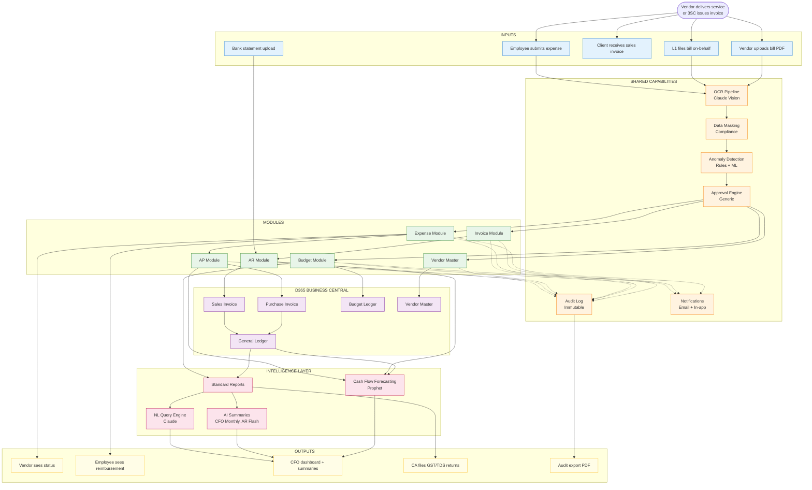
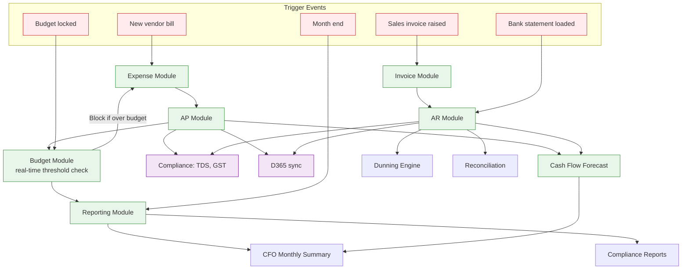

# Whole App — End-to-End Flow

This diagram shows how data and control flow through the entire FinanceAI portal — from vendor submission, through approvals, into D365, and out as reports/insights. It is the "one diagram that explains the whole product".

## Top-Level End-to-End Flow

## End-to-End Lifecycle (Bill Example)

The single most representative end-to-end journey through the system is a vendor bill from submission to payment to reporting:

```mermaid
flowchart LR
    A[Vendor uploads PDF] --> B[OCR extracts data]
    B --> C[Anomaly check]
    C -->|Clean| D[6-step approval]
    C -->|Flagged| E[Manual review]
    E --> D
    D --> F[Book in D365]
    F --> G[D365 posts invoice]
    G --> H[Payment run]
    H --> I[Bank transfers]
    I --> J[Vendor marked paid]
    J --> K[Audit log frozen]
    K --> L[Appears in MoM report]
    L --> M[Feeds cash flow forecast]
    M --> N[Surfaces in CFO summary]

    style A fill:#e3f2fd
    style N fill:#fce4ec
```

## Cross-Module Interaction Flow

How modules trigger and feed each other:

