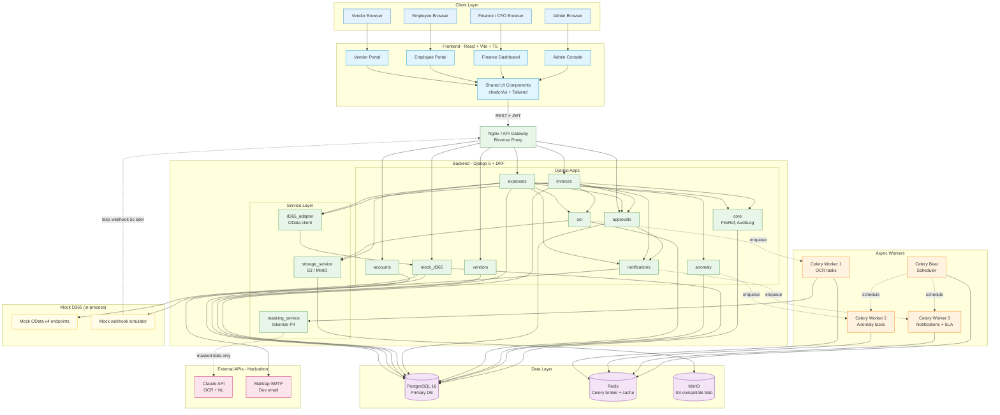

# Whole App — Architecture Diagrams

Two variants: **Hackathon** (what we're building in 4 weeks) and **Target** (full production state).

---

## Variant 1: Hackathon Architecture

### Hackathon Stack Details

| Layer | Technology | Notes |
|---|---|---|
| Frontend | React 18 + Vite + TypeScript | Single SPA, role-based routing |
| UI | TailwindCSS + shadcn/ui | Speed + consistency |
| State | TanStack Query + Zustand | Server vs UI state separation |
| Backend | Django 5 + DRF | Auth, ORM, admin out of the box |
| API style | REST + JWT | OpenAPI auto-spec via drf-spectacular |
| DB | PostgreSQL 16 | JSONB for OCR payloads, audit logs |
| Async | Celery + Redis | OCR, anomaly, SLA timers, emails |
| Storage | MinIO (S3-compatible) | Local Docker, swap to S3 in prod |
| Email | Mailtrap | Dev SMTP, real provider in prod |
| AI | Claude Sonnet 4 (Vision + Text) | OCR, anomaly narrative, NL query later |
| D365 | Mock app inside Django | Same process, separate URL prefix |
| Container | Docker Compose | One `make up` runs everything |
| CI | GitHub Actions | Lint + test on PR |

---

## Variant 2: Target Production Architecture

```mermaid
flowchart TB
    subgraph Edge["Edge Layer"]
        CDN[Cloudflare CDN]
        WAF[WAF + DDoS]
    end

    subgraph Identity["Identity Provider"]
        AAD[Azure AD<br/>SSO + MFA]
        VendorAuth[Vendor Magic Link<br/>Passwordless]
    end

    subgraph Frontend["Frontend - Vercel / Static Hosting"]
        WebApp[React SPA]
        AdminSPA[Admin Console SPA]
    end

    CDN --> WebApp
    CDN --> AdminSPA
    WAF --> CDN

    subgraph K8s["Backend - Kubernetes Cluster"]
        direction TB

        subgraph APITier["API Tier"]
            Gateway[API Gateway<br/>Kong / Envoy]
            DjangoApp1[Django Pod 1]
            DjangoApp2[Django Pod 2]
            DjangoAppN[Django Pod N]
        end

        subgraph WorkerTier["Worker Tier"]
            CeleryOcr[Celery: OCR pool]
            CeleryAno[Celery: Anomaly pool]
            CeleryNot[Celery: Notifications]
            CeleryFor[Celery: Forecasting]
            CeleryRpt[Celery: Reports]
            CeleryBeat[Celery Beat<br/>Scheduler]
        end

        subgraph IntelTier["Intelligence Tier"]
            NLQ[NL Query Service]
            Forecast[Prophet Forecast Service]
            Summarizer[Summary Generator]
            MaskSvc[Masking Middleware]
        end
    end

    WebApp --> Gateway
    AdminSPA --> Gateway
    Gateway --> AAD
    Gateway --> VendorAuth
    Gateway --> DjangoApp1
    Gateway --> DjangoApp2
    Gateway --> DjangoAppN

    DjangoApp1 -.-> CeleryOcr
    DjangoApp1 -.-> CeleryAno
    DjangoApp1 -.-> CeleryNot
    DjangoApp1 -.-> CeleryFor
    DjangoApp1 -.-> CeleryRpt

    DjangoApp1 --> NLQ
    DjangoApp1 --> Forecast
    DjangoApp1 --> Summarizer
    NLQ --> MaskSvc
    Summarizer --> MaskSvc

    subgraph DataPlatform["Data Platform"]
        PG[(PostgreSQL HA<br/>Primary + 2 replicas)]
        Redis[(Redis Cluster<br/>Broker + cache)]
        S3[(AWS S3<br/>File storage)]
        CH[(ClickHouse<br/>Analytics warehouse)]
        Vault[(HashiCorp Vault<br/>Secrets)]
    end

    DjangoApp1 --> PG
    DjangoApp2 --> PG
    DjangoAppN --> PG
    CeleryOcr --> Redis
    CeleryAno --> Redis
    CeleryNot --> Redis
    CeleryFor --> Redis
    CeleryRpt --> Redis
    CeleryOcr --> S3
    CeleryRpt --> CH
    Forecast --> CH
    DjangoApp1 --> Vault

    PG -.->|CDC stream| Debezium[Debezium]
    Debezium -.-> CH

    subgraph BI["BI / Analytics"]
        PowerBI[Power BI]
        Metabase[Metabase]
    end

    CH --> PowerBI
    CH --> Metabase

    subgraph ExtSystems["External Systems"]
        D365Real[D365 Business Central<br/>OData v4]
        GSTAPI[GST Portal API]
        BankAPI[Bank API]
        ClaudeAPI[Claude API]
        SES[AWS SES Email]
        Twilio[Twilio SMS]
        Slack[Slack API]
    end

    DjangoApp1 --> D365Real
    DjangoApp1 --> GSTAPI
    DjangoApp1 --> BankAPI
    MaskSvc -.->|tokenized data only| ClaudeAPI
    CeleryOcr --> ClaudeAPI
    CeleryNot --> SES
    CeleryNot --> Twilio
    CeleryNot --> Slack

    subgraph Observability["Observability"]
        Prom[Prometheus]
        Graf[Grafana]
        Loki[Loki Logs]
        Sentry[Sentry Errors]
    end

    DjangoApp1 -.-> Prom
    DjangoApp1 -.-> Loki
    DjangoApp1 -.-> Sentry
    Prom --> Graf
    Loki --> Graf

    classDef edge fill:#ffe0b2,stroke:#e65100
    classDef id fill:#c5cae9,stroke:#283593
    classDef fe fill:#e1f5ff,stroke:#0288d1
    classDef api fill:#e8f5e9,stroke:#388e3c
    classDef worker fill:#fff3e0,stroke:#f57c00
    classDef intel fill:#fce4ec,stroke:#c2185b
    classDef data fill:#f3e5f5,stroke:#7b1fa2
    classDef bi fill:#dcedc8,stroke:#558b2f
    classDef ext fill:#ffccbc,stroke:#bf360c
    classDef obs fill:#cfd8dc,stroke:#37474f

    class CDN,WAF edge
    class AAD,VendorAuth id
    class WebApp,AdminSPA fe
    class Gateway,DjangoApp1,DjangoApp2,DjangoAppN api
    class CeleryOcr,CeleryAno,CeleryNot,CeleryFor,CeleryRpt,CeleryBeat worker
    class NLQ,Forecast,Summarizer,MaskSvc intel
    class PG,Redis,S3,CH,Vault data
    class PowerBI,Metabase bi
    class D365Real,GSTAPI,BankAPI,ClaudeAPI,SES,Twilio,Slack ext
    class Prom,Graf,Loki,Sentry obs
```

### Target Stack Additions Beyond Hackathon

| Layer | Hackathon | Target | Why |
|---|---|---|---|
| Hosting | Docker Compose on dev machine | Kubernetes (EKS / AKS) | HA, auto-scaling |
| DB | Single Postgres | PG with HA + 2 read replicas | Reliability, read scale |
| Storage | MinIO local | AWS S3 + Cloudfront | Production scale |
| Auth | Email + password / JWT | Azure AD SSO + MFA + magic link | Enterprise-grade |
| D365 | Mock app | Real BC OData v4 | Production accounting |
| Analytics | None | ClickHouse + Debezium CDC | OLAP separate from OLTP |
| BI | None | Power BI + Metabase | CFO dashboards |
| Email | Mailtrap | AWS SES | Production volume |
| SMS | None | Twilio | Critical alerts |
| Observability | Logs in console | Prometheus + Grafana + Loki + Sentry | Production ops |
| Secrets | .env files | HashiCorp Vault | Compliance |
| CDN | None | Cloudflare | Performance + DDoS |

### Migration Path: Hackathon → Target

The hackathon is **deliberately structured** so each component can be swapped without rewrites:

1. `mock_d365` → real BC: same `d365_adapter` interface, change base URL
2. MinIO → S3: same `boto3` API, change endpoint
3. Mailtrap → SES: Django email backend swap
4. Single Postgres → HA: standard managed RDS migration
5. Single Django process → multi-pod: stateless already, just deploy
6. Add ClickHouse: Debezium watches Postgres, no app code change

This is the value of the "backbone decisions" in PLANNING.md §2.5 — no rewrites later.
