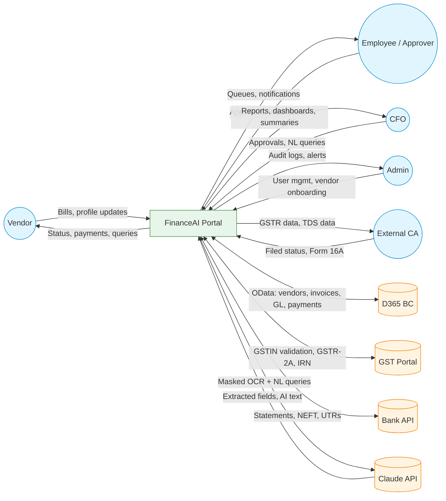
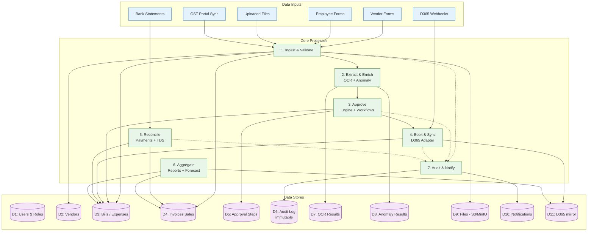
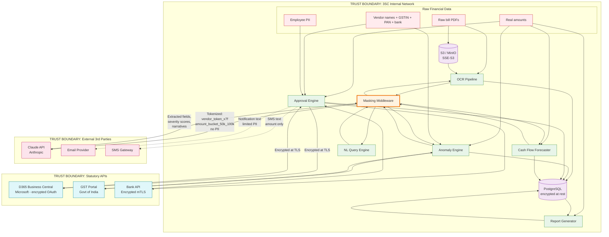
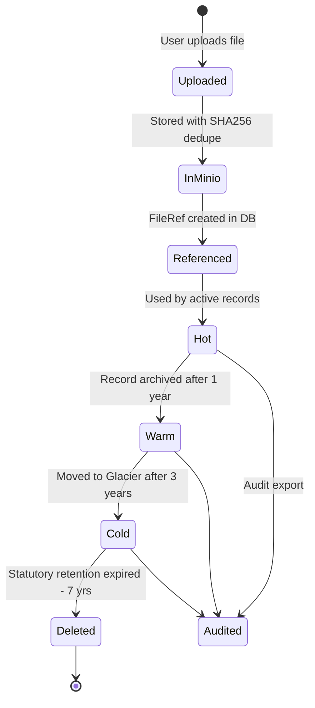

# Whole App — Data Flow Diagram

Tracks how data moves through the entire system, from ingestion to analytics. Includes trust boundaries, encryption points, and PII masking.

## DFD Level 0 — Context

## DFD Level 1 — Major Processes & Data Stores

## DFD Level 2 — Trust Boundaries & Masking

This is the **compliance-critical view**. It shows what data crosses which trust boundaries, where PII is masked, and what reaches third-party services.

## What Gets Masked Before Leaving 3SC

| Field | In Database | Sent to Claude | Sent to D365 | Sent in Email |
|---|---|---|---|---|
| Vendor legal name | Plaintext | `vendor_token_a8f3` | Plaintext (encrypted TLS) | Plaintext |
| Vendor GSTIN | Plaintext | `gstin_token` | Plaintext | Last 4 only |
| Vendor PAN | Plaintext | Not sent | Plaintext | Not sent |
| Bank account number | **Encrypted** | Not sent | Plaintext | Last 4 only |
| Invoice amount | Plaintext | `amount_bucket_50k_100k` | Plaintext | Plaintext |
| Employee name | Plaintext | `emp_token` | Plaintext | First name only |
| Employee email | Plaintext | Not sent | Plaintext | Plaintext |
| Invoice line items | Plaintext | Description text only, no client name | Plaintext | Summary only |
| Internal notes | Plaintext | Not sent | Not sent | Not sent |
| Audit log | Plaintext | Not sent | Not sent | Not sent |

The **masking middleware** is the single chokepoint for all data leaving 3SC's network bound for Claude. No service may bypass it. This is the ISO 27001 / SOC 2 control point.

## Storage Lifecycle

## Data Retention Policy

| Data Type | Retention | Storage |
|---|---|---|
| Active bills, expenses, invoices | Indefinite while live | Hot Postgres |
| Closed records | 7 years (statutory) | Hot for 1y, Warm for 2y, Cold after 3y |
| Audit log | 7 years (immutable) | Hot Postgres + cold backup |
| File attachments | 7 years | Hot S3 → Glacier after 3y |
| OCR raw responses | 90 days | Hot Postgres, then deleted |
| Anomaly model artifacts | Latest + 5 prior | Hot |
| Notifications | 1 year | Hot |
| User session tokens | 24 hours | Redis |
| Cached GSTIN validations | 24 hours | Redis |
