# Expense Management — Use Case Diagram

Detailed actor-to-use-case mapping for the vendor bill / expense module. Status: 🟢 Hackathon scope ⭐ currently designing.

## Use Case Diagram

```mermaid
flowchart LR
    %% Actors
    Vendor((Vendor))
    EmpL1((Emp L1))
    EmpL2((Emp L2))
    HoD((Dept Head))
    FinL1((Fin L1))
    FinL2((Fin L2))
    CFO((CFO))
    Admin((Admin))
    System((System / AI))
    D365((Mock D365))

    subgraph EM["Expense Management"]
        direction TB

        subgraph Submission["Submission"]
            UC1[Submit bill self-service]
            UC2[Save draft on behalf]
            UC3[File bill on behalf]
            UC4[Upload invoice file]
            UC5[Withdraw submission]
            UC6[Dispute on-behalf filing]
            UC7[Resubmit after rejection]
        end

        subgraph AISupport["AI Support"]
            UC8[Trigger OCR]
            UC9[Run anomaly detection]
            UC10[Override anomaly with reason]
            UC11[Get AI explanation]
        end

        subgraph Validation["Validation L1"]
            UC12[Review extracted data]
            UC13[Validate against PO]
            UC14[Validate against communication]
            UC15[Cross-check vendor history]
            UC16[Add validation note]
        end

        subgraph DeptApproval["Dept Chain Approval"]
            UC17[Approve at L1]
            UC18[Approve at L2]
            UC19[Approve at HoD]
            UC20[Reject at any dept step]
            UC21[Raise query at any dept step]
        end

        subgraph FinApproval["Finance Chain Approval"]
            UC22[Validate tax compliance]
            UC23[Check vendor credit limit]
            UC24[Approve at Fin L1]
            UC25[Approve at Fin L2]
            UC26[Approve at Fin Head]
            UC27[Reject at any fin step]
            UC28[Raise query at any fin step]
        end

        subgraph QueryLoop["Query Loop"]
            UC29[Respond to query]
            UC30[Attach evidence to response]
            UC31[Continue thread]
        end

        subgraph D365Booking["D365 Booking"]
            UC32[Book in D365]
            UC33[Retry failed booking]
            UC34[Receive posted webhook]
            UC35[Receive payment webhook]
        end

        subgraph Visibility["Visibility & Tracking"]
            UC36[View own bill list]
            UC37[View bill timeline]
            UC38[View thread participants]
            UC39[Download remittance PDF]
            UC40[Search and filter bills]
        end

        subgraph AdminOps["Admin Operations"]
            UC41[Map L1 to vendor]
            UC42[Configure backup approver]
            UC43[Reactivate expired bill]
            UC44[Reassign deactivated approver]
            UC45[View dispute alerts]
        end

        subgraph Notifications["Notifications"]
            UC46[Receive submission ack]
            UC47[Receive step approval notice]
            UC48[Receive rejection broadcast]
            UC49[Receive SLA reminder]
            UC50[Receive payment confirmation]
        end
    end

    %% Vendor
    Vendor --> UC1
    Vendor --> UC4
    Vendor --> UC5
    Vendor --> UC6
    Vendor --> UC7
    Vendor --> UC29
    Vendor --> UC30
    Vendor --> UC36
    Vendor --> UC37
    Vendor --> UC39
    Vendor --> UC40
    Vendor --> UC46
    Vendor --> UC50

    %% Employee L1
    EmpL1 --> UC2
    EmpL1 --> UC3
    EmpL1 --> UC4
    EmpL1 --> UC12
    EmpL1 --> UC13
    EmpL1 --> UC14
    EmpL1 --> UC15
    EmpL1 --> UC16
    EmpL1 --> UC17
    EmpL1 --> UC20
    EmpL1 --> UC21
    EmpL1 --> UC10
    EmpL1 --> UC29
    EmpL1 --> UC36
    EmpL1 --> UC47
    EmpL1 --> UC48
    EmpL1 --> UC49

    %% Employee L2
    EmpL2 --> UC18
    EmpL2 --> UC20
    EmpL2 --> UC21
    EmpL2 --> UC10
    EmpL2 --> UC47
    EmpL2 --> UC48
    EmpL2 --> UC49

    %% HoD
    HoD --> UC19
    HoD --> UC20
    HoD --> UC21
    HoD --> UC10
    HoD --> UC47
    HoD --> UC48

    %% Finance L1
    FinL1 --> UC22
    FinL1 --> UC23
    FinL1 --> UC24
    FinL1 --> UC27
    FinL1 --> UC28
    FinL1 --> UC10

    %% Finance L2
    FinL2 --> UC25
    FinL2 --> UC27
    FinL2 --> UC28
    FinL2 --> UC10

    %% CFO
    CFO --> UC26
    CFO --> UC27
    CFO --> UC32
    CFO --> UC33

    %% Admin
    Admin --> UC41
    Admin --> UC42
    Admin --> UC43
    Admin --> UC44
    Admin --> UC45

    %% System / AI
    System -.-> UC8
    System -.-> UC9
    System -.-> UC11
    System -.-> UC34
    System -.-> UC35
    System -.-> UC44
    System -.-> UC46
    System -.-> UC47
    System -.-> UC48
    System -.-> UC49
    System -.-> UC50

    %% D365
    D365 -.-> UC34
    D365 -.-> UC35

    classDef actor fill:#e1f5ff,stroke:#0288d1,stroke-width:2px
    classDef sys fill:#f3e5f5,stroke:#7b1fa2
    classDef ext fill:#fff4e1,stroke:#f57c00
    class Vendor,EmpL1,EmpL2,HoD,FinL1,FinL2,CFO,Admin actor
    class System sys
    class D365 ext
```



## Use Case Index

| ID | Use Case | Primary Actor | Preconditions |
|---|---|---|---|
| UC1 | Submit bill self-service | Vendor | Vendor account active, has mapped L1 |
| UC2 | Save draft on behalf | Emp L1 | Vendor mapped to L1 |
| UC3 | File bill on behalf | Emp L1 | Vendor mapped to L1, evidence available |
| UC4 | Upload invoice file | Vendor / L1 | File ≤ 10MB, PDF/JPG/PNG |
| UC5 | Withdraw submission | Vendor | Bill in SUBMITTED state, no L1 action yet |
| UC6 | Dispute on-behalf filing | Vendor | Bill is `is_on_behalf=True` |
| UC7 | Resubmit after rejection | Vendor / L1 | Original bill in REJECTED state |
| UC8 | Trigger OCR | System | File uploaded |
| UC9 | Run anomaly detection | System | Bill in SUBMITTED state |
| UC10 | Override anomaly with reason | Any approver | Anomaly severity HIGH/CRITICAL, reason ≥50 chars |
| UC11 | Get AI explanation | System | Anomaly flagged |
| UC12 | Review extracted data | L1 | Bill in PENDING_L1 |
| UC13 | Validate against PO | L1 | PO reference present |
| UC14 | Validate against communication | L1 | — |
| UC15 | Cross-check vendor history | L1 | Vendor has prior bills |
| UC16 | Add validation note | L1 | Bill in PENDING_L1 |
| UC17 | Approve at L1 | L1 | L1 ≠ filer (SoD) |
| UC18 | Approve at L2 | L2 | L2 ≠ L1 of this bill |
| UC19 | Approve at HoD | HoD | HoD ≠ L1, L2 of this bill |
| UC20 | Reject at any dept step | L1/L2/HoD | Reason ≥30 chars |
| UC21 | Raise query at any dept step | L1/L2/HoD | — |
| UC22 | Validate tax compliance | Fin L1 | — |
| UC23 | Check vendor credit limit | Fin L1 | — |
| UC24 | Approve at Fin L1 | Fin L1 | Bill in PENDING_FIN_L1 |
| UC25 | Approve at Fin L2 | Fin L2 | Bill in PENDING_FIN_L2 |
| UC26 | Approve at Fin Head | CFO | Bill in PENDING_FIN_HEAD |
| UC27 | Reject at any fin step | Fin L1/L2/Head | Reason ≥30 chars |
| UC28 | Raise query at any fin step | Fin L1/L2/Head | — |
| UC29 | Respond to query | Vendor / Filer L1 | Bill in QUERY_RAISED |
| UC30 | Attach evidence to response | Vendor / Filer L1 | — |
| UC31 | Continue thread | Vendor / Filer L1 / Approver | — |
| UC32 | Book in D365 | CFO | Bill in APPROVED state |
| UC33 | Retry failed booking | CFO / Admin | Bill rolled back from PENDING_D365 to APPROVED |
| UC34 | Receive posted webhook | System | Bill in BOOKED_D365 |
| UC35 | Receive payment webhook | System | Bill in POSTED_D365 |
| UC36 | View own bill list | Vendor / L1 | Authenticated |
| UC37 | View bill timeline | Anyone in thread | — |
| UC38 | View thread participants | Anyone in thread | — |
| UC39 | Download remittance PDF | Vendor | Bill in PAID state |
| UC40 | Search and filter bills | Any role | — |
| UC41 | Map L1 to vendor | Admin | Vendor exists |
| UC42 | Configure backup approver | Admin | — |
| UC43 | Reactivate expired bill | Admin | Bill in EXPIRED state |
| UC44 | Reassign deactivated approver | Admin / System | Approver deactivated |
| UC45 | View dispute alerts | Admin | Disputes pending |
| UC46–50 | Various notifications | System → recipients | Triggered by events |
```
