# Expense Management — Flow Diagrams

Comprehensive flows for the vendor bill / expense module: state machine, happy paths, bad paths, and edge cases. This is the deepest module spec.

## 1. Master State Machine

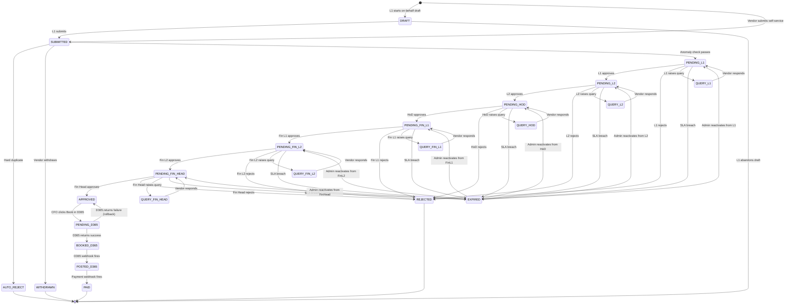

## 2. Happy Path A — Vendor Self-Service Clean Submission

```mermaid
flowchart TD
    Start([Vendor logs in]) --> ClickNew[Click 'Submit New Bill']
    ClickNew --> Form[Form auto-pre-fills<br/>vendor master data]
    Form --> Upload[Vendor uploads invoice PDF]
    Upload --> OCR[OCR extracts data<br/>~6 seconds]
    OCR --> Review[Vendor reviews<br/>auto-filled fields]
    Review --> SelectL1[Select mapped L1 contact]
    SelectL1 --> Submit[Click Submit]
    Submit --> Validate{Server validates<br/>fields and uniqueness}
    Validate -->|Fail| Error[Return errors]
    Error --> Review
    Validate -->|Pass| Created[Bill created in SUBMITTED]
    Created --> Ack[Vendor sees ack page<br/>BILL-2026-0042]
    Created --> EnqAnomaly[Enqueue anomaly task]

    EnqAnomaly --> Anomaly[Anomaly worker runs]
    Anomaly --> AnomResult{Severity?}
    AnomResult -->|Clean / Low| L1State[State: PENDING_L1]
    AnomResult -->|Hard duplicate| AutoRej[State: AUTO_REJECT]

    L1State --> NotifyL1[Notify mapped L1]
    NotifyL1 --> L1Open[L1 opens queue]
    L1Open --> L1Review[L1 reviews PDF + data + history]
    L1Review --> L1Approve[L1 approves with note]
    L1Approve --> L2State[State: PENDING_L2]

    L2State --> L2Approve[L2 approves]
    L2Approve --> HoDState[State: PENDING_HOD]
    HoDState --> HoDApprove[HoD approves]
    HoDApprove --> FinL1State[State: PENDING_FIN_L1]

    FinL1State --> FinL1Check[Fin L1 checks<br/>tax, PO, credit]
    FinL1Check --> FinL1Approve[Fin L1 approves]
    FinL1Approve --> FinL2State[State: PENDING_FIN_L2]
    FinL2State --> FinL2Approve[Fin L2 approves]
    FinL2Approve --> FinHeadState[State: PENDING_FIN_HEAD]
    FinHeadState --> CFOApprove[CFO approves]
    CFOApprove --> ApprovedState[State: APPROVED]

    ApprovedState --> CFOBook[CFO clicks Book in D365]
    CFOBook --> D365Call[Call mock D365 OData]
    D365Call --> D365OK{Success?}
    D365OK -->|No| Rollback[Rollback to APPROVED]
    Rollback --> CFOBook
    D365OK -->|Yes| Booked[State: BOOKED_D365]
    Booked --> WaitPost[Wait for posted webhook ~5s]
    WaitPost --> Posted[State: POSTED_D365]
    Posted --> WaitPay[Wait for payment webhook]
    WaitPay --> Paid[State: PAID]
    Paid --> NotifyAll[Notify full thread + vendor]
    NotifyAll --> End([Done])

    classDef start fill:#c8e6c9,stroke:#2e7d32
    classDef happy fill:#e8f5e9,stroke:#388e3c
    classDef state fill:#fff9c4,stroke:#f57f17
    classDef ai fill:#f3e5f5,stroke:#7b1fa2
    classDef ext fill:#e0f7fa,stroke:#00838f
    classDef done fill:#c8e6c9,stroke:#2e7d32

    class Start,End start
    class ClickNew,Form,Upload,Review,SelectL1,Submit,Ack,L1Review,L1Approve,L2Approve,HoDApprove,FinL1Check,FinL1Approve,FinL2Approve,CFOApprove,CFOBook,NotifyAll happy
    class Created,L1State,L2State,HoDState,FinL1State,FinL2State,FinHeadState,ApprovedState,Booked,Posted,Paid,AutoRej state
    class OCR,Anomaly,EnqAnomaly,AnomResult,AnomResult ai
    class D365Call,D365OK,WaitPost,WaitPay ext
```

## 3. Happy Path B — L1 Files on Behalf of Vendor

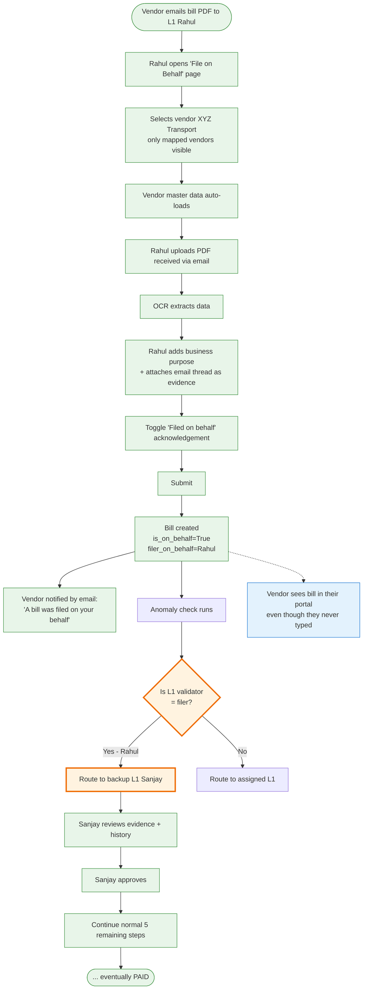

## 4. Happy Path C — Anomaly Override

```mermaid
flowchart TD
    Submit[Vendor submits ₹1,15,000 bill<br/>vendor avg is ₹80,000] --> Anomaly[Anomaly worker runs]
    Anomaly --> ML[Isolation Forest:<br/>z-score = 2.8]
    ML --> Flag[Severity: HIGH<br/>signal: Amount Deviation]
    Flag --> L1State[State: PENDING_L1<br/>anomaly_severity=HIGH]
    L1State --> L1Open[L1 sees amber-highlighted bill]
    L1Open --> AnomPanel[Anomaly panel shows:<br/>43% above 6-mo average<br/>last 6 amounts: ~₹80k]
    AnomPanel --> L1Investigate[L1 checks email for context]
    L1Investigate --> Found[Finds HoD email<br/>'New staging env approved']
    Found --> Override[Click Approve<br/>mandatory override modal]
    Override --> ReasonInput[Enter override reason<br/>min 50 chars]
    ReasonInput --> Audit[Audit log: anomaly_override<br/>severity, reason, user]
    Audit --> L2State[State: PENDING_L2]
    L2State --> L2View[L2 sees anomaly + override reason<br/>prominently displayed]
    L2View --> L2Approve[L2 approves without re-investigation]
    L2Approve --> Continue[Continue chain]
    Continue --> Paid([... eventually PAID])

    classDef ai fill:#f3e5f5,stroke:#7b1fa2
    classDef warn fill:#fff3e0,stroke:#ef6c00
    classDef happy fill:#e8f5e9,stroke:#388e3c
    class Anomaly,ML,Flag,AnomPanel ai
    class L1State,Override,ReasonInput,Audit warn
    class Submit,L1Open,L1Investigate,Found,L2State,L2View,L2Approve,Continue,Paid happy
```

## 5. Bad Path A — L1 Rejection (Wrong Amount)

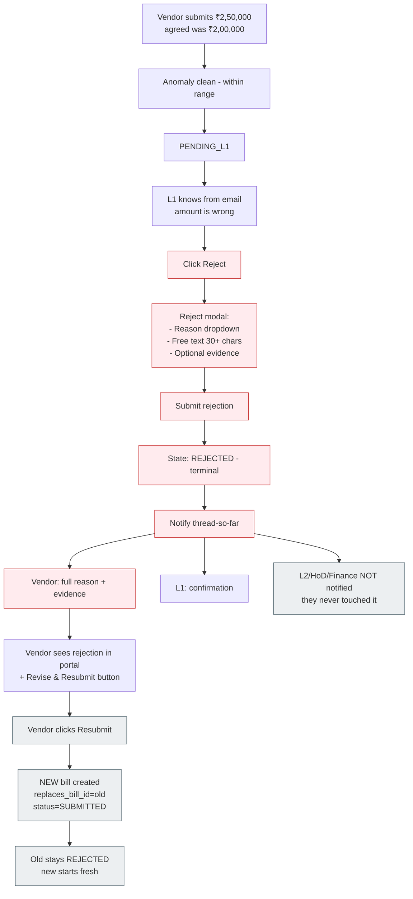

## 6. Bad Path B — Mid-Chain Rejection (HoD on Budget)

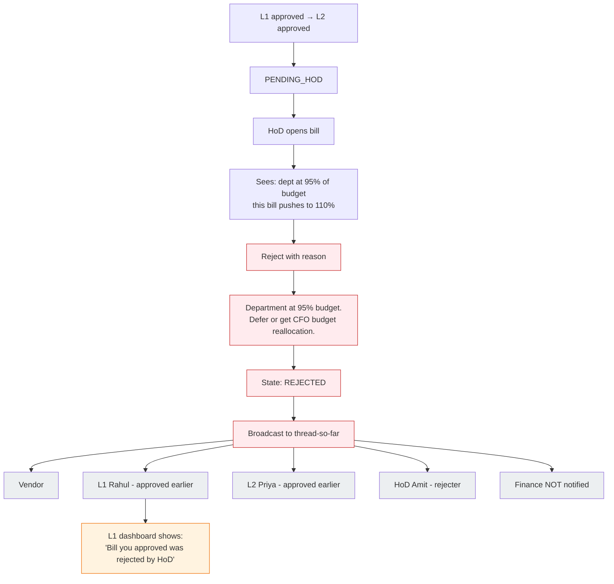

## 7. Bad Path C — Query Loop Leading to Rejection

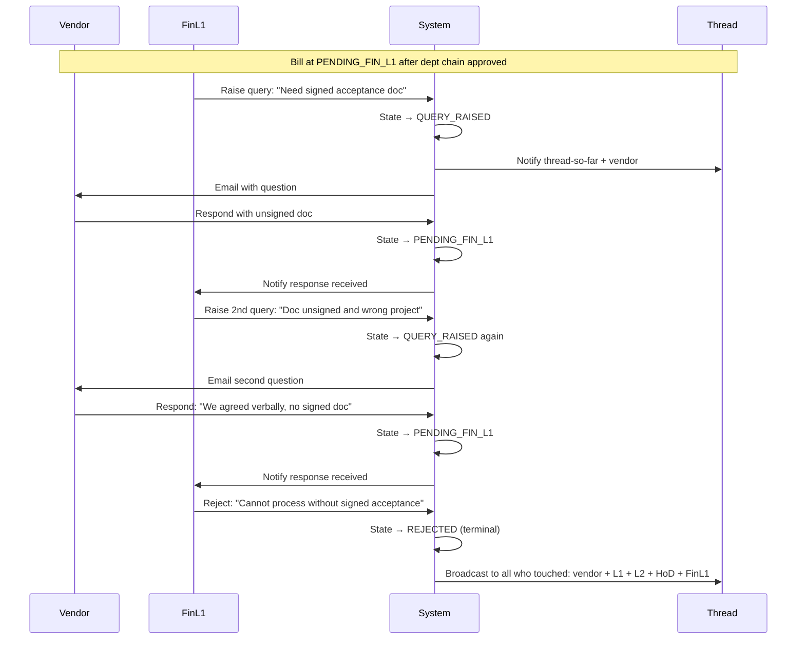

## 8. Bad Path D — Mock D365 Booking Failure

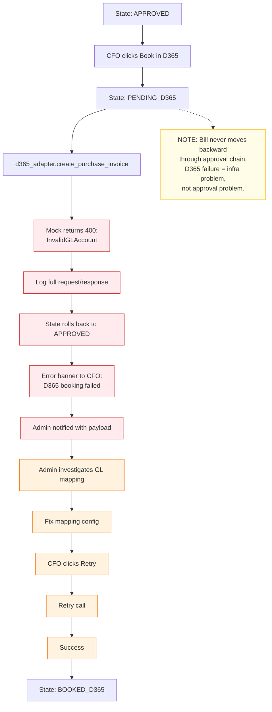

## 9. Edge Case — Approver Deactivated Mid-Flow

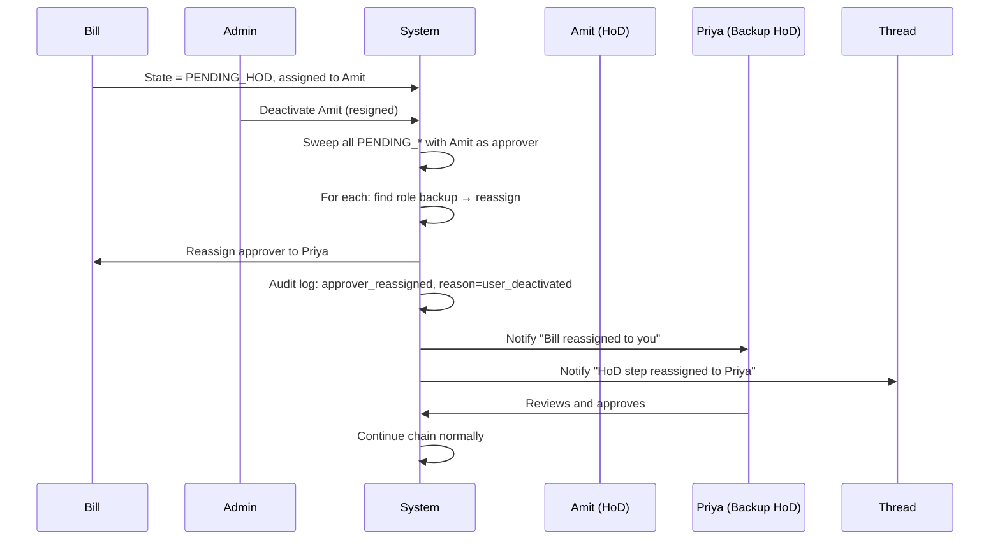

## 10. Edge Case — Delegate Already In Chain

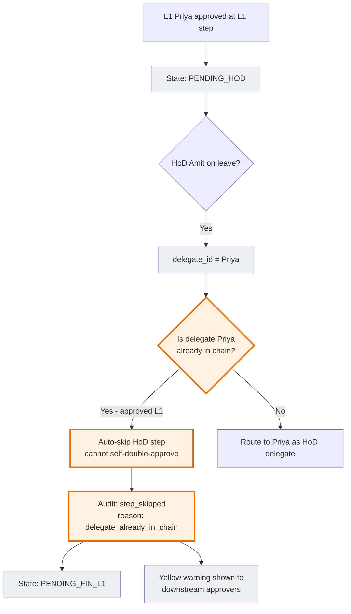

## 11. Edge Case — Vendor Disputes On-Behalf Filing

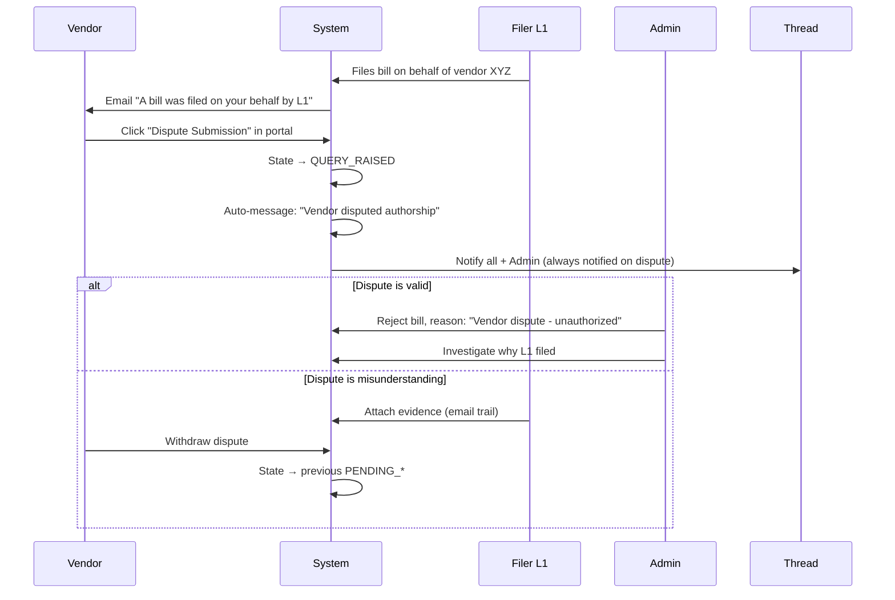

## 12. Edge Case — Race Condition (Optimistic Lock)

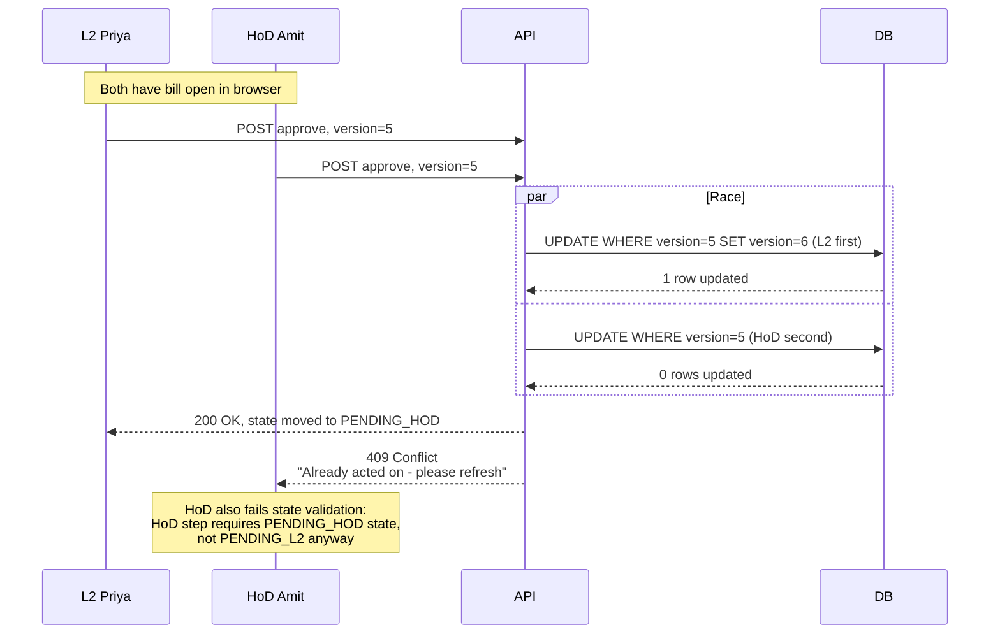

## 13. Edge Case — SLA Breach and Reactivation

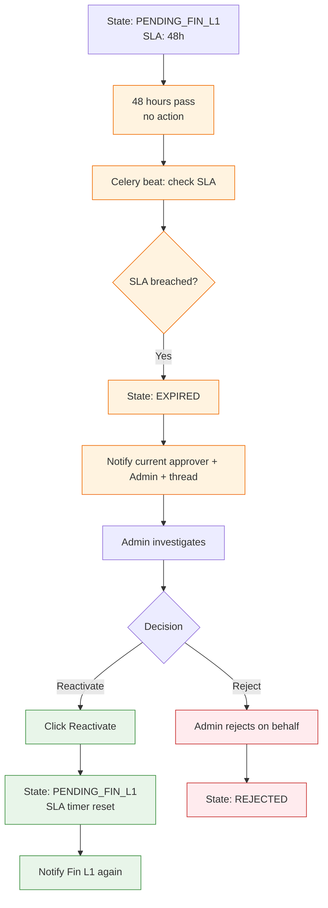

## 14. Edge Case — Vendor Bank Account Change Holds Payment

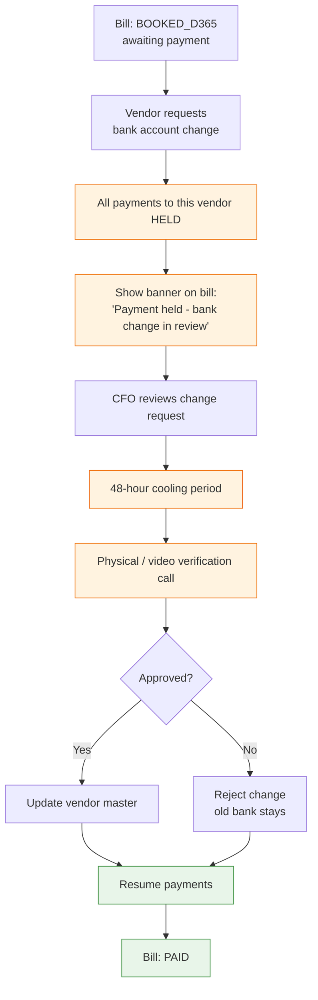

## 15. Notification Broadcast on Rejection

```mermaid
flowchart LR
    subgraph Thread["Thread members at time of rejection"]
        Vendor
        L1
        L2
        HoD
        FinL1[Finance L1<br/>rejecter]
    end

    subgraph NotInThread["Not yet in thread - not notified"]
        FinL2[Finance L2]
        FinHead[Finance Head]
    end

    Reject[REJECTED at FinL1 step] -.-> Vendor
    Reject -.-> L1
    Reject -.-> L2
    Reject -.-> HoD
    Reject -.-> FinL1
    Reject -.x FinL2
    Reject -.x FinHead

    classDef in fill:#e8f5e9,stroke:#388e3c
    classDef out fill:#eceff1,stroke:#90a4ae
    classDef rej fill:#ffebee,stroke:#c62828
    class Vendor,L1,L2,HoD,FinL1 in
    class FinL2,FinHead out
    class Reject rej
```
