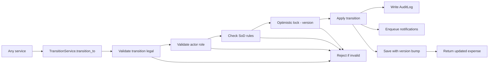
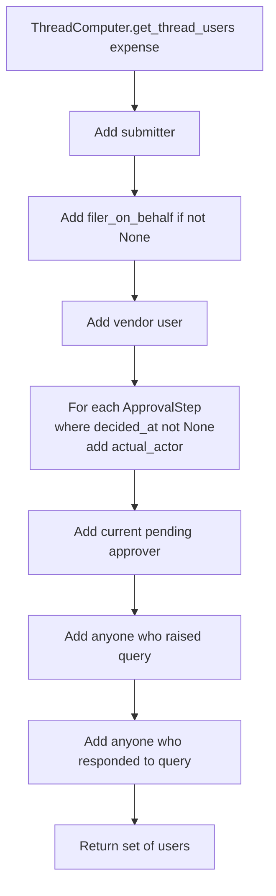
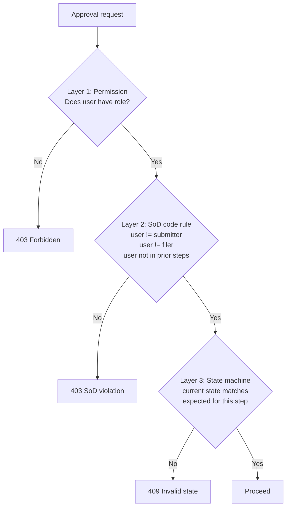

# Expense Management — Architecture Diagram

Component-level architecture of the expense management module. Shows how Django apps, Celery workers, services, and external interfaces compose to deliver the module.

## Module Component Architecture

```mermaid
flowchart TB
    subgraph FE["Frontend - React"]
        VPortal[Vendor Portal<br/>/vendor/bills/*]
        EPortal[Employee Portal<br/>/employee/bills/*]
        FQueue[Finance Queue<br/>/finance/bills/*]
        CFODash[CFO Dashboard<br/>/cfo/*]
    end

    Gateway[API Gateway / Nginx]
    VPortal --> Gateway
    EPortal --> Gateway
    FQueue --> Gateway
    CFODash --> Gateway

    subgraph DjangoApp["Django: apps/expenses"]
        direction TB

        subgraph API["API Layer - DRF Views"]
            VVApi[VendorBillViewSet]
            EVApi[OnBehalfViewSet]
            QApi[QueueViewSet]
            ApprApi[ApprovalActionViewSet]
            QryApi[QueryViewSet]
            BookApi[D365BookingViewSet]
            HookApi[WebhookViewSet]
        end

        subgraph Domain["Domain Layer"]
            ExpenseModel[Expense Model<br/>+ State Machine]
            StepModel[ExpenseApprovalStep]
            QueryModel[ExpenseQuery]
            Mapping[VendorL1Mapping]
            BackupCfg[BackupApproverConfig]
        end

        subgraph Services["Service Layer"]
            SubSvc[SubmissionService]
            ApproveSvc[ApprovalService<br/>delegates to engine]
            TransitionSvc[TransitionService<br/>state machine guard]
            NotifSvc[NotificationDispatcher]
            ThreadSvc[ThreadComputer]
        end
    end

    Gateway --> VVApi
    Gateway --> EVApi
    Gateway --> QApi
    Gateway --> ApprApi
    Gateway --> QryApi
    Gateway --> BookApi
    Gateway --> HookApi

    VVApi --> SubSvc
    EVApi --> SubSvc
    SubSvc --> ExpenseModel
    SubSvc --> TransitionSvc

    ApprApi --> ApproveSvc
    ApproveSvc --> TransitionSvc
    TransitionSvc --> ExpenseModel
    TransitionSvc --> StepModel
    TransitionSvc --> NotifSvc
    NotifSvc --> ThreadSvc

    QryApi --> QueryModel
    QryApi --> TransitionSvc

    BookApi --> D365Adapter[d365_adapter.py]
    HookApi --> TransitionSvc

    subgraph SharedCaps["Shared Capabilities"]
        OcrApp[apps/ocr]
        AnomApp[apps/anomaly]
        ApprovalApp[apps/approvals<br/>generic engine]
        AuditApp[apps/core - AuditLog]
        FilesApp[apps/core - FileRef]
        AccountsApp[apps/accounts<br/>RBAC]
        NotifApp[apps/notifications]
    end

    SubSvc --> OcrApp
    SubSvc --> AnomApp
    SubSvc --> FilesApp
    ApproveSvc --> ApprovalApp
    TransitionSvc --> AuditApp
    NotifSvc --> NotifApp
    ApprApi --> AccountsApp
    BookApi --> AccountsApp

    subgraph Workers["Celery Workers"]
        OcrWorker[OCR Worker]
        AnomWorker[Anomaly Worker]
        SlaWorker[SLA Beat Worker]
        NotifWorker[Notification Worker]
    end

    OcrApp -.->|enqueue| OcrWorker
    AnomApp -.->|enqueue| AnomWorker
    NotifApp -.->|enqueue| NotifWorker

    Beat[Celery Beat] -.->|every 5min| SlaWorker
    SlaWorker --> StepModel
    SlaWorker --> NotifApp

    subgraph Storage["Storage"]
        PG[(PostgreSQL<br/>expenses tables)]
        Minio[(MinIO<br/>bill PDFs)]
        Redis[(Redis<br/>broker)]
    end

    ExpenseModel --> PG
    StepModel --> PG
    QueryModel --> PG
    Mapping --> PG
    BackupCfg --> PG
    AuditApp --> PG
    FilesApp --> Minio
    OcrWorker --> Redis
    AnomWorker --> Redis
    NotifWorker --> Redis
    SlaWorker --> Redis

    subgraph External["External"]
        Claude[Claude Vision API<br/>via mask service]
        MockD365[Mock D365 App]
        SMTP[Email SMTP]
    end

    OcrWorker --> Claude
    D365Adapter --> MockD365
    NotifWorker --> SMTP
    MockD365 -.->|webhook 5s later| HookApi

    classDef fe fill:#e1f5ff,stroke:#0288d1
    classDef api fill:#e8f5e9,stroke:#388e3c
    classDef domain fill:#dcedc8,stroke:#558b2f
    classDef svc fill:#fff9c4,stroke:#f9a825
    classDef shared fill:#f3e5f5,stroke:#7b1fa2
    classDef worker fill:#fff3e0,stroke:#f57c00
    classDef store fill:#f5f5f5,stroke:#616161
    classDef ext fill:#fce4ec,stroke:#c2185b

    class VPortal,EPortal,FQueue,CFODash fe
    class VVApi,EVApi,QApi,ApprApi,QryApi,BookApi,HookApi api
    class ExpenseModel,StepModel,QueryModel,Mapping,BackupCfg domain
    class SubSvc,ApproveSvc,TransitionSvc,NotifSvc,ThreadSvc svc
    class OcrApp,AnomApp,ApprovalApp,AuditApp,FilesApp,AccountsApp,NotifApp shared
    class OcrWorker,AnomWorker,SlaWorker,NotifWorker,Beat worker
    class PG,Minio,Redis store
    class Claude,MockD365,SMTP ext
```

## Key Design Patterns

### State Machine Guard
All state changes flow through `TransitionService.transition_to(expense, new_status, actor, reason)`. No code outside this service ever sets `expense.status` directly. Direct assignment raises `IllegalStateAssignment`.

### Thread Computation
The `ThreadComputer` is the single source of truth for "who has touched this bill". Used for visibility checks and rejection broadcast notifications.

### SoD Enforcement Cascade
Self-approval and double-approval are blocked at three layers:

