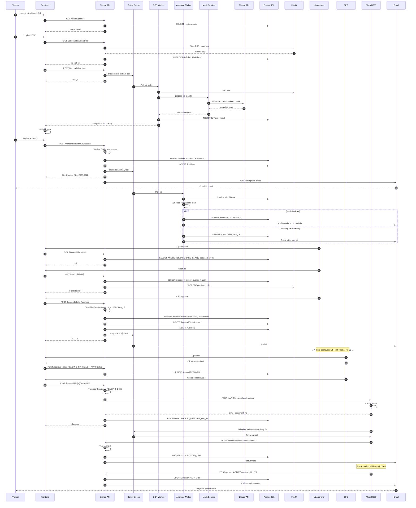
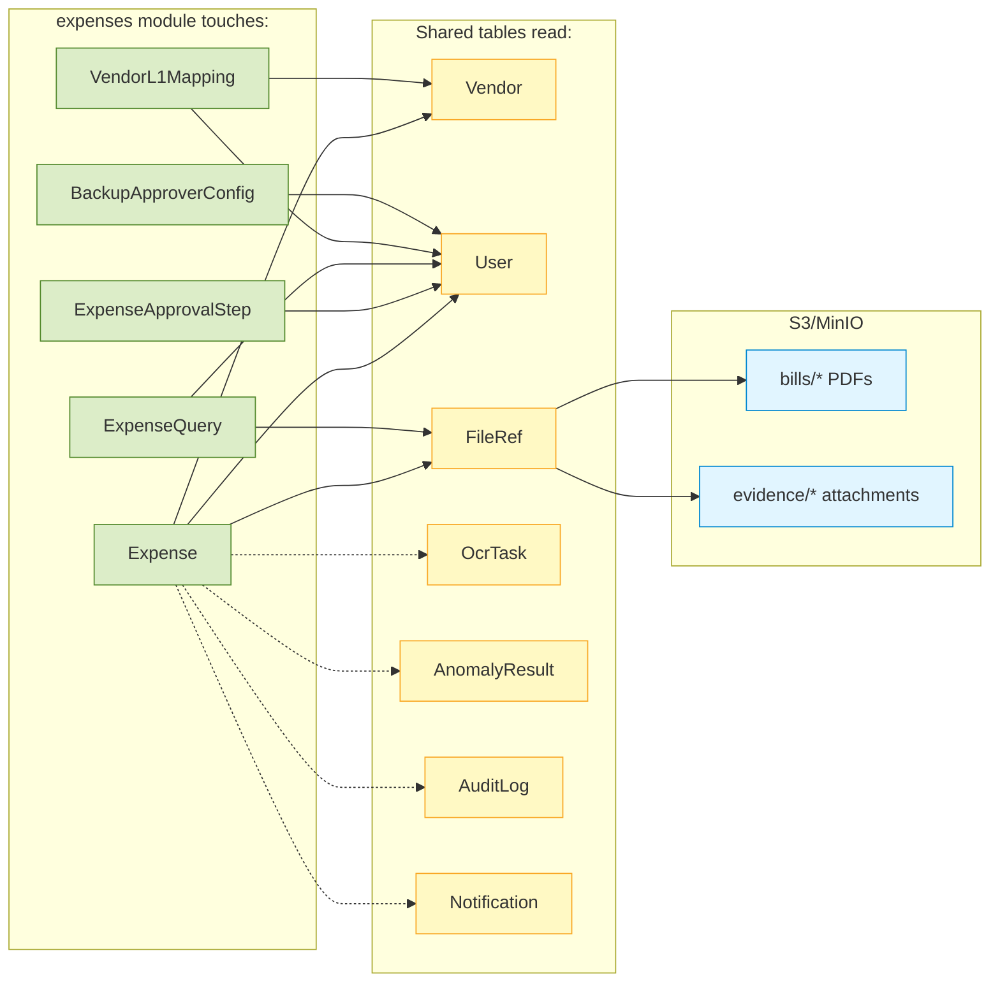

# Expense Management — Data Flow Diagram

## Submission to Payment — Sequence View

```mermaid
sequenceDiagram
    autonumber
    participant V as Vendor
    participant FE as Frontend
    participant API as Django API
    participant Q as Celery Queue
    participant OCR as OCR Worker
    participant Anom as Anomaly Worker
    participant Mask as Mask Service
    participant Claude as Claude API
    participant DB as PostgreSQL
    participant S3 as MinIO
    participant L1 as L1 Approver
    participant CFO
    participant D365 as Mock D365
    participant Email

    V->>FE: Login + click Submit Bill
    FE->>API: GET /vendor/profile
    API->>DB: SELECT vendor master
    API-->>FE: Pre-fill fields

    V->>FE: Upload PDF
    FE->>API: POST /vendor/bills/upload-file
    API->>S3: Store PDF, return key
    S3-->>API: bucket+key
    API->>DB: INSERT FileRef sha256 dedupe
    API-->>FE: file_ref_id

    FE->>API: POST /vendor/bills/extract
    API->>Q: enqueue ocr_extract task
    API-->>FE: task_id

    Q->>OCR: Pick up task
    OCR->>S3: GET file
    OCR->>Mask: prepare for Claude
    Mask->>Claude: Vision API call - masked context
    Claude-->>Mask: extracted fields
    Mask-->>OCR: unmasked result
    OCR->>DB: INSERT OcrTask + result
    OCR-->>FE: completion via polling

    FE->>FE: Auto-fill form
    V->>FE: Review + submit
    FE->>API: POST /vendor/bills with full payload
    API->>API: Validate fields, uniqueness
    API->>DB: INSERT Expense status=SUBMITTED
    API->>DB: INSERT AuditLog
    API->>Q: enqueue anomaly task
    API-->>FE: 201 Created BILL-2026-0042
    API->>Email: Acknowledgment email
    Email-->>V: Email received

    Q->>Anom: Pick up
    Anom->>DB: Load vendor history
    Anom->>Anom: Run rules + Isolation Forest
    alt Hard duplicate
        Anom->>DB: UPDATE status=AUTO_REJECT
        Anom->>Email: Notify vendor + L1 + Admin
    else Anomaly clean or low
        Anom->>DB: UPDATE status=PENDING_L1
        Anom->>Email: Notify L1 of new bill
    end

    L1->>FE: Open queue
    FE->>API: GET /finance/bills/queue
    API->>DB: SELECT WHERE status=PENDING_L1 AND assigned_l1=me
    API-->>FE: List

    L1->>FE: Open bill
    FE->>API: GET /vendor/bills/{id}
    API->>DB: SELECT expense + steps + queries + audit
    API->>S3: GET PDF presigned URL
    API-->>FE: Full bill detail

    L1->>FE: Click Approve
    FE->>API: POST /finance/bills/{id}/approve
    API->>API: TransitionService.transition_to PENDING_L2
    API->>DB: UPDATE expense status=PENDING_L2 version++
    API->>DB: INSERT ApprovalStep decided
    API->>DB: INSERT AuditLog
    API->>Q: enqueue notify task
    API-->>FE: 200 OK
    Q->>Email: Notify L2

    Note over L1,CFO: ... 4 more approvals: L2, HoD, Fin L1, Fin L2 ...

    CFO->>FE: Open bill
    CFO->>FE: Click Approve final
    FE->>API: POST /approve - state PENDING_FIN_HEAD → APPROVED
    API->>DB: UPDATE status=APPROVED

    CFO->>FE: Click Book in D365
    FE->>API: POST /finance/bills/{id}/book-d365
    API->>API: TransitionService → PENDING_D365
    API->>D365: POST /api/v2.0/.../purchaseInvoices
    D365->>D365: Create record
    D365-->>API: 201 + document_no
    API->>DB: UPDATE status=BOOKED_D365 d365_doc_no
    API-->>FE: Success

    D365->>Q: Schedule webhook task delay 5s
    Q->>D365: Fire webhook
    D365->>API: POST /webhooks/d365 status=posted
    API->>API: Verify HMAC
    API->>DB: UPDATE status=POSTED_D365
    API->>Email: Notify thread

    Note over D365: Admin marks paid in mock D365
    D365->>API: POST /webhooks/d365/payment with UTR
    API->>DB: UPDATE status=PAID + UTR
    API->>Email: Notify thread + vendor
    Email-->>V: Payment confirmation
```

## Data Stores Used by Module

```mermaid
flowchart LR
    subgraph Module["expenses module touches:"]
        E[Expense]
        ES[ExpenseApprovalStep]
        EQ[ExpenseQuery]
        VLM[VendorL1Mapping]
        BAC[BackupApproverConfig]
    end

    subgraph SharedTables["Shared tables read:"]
        V[Vendor]
        U[User]
        FR[FileRef]
        OT[OcrTask]
        AR[AnomalyResult]
        AL[AuditLog]
        N[Notification]
    end

    subgraph S3Bucket["S3/MinIO"]
        Bills[bills/* PDFs]
        Evidence[evidence/* attachments]
    end

    E --> V
    E --> U
    E --> FR
    ES --> U
    EQ --> U
    EQ --> FR
    VLM --> V
    VLM --> U
    BAC --> U

    E -.-> OT
    E -.-> AR
    E -.-> AL
    E -.-> N

    FR --> Bills
    FR --> Evidence

    classDef own fill:#dcedc8,stroke:#558b2f
    classDef shared fill:#fff9c4,stroke:#f9a825
    classDef store fill:#e1f5ff,stroke:#0288d1
    class E,ES,EQ,VLM,BAC own
    class V,U,FR,OT,AR,AL,N shared
    class Bills,Evidence store
```

## Field-Level Data Flow Through Pipeline

```mermaid
flowchart LR
    PDF[PDF File] -->|raw bytes| OCR[OCR Worker]
    OCR -->|extracted fields| Stage1[Form auto-fill]
    Stage1 -->|user-confirmed| Submit[Submission validation]
    Submit -->|valid record| Expense[Expense row created]
    Expense -->|amount + vendor + history| Anomaly[Anomaly check]
    Anomaly -->|severity + signals| AnomalyResult[AnomalyResult row]
    Expense -->|state transitions| Steps[ApprovalStep rows]
    Steps -->|all approved| D365Map[D365 field mapping]
    D365Map -->|OData payload| MockD365[Mock D365 PI]
    MockD365 -->|document_no| Expense
    MockD365 -->|webhook| ExpenseFinal[Expense PAID]

    classDef data fill:#e1f5ff
    classDef proc fill:#e8f5e9
    classDef store fill:#f3e5f5
    class PDF,Stage1,D365Map data
    class OCR,Submit,Anomaly,Steps proc
    class Expense,AnomalyResult,MockD365,ExpenseFinal store
```
