# Invoice Management (Sales) — Use Case Diagram

Sales invoice issuance to clients across 4 service lines (SaaS, AAAS, Transport, Warehouse). Status: 🟡 Phase 2.

```mermaid
flowchart LR
    FinL1((Finance L1))
    FinL2((Finance L2))
    CFO((CFO))
    Client((Client))
    System((System))
    GST((GST Portal))
    Bank((Bank))
    D365((D365))

    subgraph IM["Invoice Management"]
        UC1[Create draft invoice]
        UC2[Select service-line template]
        UC3[Pull client master data]
        UC4[Validate GSTIN live]
        UC5[Validate SAC code]
        UC6[Auto-calc CGST SGST IGST]
        UC7[Auto-calc TDS]
        UC8[Apply currency conversion]
        UC9[Generate e-invoice IRN]
        UC10[Embed QR code in PDF]
        UC11[Send invoice to client]
        UC12[Track view receipts]
        UC13[Track overdue status]
        UC14[Trigger Stage 1 reminder]
        UC15[Trigger Stage 2 notice]
        UC16[Trigger Stage 3 escalation]
        UC17[Mark legal referral]
        UC18[Reconcile bank receipt]
        UC19[Apply partial payment]
        UC20[Issue credit note]
        UC21[Mark dispute]
        UC22[Resolve dispute]
        UC23[Track Form 16A receipt]
        UC24[Sync to D365]
        UC25[Export invoice register]
    end

    FinL1 --> UC1
    FinL1 --> UC2
    FinL1 --> UC3
    FinL1 --> UC11
    FinL1 --> UC18
    FinL1 --> UC19
    FinL1 --> UC23

    FinL2 --> UC15
    FinL2 --> UC20
    FinL2 --> UC22
    FinL2 --> UC25

    CFO --> UC16
    CFO --> UC17

    Client --> UC11
    Client --> UC12
    Client --> UC21

    System -.-> UC4
    System -.-> UC5
    System -.-> UC6
    System -.-> UC7
    System -.-> UC8
    System -.-> UC9
    System -.-> UC13
    System -.-> UC14

    GST -.-> UC4
    GST -.-> UC9
    Bank -.-> UC18
    D365 -.-> UC24

    classDef actor fill:#e1f5ff,stroke:#0288d1
    classDef ext fill:#fff4e1,stroke:#f57c00
    class FinL1,FinL2,CFO,Client actor
    class System,GST,Bank,D365 ext
```

## Use Case Index

| ID | Use Case | Actor | Notes |
|---|---|---|---|
| UC1 | Create draft invoice | Fin L1 | Starts in Draft state |
| UC2 | Select service-line template | Fin L1 | SaaS / AAAS / Transport / Warehouse |
| UC3 | Pull client master data | Fin L1 | Auto-populates GSTIN, address, payment terms |
| UC4 | Validate GSTIN live | System | Calls GST portal API |
| UC5 | Validate SAC code | System | Against HSN/SAC master |
| UC6 | Auto-calc CGST SGST IGST | System | Based on Place of Supply |
| UC7 | Auto-calc TDS | System | From client TDS section |
| UC8 | Apply currency conversion | System | RBI rate on invoice date for USD |
| UC9 | Generate e-invoice IRN | System | If client turnover > ₹5Cr |
| UC10 | Embed QR code in PDF | System | After IRN generation |
| UC11 | Send invoice to client | Fin L1 | Email + portal link |
| UC12 | Track view receipts | System | Email open + portal link click |
| UC13 | Track overdue status | System | Day-after-due trigger |
| UC14 | Trigger Stage 1 reminder | System | Day +1, friendly tone |
| UC15 | Trigger Stage 2 notice | Fin L2 | Day +7, firm tone, FM email |
| UC16 | Trigger Stage 3 escalation | CFO | Day +15, formal, CFO email |
| UC17 | Mark legal referral | CFO | Day +30 |
| UC18 | Reconcile bank receipt | Fin L1 | Bank statement upload + auto-match |
| UC19 | Apply partial payment | Fin L1 | Tracks remaining balance |
| UC20 | Issue credit note | Fin L2 | Auto-generates with GST reversal |
| UC21 | Mark dispute | Client | Via portal or email |
| UC22 | Resolve dispute | Fin L2 | Closes dispute, may issue CN |
| UC23 | Track Form 16A | Fin L1 | Quarterly tracker |
| UC24 | Sync to D365 | System | Posted Sales Invoice |
| UC25 | Export invoice register | Fin L2 | Monthly + on-demand |
