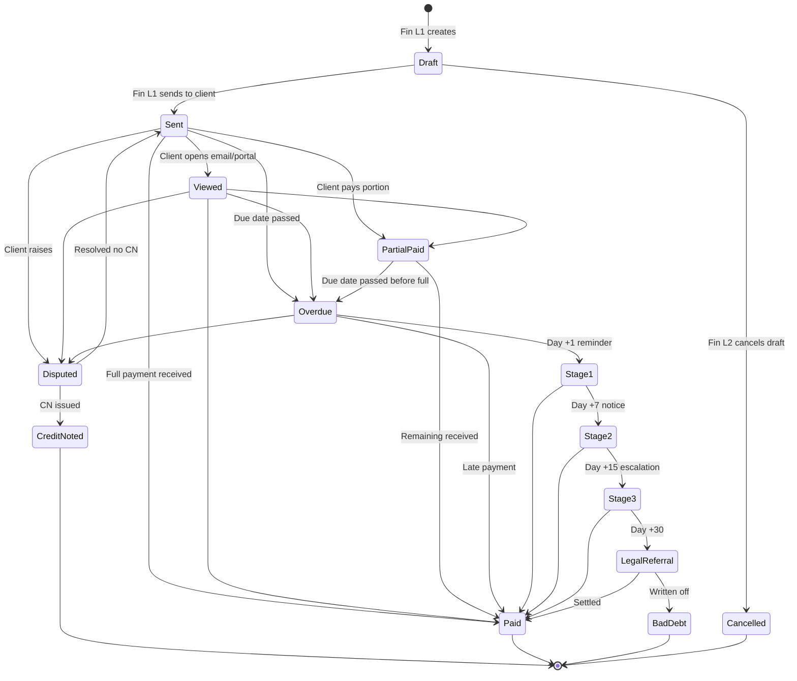
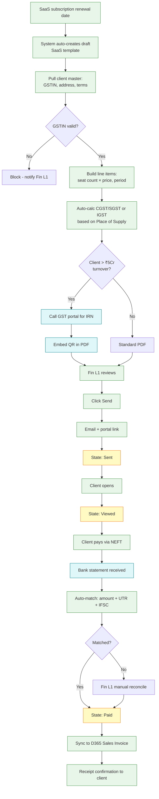
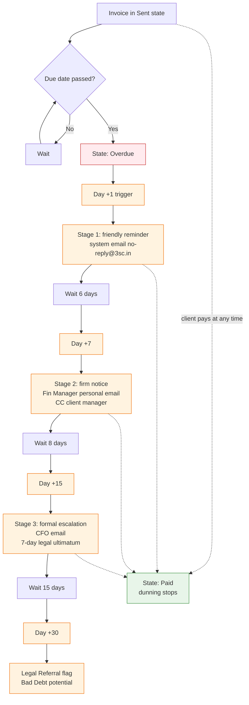
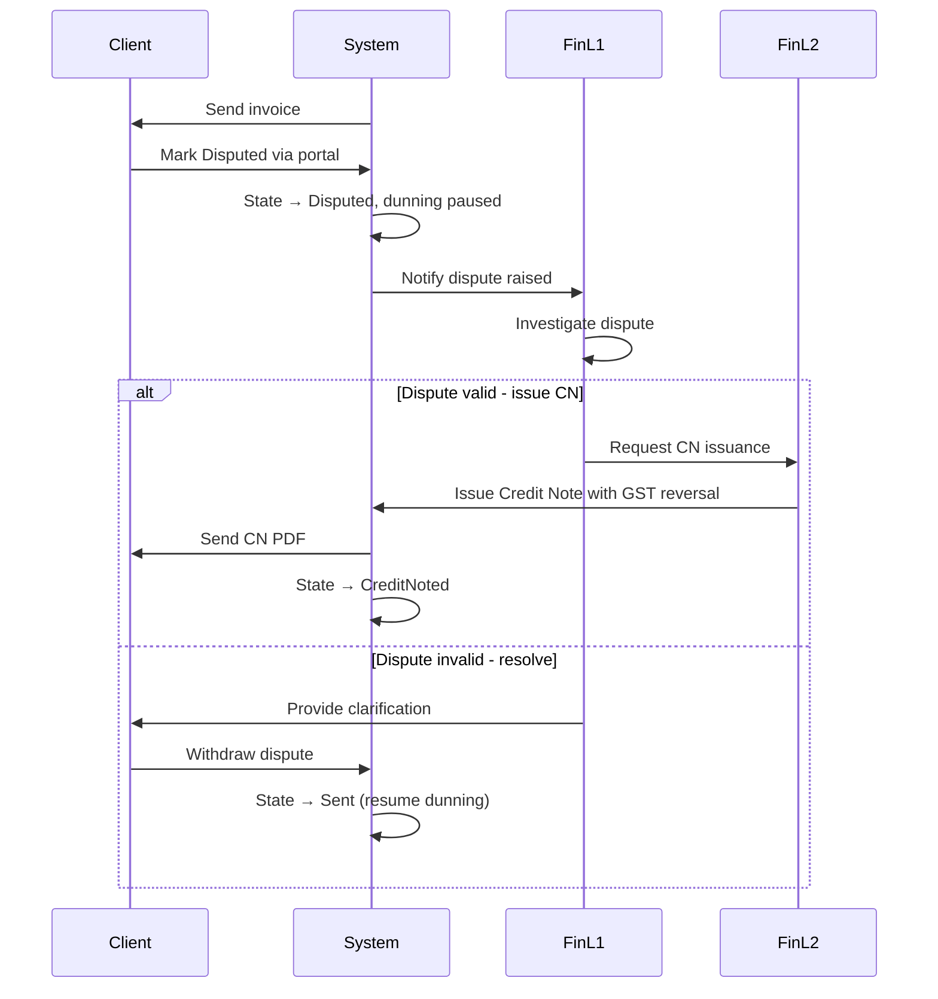

# Invoice Management — Flow Diagrams

## State Machine

## Happy Path — SaaS Subscription Invoice

## Bad Path — Overdue Triggering Dunning Sequence

## Bad Path — Client Disputes

## Edge Cases

```mermaid
flowchart TD
    EC1[Partial Payment] --> EC1Detail[Apply ₹X to invoice<br/>track remaining<br/>continue dunning on balance]
    EC2[GSTIN suspended<br/>before invoice send] --> EC2Detail[Block send<br/>notify Fin L1 + Admin<br/>require client GSTIN update]
    EC3[Currency mismatch<br/>USD invoice] --> EC3Detail[Show INR equivalent<br/>at RBI rate on invoice date<br/>fixed for life of invoice]
    EC4[E-invoice IRN portal down] --> EC4Detail[Queue retry every 15min<br/>block send until IRN received]
    EC5[Bank statement<br/>match ambiguous] --> EC5Detail[Multiple invoices same amount<br/>flag for Fin L1 manual<br/>do not auto-apply]
    EC6[TDS deducted by client<br/>but no Form 16A] --> EC6Detail[Quarterly alert<br/>track in Form 16A pending<br/>contact client]
    EC7[Credit note issued<br/>after partial payment] --> EC7Detail[CN amount cannot exceed<br/>net unpaid<br/>refund flow if needed]
    EC8[Invoice cancelled<br/>after send] --> EC8Detail[Cancellation requires CN<br/>cannot just delete<br/>audit trail preserved]

    classDef ec fill:#f3e5f5,stroke:#7b1fa2
    classDef detail fill:#fff9c4,stroke:#f57f17
    class EC1,EC2,EC3,EC4,EC5,EC6,EC7,EC8 ec
    class EC1Detail,EC2Detail,EC3Detail,EC4Detail,EC5Detail,EC6Detail,EC7Detail,EC8Detail detail
```

