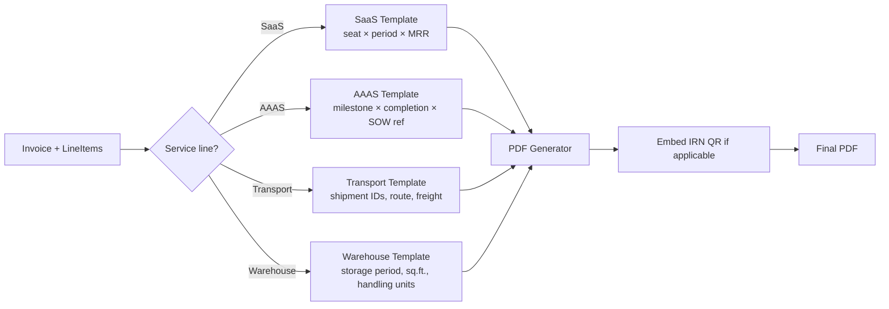

# Invoice Management — Architecture Diagram

```mermaid
flowchart TB
    subgraph FE["Frontend"]
        FinUI[Finance Invoice UI]
        ClientPortal[Client Portal Phase 2<br/>view + dispute]
    end

    Gateway[API Gateway]
    FinUI --> Gateway
    ClientPortal --> Gateway

    subgraph DjangoApp["Django: apps/invoices"]
        IVApi[InvoiceViewSet]
        TplApi[TemplateViewSet<br/>4 service lines]
        DunApi[DunningViewSet]
        ReconApi[ReconcileViewSet]
        DispApi[DisputeViewSet]
        CNApi[CreditNoteViewSet]

        InvModel[Invoice Model]
        LineModel[InvoiceLineItem]
        CNModel[CreditNote]
        DispModel[Dispute]
        DunModel[DunningEvent]
        RecModel[Receipt]

        SvcCreate[InvoiceCreationService]
        SvcRender[TemplateRenderer<br/>SaaS/AAAS/Transport/Warehouse]
        SvcEInv[EInvoiceService<br/>IRN generation]
        SvcDun[DunningEngine]
        SvcRecon[ReconciliationService]
        SvcMatch[BankMatchService]
    end

    Gateway --> IVApi
    Gateway --> TplApi
    Gateway --> DunApi
    Gateway --> ReconApi
    Gateway --> DispApi
    Gateway --> CNApi

    IVApi --> SvcCreate
    SvcCreate --> SvcRender
    SvcCreate --> SvcEInv
    SvcCreate --> InvModel
    DunApi --> SvcDun
    ReconApi --> SvcRecon
    SvcRecon --> SvcMatch

    subgraph Workers["Celery Workers"]
        DunWorker[Dunning Scheduler<br/>daily beat]
        ReconWorker[Bank Recon Worker]
        EmailWorker[Email Worker]
        EInvWorker[E-Invoice Worker]
    end

    SvcDun -.-> DunWorker
    SvcRecon -.-> ReconWorker
    SvcEInv -.-> EInvWorker

    Beat[Celery Beat] -.->|daily| DunWorker

    subgraph Shared["Shared"]
        AuditApp[apps/core - Audit]
        FilesApp[apps/core - Files]
        NotifApp[apps/notifications]
        ApprovalApp[apps/approvals<br/>for CN approval]
        AccountsApp[apps/accounts]
    end

    SvcCreate --> AuditApp
    SvcCreate --> FilesApp
    DunWorker --> NotifApp
    CNApi --> ApprovalApp
    IVApi --> AccountsApp

    subgraph DB[(PostgreSQL)]
        Tables[invoices, invoice_line_items,<br/>credit_notes, disputes,<br/>dunning_events, receipts]
    end

    InvModel --> DB
    LineModel --> DB
    CNModel --> DB
    DispModel --> DB
    DunModel --> DB
    RecModel --> DB

    subgraph External["External"]
        GSTPortal[GST Portal API<br/>IRN generation]
        BankAPI[Bank API<br/>Phase 2]
        D365Real[Real D365 Phase 2<br/>Sales Invoice posting]
        SES[Email Provider]
    end

    EInvWorker --> GSTPortal
    ReconWorker --> BankAPI
    SvcCreate --> D365Real
    EmailWorker --> SES

    classDef api fill:#e8f5e9,stroke:#388e3c
    classDef svc fill:#fff9c4,stroke:#f9a825
    classDef worker fill:#fff3e0,stroke:#f57c00
    classDef ext fill:#fce4ec,stroke:#c2185b
    classDef shared fill:#f3e5f5,stroke:#7b1fa2

    class IVApi,TplApi,DunApi,ReconApi,DispApi,CNApi api
    class SvcCreate,SvcRender,SvcEInv,SvcDun,SvcRecon,SvcMatch svc
    class DunWorker,ReconWorker,EmailWorker,EInvWorker,Beat worker
    class GSTPortal,BankAPI,D365Real,SES ext
    class AuditApp,FilesApp,NotifApp,ApprovalApp,AccountsApp shared
```

## Template Rendering Strategy

Each service line has its own template renderer that knows what fields to populate:


