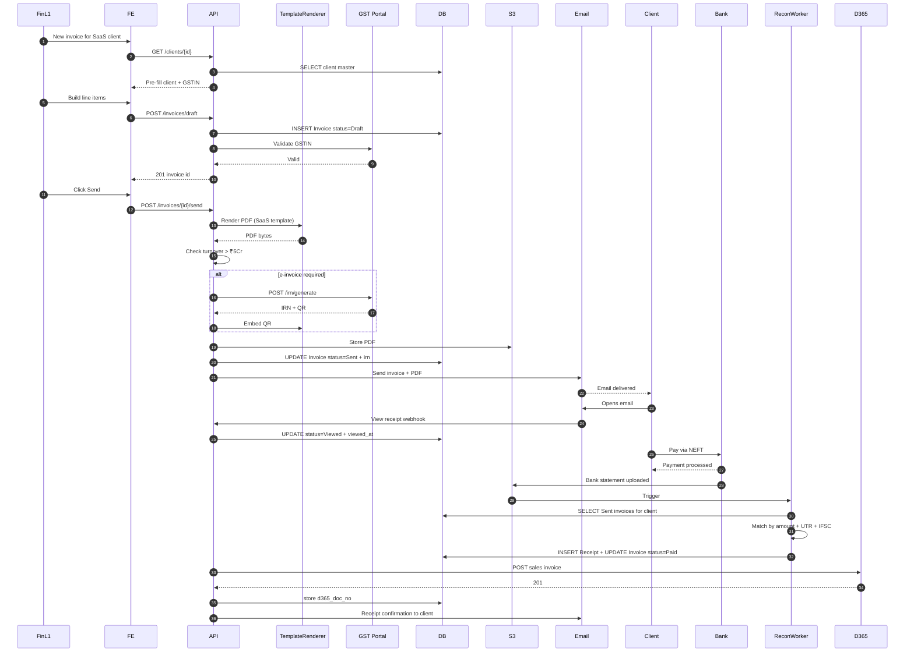
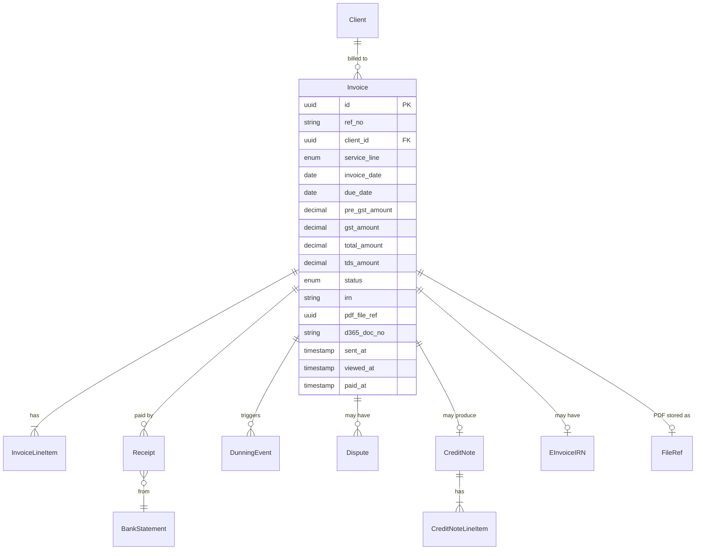
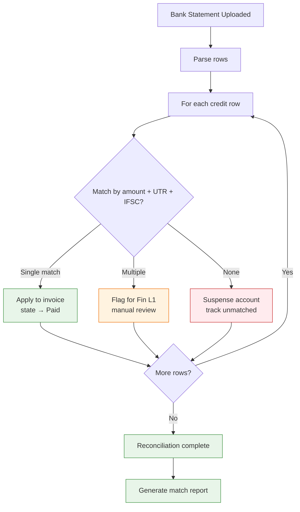

# Invoice Management — Data Flow

## Sequence: Invoice Creation to Payment

```mermaid
sequenceDiagram
    autonumber
    participant FinL1
    participant FE
    participant API
    participant Render as TemplateRenderer
    participant GST as GST Portal
    participant DB
    participant S3
    participant Email
    participant Client
    participant Bank
    participant Recon as ReconWorker
    participant D365

    FinL1->>FE: New invoice for SaaS client
    FE->>API: GET /clients/{id}
    API->>DB: SELECT client master
    API-->>FE: Pre-fill client + GSTIN

    FinL1->>FE: Build line items
    FE->>API: POST /invoices/draft
    API->>DB: INSERT Invoice status=Draft
    API->>GST: Validate GSTIN
    GST-->>API: Valid
    API-->>FE: 201 invoice id

    FinL1->>FE: Click Send
    FE->>API: POST /invoices/{id}/send
    API->>Render: Render PDF (SaaS template)
    Render-->>API: PDF bytes
    API->>API: Check turnover > ₹5Cr
    alt e-invoice required
        API->>GST: POST /irn/generate
        GST-->>API: IRN + QR
        API->>Render: Embed QR
    end
    API->>S3: Store PDF
    API->>DB: UPDATE Invoice status=Sent + irn
    API->>Email: Send invoice + PDF
    Email-->>Client: Email delivered

    Client->>Email: Opens email
    Email->>API: View receipt webhook
    API->>DB: UPDATE status=Viewed + viewed_at

    Client->>Bank: Pay via NEFT
    Bank-->>Client: Payment processed
    Bank->>S3: Bank statement uploaded
    S3->>Recon: Trigger
    Recon->>DB: SELECT Sent invoices for client
    Recon->>Recon: Match by amount + UTR + IFSC
    Recon->>DB: INSERT Receipt + UPDATE Invoice status=Paid

    API->>D365: POST sales invoice
    D365-->>API: 201
    API->>DB: store d365_doc_no
    API->>Email: Receipt confirmation to client
```

## Data Model

```mermaid
erDiagram
    Client ||--o{ Invoice : "billed to"
    Invoice ||--|{ InvoiceLineItem : has
    Invoice ||--o{ Receipt : "paid by"
    Invoice ||--o{ DunningEvent : "triggers"
    Invoice ||--o{ Dispute : "may have"
    Invoice ||--o| CreditNote : "may produce"
    Invoice ||--o| EInvoiceIRN : "may have"
    Invoice ||--o| FileRef : "PDF stored as"
    Receipt }o--|| BankStatement : "from"
    CreditNote ||--|{ CreditNoteLineItem : has

    Invoice {
        uuid id PK
        string ref_no
        uuid client_id FK
        enum service_line
        date invoice_date
        date due_date
        decimal pre_gst_amount
        decimal gst_amount
        decimal total_amount
        decimal tds_amount
        enum status
        string irn
        uuid pdf_file_ref
        string d365_doc_no
        timestamp sent_at
        timestamp viewed_at
        timestamp paid_at
    }
```

## Bank Reconciliation Flow

```mermaid
flowchart TD
    Upload[Bank Statement Uploaded] --> Parse[Parse rows]
    Parse --> Loop[For each credit row]
    Loop --> Match{Match by amount + UTR + IFSC?}
    Match -->|Single match| Apply[Apply to invoice<br/>state → Paid]
    Match -->|Multiple| Flag[Flag for Fin L1<br/>manual review]
    Match -->|None| Suspense[Suspense account<br/>track unmatched]
    Apply --> NextRow{More rows?}
    Flag --> NextRow
    Suspense --> NextRow
    NextRow -->|Yes| Loop
    NextRow -->|No| Done[Reconciliation complete]
    Done --> Report[Generate match report]

    classDef ok fill:#e8f5e9,stroke:#388e3c
    classDef warn fill:#fff3e0,stroke:#ef6c00
    classDef bad fill:#ffebee,stroke:#c62828
    class Apply,Done,Report ok
    class Flag warn
    class Suspense bad
```
