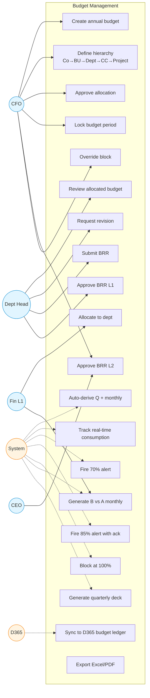

# Budget Management — Use Case Diagram

Hierarchical budgeting with real-time threshold enforcement at the moment of invoice booking. Status: 🟡 Phase 2.

## Use Case Index

| ID | Use Case | Actor | Notes |
|---|---|---|---|
| UC1 | Create annual budget | CFO | FY Apr–Mar |
| UC2 | Define hierarchy | CFO | 5-level: Co → BU → Dept → CC → Project |
| UC3 | Allocate to dept | Fin L1 | Per cost centre and category |
| UC4 | Review allocated budget | HoD | Accept or request revision |
| UC5 | Request revision | HoD | With justification |
| UC6 | Approve allocation | CFO | Final lock-in |
| UC7 | Lock budget period | CFO | Locked = no changes without BRR |
| UC8 | Auto-derive Q + monthly | System | From annual budget |
| UC9 | Track real-time consumption | System | At every invoice booking |
| UC10 | Fire 70% alert | System | Yellow, no block |
| UC11 | Fire 85% alert with ack | System | Amber, requires HoD ack on next booking |
| UC12 | Block at 100% | System | Hard block on D365 booking |
| UC13 | Submit BRR | HoD | Budget Reallocation Request |
| UC14 | Approve BRR L1 | HoD | Self if intra-dept |
| UC15 | Approve BRR L2 | CFO + CEO | If inter-dept or > threshold |
| UC16 | Override block | CFO | Emergency only, full audit |
| UC17 | Generate B vs A monthly | System | Auto on 2nd of month |
| UC18 | Generate quarterly deck | System | PDF auto-distributed |
| UC19 | Sync to D365 budget ledger | System | Bidirectional |
| UC20 | Export Excel/PDF | Any approver | On-demand |
