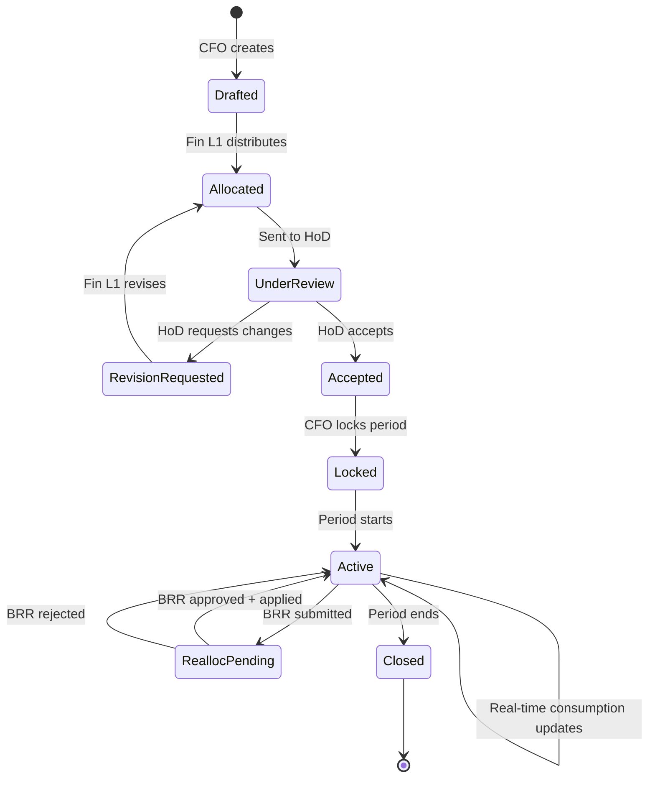
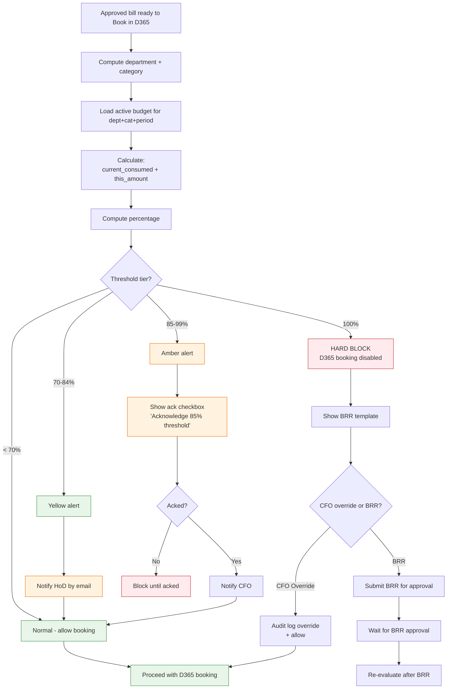
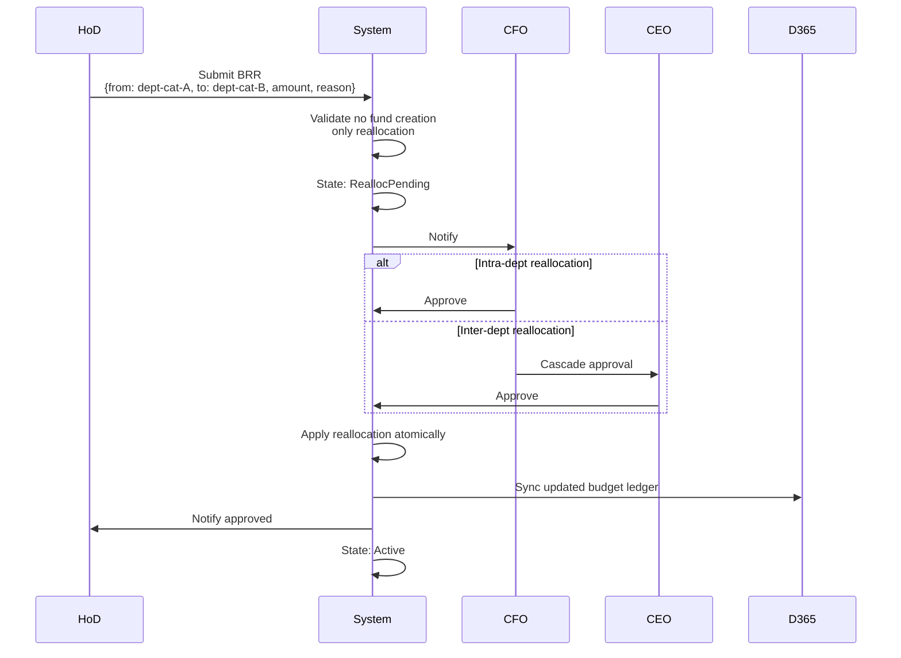
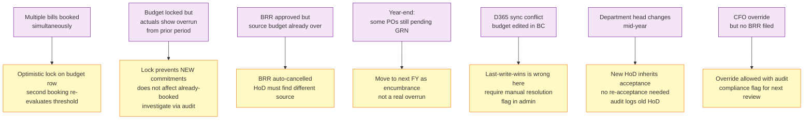

# Budget Management — Flow Diagrams

## Lifecycle State Machine

```mermaid
stateDiagram-v2
    [*] --> Drafted: CFO creates
    Drafted --> Allocated: Fin L1 distributes
    Allocated --> UnderReview: Sent to HoD
    UnderReview --> RevisionRequested: HoD requests changes
    RevisionRequested --> Allocated: Fin L1 revises
    UnderReview --> Accepted: HoD accepts
    Accepted --> Locked: CFO locks period
    Locked --> Active: Period starts
    Active --> Active: Real-time consumption updates
    Active --> ReallocPending: BRR submitted
    ReallocPending --> Active: BRR approved + applied
    ReallocPending --> Active: BRR rejected
    Active --> Closed: Period ends
    Closed --> [*]
```

## Real-Time Threshold Check at Invoice Booking

```mermaid
flowchart TD
    Trigger[Approved bill ready to Book in D365] --> CalcDept[Compute department + category]
    CalcDept --> LoadBudget[Load active budget for dept+cat+period]
    LoadBudget --> CalcCons[Calculate:<br/>current_consumed + this_amount]
    CalcCons --> Pct[Compute percentage]
    Pct --> Tier{Threshold tier?}

    Tier -->|< 70%| Allow1[Normal - allow booking]
    Tier -->|70-84%| Allow2[Yellow alert]
    Allow2 --> NotifyHoD[Notify HoD by email]
    NotifyHoD --> Allow1

    Tier -->|85-99%| Amber[Amber alert]
    Amber --> RequireAck[Show ack checkbox<br/>'Acknowledge 85% threshold']
    RequireAck --> AckCheck{Acked?}
    AckCheck -->|No| BlockUntilAck[Block until acked]
    AckCheck -->|Yes| NotifyCFO[Notify CFO]
    NotifyCFO --> Allow1

    Tier -->|100%| HardBlock[HARD BLOCK<br/>D365 booking disabled]
    HardBlock --> ShowBRR[Show BRR template]
    ShowBRR --> CFOOption{CFO override or BRR?}
    CFOOption -->|CFO Override| AuditOverride[Audit log override<br/>+ allow]
    CFOOption -->|BRR| BRRFlow[Submit BRR for approval]
    BRRFlow --> WaitBRR[Wait for BRR approval]
    WaitBRR --> Reapply[Re-evaluate after BRR]

    Allow1 --> Book[Proceed with D365 booking]
    AuditOverride --> Book

    classDef ok fill:#e8f5e9,stroke:#388e3c
    classDef warn fill:#fff3e0,stroke:#ef6c00
    classDef block fill:#ffebee,stroke:#c62828
    class Allow1,Allow2,Book ok
    class Amber,RequireAck,NotifyHoD warn
    class HardBlock,BlockUntilAck block
```

## BRR Workflow

```mermaid
sequenceDiagram
    participant HoD
    participant System
    participant CFO
    participant CEO
    participant D365

    HoD->>System: Submit BRR<br/>{from: dept-cat-A, to: dept-cat-B, amount, reason}
    System->>System: Validate no fund creation<br/>only reallocation
    System->>System: State: ReallocPending
    System->>CFO: Notify

    alt Intra-dept reallocation
        CFO->>System: Approve
    else Inter-dept reallocation
        CFO->>CEO: Cascade approval
        CEO->>System: Approve
    end

    System->>System: Apply reallocation atomically
    System->>D365: Sync updated budget ledger
    System->>HoD: Notify approved
    System->>System: State: Active
```

## Edge Cases

```mermaid
flowchart TD
    EC1[Multiple bills booked<br/>simultaneously] --> EC1D[Optimistic lock on budget row<br/>second booking re-evaluates threshold]
    EC2[Budget locked but<br/>actuals show overrun<br/>from prior period] --> EC2D[Lock prevents NEW commitments<br/>does not affect already-booked<br/>investigate via audit]
    EC3[BRR approved but<br/>source budget already over] --> EC3D[BRR auto-cancelled<br/>HoD must find different source]
    EC4[Year-end:<br/>some POs still pending GRN] --> EC4D[Move to next FY as encumbrance<br/>not a real overrun]
    EC5[D365 sync conflict<br/>budget edited in BC] --> EC5D[Last-write-wins is wrong here<br/>require manual resolution<br/>flag in admin]
    EC6[Department head changes<br/>mid-year] --> EC6D[New HoD inherits acceptance<br/>no re-acceptance needed<br/>audit logs old HoD]
    EC7[CFO override<br/>but no BRR filed] --> EC7D[Override allowed with audit<br/>compliance flag for next review]

    classDef ec fill:#f3e5f5,stroke:#7b1fa2
    classDef detail fill:#fff9c4,stroke:#f57f17
    class EC1,EC2,EC3,EC4,EC5,EC6,EC7 ec
    class EC1D,EC2D,EC3D,EC4D,EC5D,EC6D,EC7D detail
```
