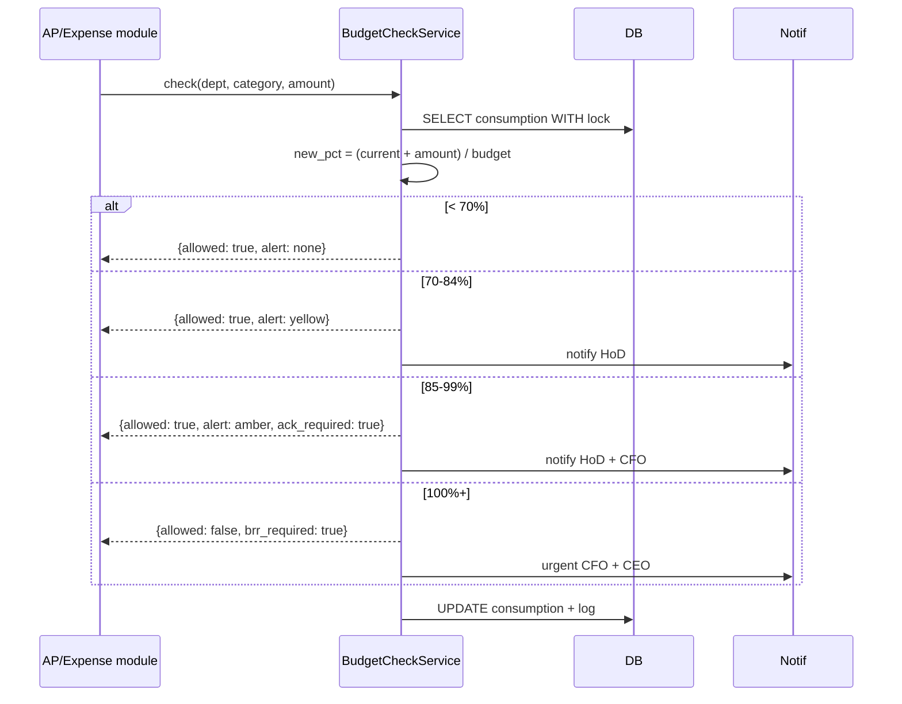

# Budget Management — Architecture Diagram

```mermaid
flowchart TB
    subgraph FE["Frontend"]
        CFOUI[CFO Budget Console]
        HoDUI[HoD Acceptance UI]
        DashUI[Dept Consumption Dashboard]
    end

    Gateway[API Gateway]
    CFOUI --> Gateway
    HoDUI --> Gateway
    DashUI --> Gateway

    subgraph DjangoApp["Django: apps/budgets"]
        BudApi[BudgetViewSet]
        AllocApi[AllocationViewSet]
        BRRApi[BRRViewSet]
        ConsApi[ConsumptionViewSet]
        ChkApi[BudgetCheckEndpoint<br/>called by AP]

        BudgetModel[Budget Hierarchy Model]
        AllocModel[BudgetAllocation]
        ConsumeModel[BudgetConsumption]
        BRRModel[BudgetReallocationRequest]
        ThreshModel[ThresholdAlert]

        SvcCheck[BudgetCheckService<br/>real-time threshold]
        SvcCons[ConsumptionTracker]
        SvcDeriv[PeriodDeriver<br/>annual→Q→monthly]
        SvcBRR[BRREngine]
        SvcReport[BvAReportGenerator]
    end

    Gateway --> BudApi
    Gateway --> AllocApi
    Gateway --> BRRApi
    Gateway --> ConsApi
    Gateway --> ChkApi

    BudApi --> SvcDeriv
    SvcDeriv --> BudgetModel
    AllocApi --> AllocModel
    ConsApi --> SvcCons
    SvcCons --> ConsumeModel
    ChkApi --> SvcCheck
    BRRApi --> SvcBRR

    subgraph Workers["Celery Workers"]
        ConsBeat[Consumption Sync Beat<br/>hourly from D365]
        ReportBeat[B vs A Report Beat<br/>monthly 2nd]
        AlertWorker[Threshold Alert Worker]
    end

    SvcCons -.-> ConsBeat
    SvcReport -.-> ReportBeat
    SvcCheck -.->|fire alert| AlertWorker

    Beat[Celery Beat] -.-> ConsBeat
    Beat -.-> ReportBeat

    subgraph CrossModule["Cross-Module Integration"]
        APModule[apps/expenses + apps/ap<br/>calls budget check before D365 booking]
    end

    APModule -->|sync call| ChkApi

    subgraph Shared["Shared"]
        ApprovalApp[apps/approvals<br/>BRR approvals]
        AuditApp[apps/core - Audit]
        NotifApp[apps/notifications]
    end

    SvcBRR --> ApprovalApp
    SvcCheck --> AuditApp
    SvcCheck --> NotifApp
    AlertWorker --> NotifApp

    subgraph DB[(PostgreSQL)]
        Tables[budgets, budget_allocations,<br/>budget_consumption,<br/>brrs, threshold_alerts]
    end

    BudgetModel --> DB
    AllocModel --> DB
    ConsumeModel --> DB
    BRRModel --> DB

    subgraph External["External"]
        D365Bud[D365 Budget Ledger<br/>bidirectional sync]
        D365GL[D365 GL Entries<br/>actuals source]
    end

    SvcCons --> D365GL
    BudgetModel --> D365Bud

    classDef api fill:#e8f5e9,stroke:#388e3c
    classDef svc fill:#fff9c4,stroke:#f9a825
    classDef worker fill:#fff3e0,stroke:#f57c00
    classDef ext fill:#fce4ec,stroke:#c2185b
    classDef cross fill:#fffde7,stroke:#fbc02d

    class BudApi,AllocApi,BRRApi,ConsApi,ChkApi api
    class SvcCheck,SvcCons,SvcDeriv,SvcBRR,SvcReport svc
    class ConsBeat,ReportBeat,AlertWorker,Beat worker
    class D365Bud,D365GL ext
    class APModule cross
```

## Critical Integration: Real-Time Check from AP/Expenses

The Budget Module exposes a synchronous endpoint that AP and Expense modules call **before** triggering D365 booking. This is the most performance-sensitive path in the system.


