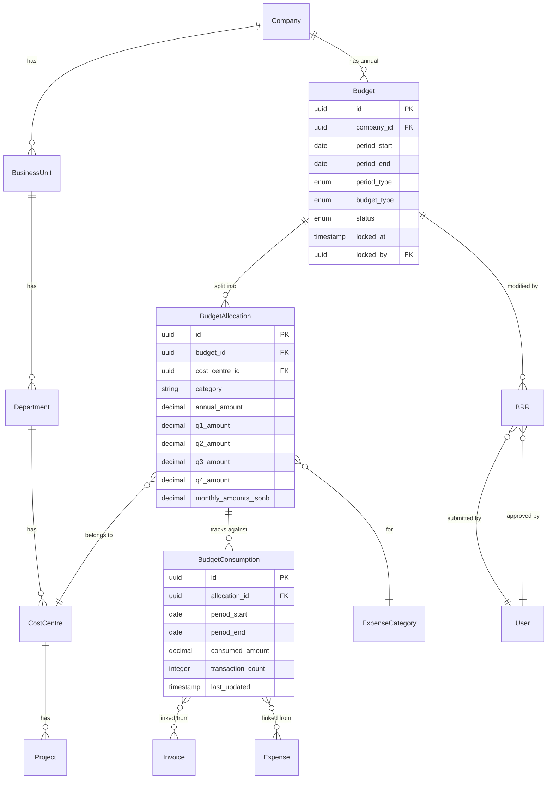
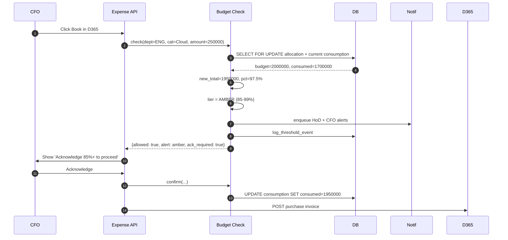
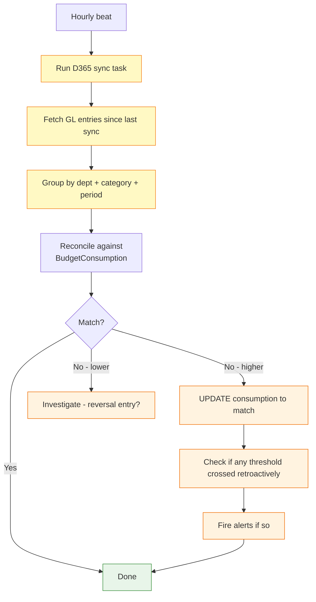
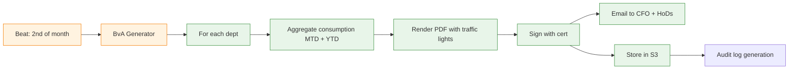

# Budget Management — Data Flow Diagram

## Hierarchy Data Model

```mermaid
erDiagram
    Company ||--o{ BusinessUnit : has
    BusinessUnit ||--o{ Department : has
    Department ||--o{ CostCentre : has
    CostCentre ||--o{ Project : has

    Company ||--o{ Budget : "has annual"
    Budget ||--o{ BudgetAllocation : "split into"
    BudgetAllocation ||--o{ BudgetConsumption : "tracks against"
    BudgetAllocation }o--|| CostCentre : "belongs to"
    BudgetAllocation }o--|| ExpenseCategory : "for"
    BudgetConsumption }o--o{ Invoice : "linked from"
    BudgetConsumption }o--o{ Expense : "linked from"

    Budget ||--o{ BRR : "modified by"
    BRR }o--|| User : "submitted by"
    BRR }o--|| User : "approved by"

    Budget {
        uuid id PK
        uuid company_id FK
        date period_start
        date period_end
        enum period_type
        enum budget_type
        enum status
        timestamp locked_at
        uuid locked_by FK
    }

    BudgetAllocation {
        uuid id PK
        uuid budget_id FK
        uuid cost_centre_id FK
        string category
        decimal annual_amount
        decimal q1_amount
        decimal q2_amount
        decimal q3_amount
        decimal q4_amount
        decimal monthly_amounts_jsonb
    }

    BudgetConsumption {
        uuid id PK
        uuid allocation_id FK
        date period_start
        date period_end
        decimal consumed_amount
        integer transaction_count
        timestamp last_updated
    }
```

## Sequence: Bill Triggers Real-Time Budget Check

```mermaid
sequenceDiagram
    autonumber
    participant CFO
    participant ExpAPI as Expense API
    participant BudCheck as Budget Check
    participant DB
    participant Notif
    participant D365

    CFO->>ExpAPI: Click Book in D365
    ExpAPI->>BudCheck: check(dept=ENG, cat=Cloud, amount=250000)
    BudCheck->>DB: SELECT FOR UPDATE allocation + current consumption
    DB-->>BudCheck: budget=2000000, consumed=1700000
    BudCheck->>BudCheck: new_total=1950000, pct=97.5%
    BudCheck->>BudCheck: tier = AMBER (85-99%)
    BudCheck->>Notif: enqueue HoD + CFO alerts
    BudCheck->>DB: log_threshold_event
    BudCheck-->>ExpAPI: {allowed: true, alert: amber, ack_required: true}
    ExpAPI->>CFO: Show 'Acknowledge 85%+ to proceed'
    CFO->>ExpAPI: Acknowledge
    ExpAPI->>BudCheck: confirm(...)
    BudCheck->>DB: UPDATE consumption SET consumed=1950000
    ExpAPI->>D365: POST purchase invoice
```

## Sync from D365 (Actuals)

```mermaid
flowchart TD
    Beat[Hourly beat] --> Sync[Run D365 sync task]
    Sync --> FetchGL[Fetch GL entries since last sync]
    FetchGL --> Group[Group by dept + category + period]
    Group --> Reconcile[Reconcile against<br/>BudgetConsumption]
    Reconcile --> Discrepancy{Match?}
    Discrepancy -->|Yes| Done[Done]
    Discrepancy -->|No - higher| Update[UPDATE consumption to match]
    Update --> Recheck[Check if any threshold crossed retroactively]
    Recheck --> Alert[Fire alerts if so]
    Alert --> Done
    Discrepancy -->|No - lower| Investigate[Investigate - reversal entry?]

    classDef sync fill:#fff9c4,stroke:#f57f17
    classDef ok fill:#e8f5e9,stroke:#388e3c
    classDef warn fill:#fff3e0,stroke:#ef6c00
    class Sync,FetchGL,Group sync
    class Done ok
    class Update,Recheck,Alert,Investigate warn
```

## Monthly B vs A Report Generation

```mermaid
flowchart LR
    Beat[Beat: 2nd of month] --> Trigger[BvA Generator]
    Trigger --> Loop[For each dept]
    Loop --> Aggregate[Aggregate consumption MTD + YTD]
    Aggregate --> Render[Render PDF with traffic lights]
    Render --> Sign[Sign with cert]
    Sign --> Email[Email to CFO + HoDs]
    Sign --> Store[Store in S3]
    Store --> Audit[Audit log generation]

    classDef beat fill:#fff3e0,stroke:#f57c00
    classDef gen fill:#e8f5e9,stroke:#388e3c
    class Beat,Trigger beat
    class Loop,Aggregate,Render,Sign,Email,Store gen
```
