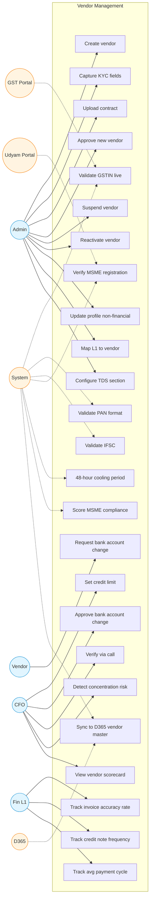

# Vendor Management — Use Case Diagram

Centralized vendor master with KYC, MSME tracking, bank account controls. Status: 🟢 Hackathon (basic) / 🟡 Phase 2 (full).

```mermaid
flowchart LR
    Admin((Admin))
    CFO((CFO))
    FinL1((Fin L1))
    Vendor((Vendor))
    System((System))
    GST((GST Portal))
    Udyam((Udyam Portal))
    D365((D365))

    subgraph VM["Vendor Management"]
        UC1[Create vendor]
        UC2[Capture KYC fields]
        UC3[Validate GSTIN live]
        UC4[Validate PAN format]
        UC5[Validate IFSC]
        UC6[Verify MSME registration]
        UC7[Upload contract]
        UC8[Approve new vendor]
        UC9[Suspend vendor]
        UC10[Reactivate vendor]
        UC11[Update profile non-financial]
        UC12[Map L1 to vendor]
        UC13[Set credit limit]
        UC14[Configure TDS section]
        UC15[Request bank account change]
        UC16[Approve bank account change]
        UC17[48-hour cooling period]
        UC18[Verify via call]
        UC19[Track invoice accuracy rate]
        UC20[Track credit note frequency]
        UC21[Track avg payment cycle]
        UC22[Score MSME compliance]
        UC23[Detect concentration risk]
        UC24[Sync to D365 vendor master]
        UC25[View vendor scorecard]
    end

    Admin --> UC1
    Admin --> UC2
    Admin --> UC7
    Admin --> UC8
    Admin --> UC9
    Admin --> UC10
    Admin --> UC11
    Admin --> UC12
    Admin --> UC14
    CFO --> UC13
    CFO --> UC16
    CFO --> UC18
    CFO --> UC23
    CFO --> UC25
    FinL1 --> UC19
    FinL1 --> UC20
    FinL1 --> UC21
    Vendor --> UC15
    System -.-> UC3
    System -.-> UC4
    System -.-> UC5
    System -.-> UC6
    System -.-> UC17
    System -.-> UC22
    System -.-> UC24
    GST -.-> UC3
    Udyam -.-> UC6
    D365 -.-> UC24

    classDef actor fill:#e1f5ff,stroke:#0288d1
    classDef ext fill:#fff4e1,stroke:#f57c00
    class Admin,CFO,FinL1,Vendor actor
    class System,GST,Udyam,D365 ext
```
