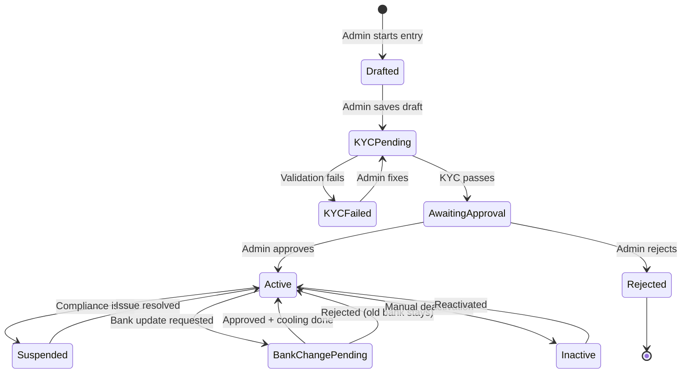
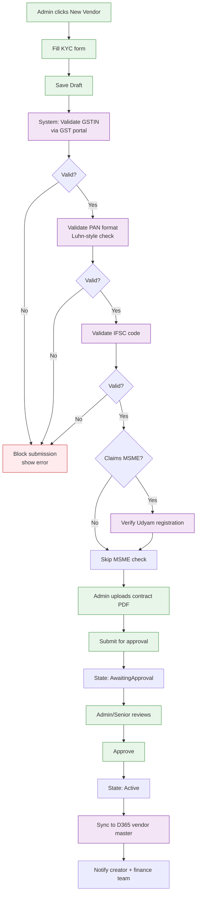
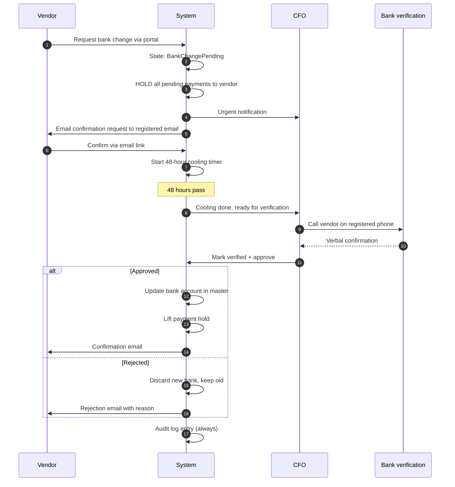
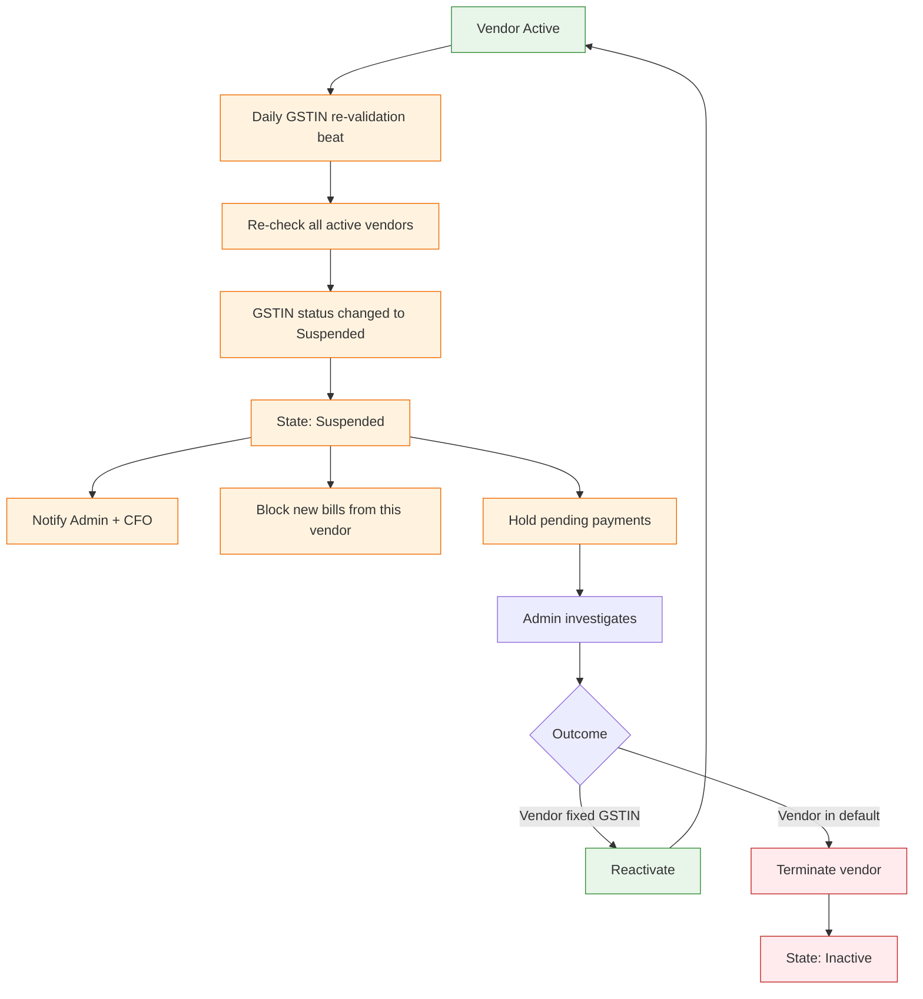

# Vendor Management — Flow Diagrams

## Vendor Lifecycle State Machine

## Happy Path — New Vendor Onboarding

## Critical Flow — Bank Account Change (Fraud Risk)

## Bad Path — GSTIN Suspended After Onboarding

## Edge Cases

| ID | Edge Case | Resolution |
|---|---|---|
| VEC1 | Duplicate vendor (same PAN, different name) | Block creation, show existing vendor |
| VEC2 | Vendor changes legal name (M&A) | Allow update with audit, retain old name in history |
| VEC3 | MSME status expires (annual renewal) | Auto-flag, warn 30 days before, alert if not renewed |
| VEC4 | Vendor deactivated but has pending bills | Block deactivation, show pending bills, require cleanup |
| VEC5 | Same vendor in two D365 companies | Allow, link via shared parent record |
| VEC6 | Vendor exceeds credit limit mid-bill | Block at booking, require CFO override |
| VEC7 | Bank IFSC merged/changed by RBI | Daily IFSC sync, auto-update with audit |
| VEC8 | Vendor portal email bounces | Mark email as bounced, alert Admin to update |
| VEC9 | L1 mapped to vendor leaves company | Auto-reassign to backup L1, alert Admin |
| VEC10 | Concentration risk: vendor >40% of category spend | CFO alert, suggest diversification |
