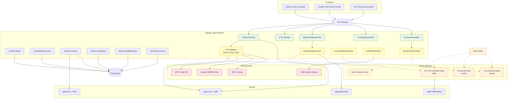

# Vendor Management — Architecture Diagram

```mermaid
flowchart TB
    subgraph FE["Frontend"]
        AdminUI[Admin Vendor Console]
        VendorPortal[Vendor Self-Service Portal]
        CFOView[CFO Vendor Scorecard]
    end

    Gateway[API Gateway]
    AdminUI --> Gateway
    VendorPortal --> Gateway
    CFOView --> Gateway

    subgraph DjangoApp["Django: apps/vendors"]
        VApi[VendorViewSet]
        KYCApi[KYCViewSet]
        BankApi[BankChangeViewSet]
        MapApi[L1MappingViewSet]
        ScoreApi[ScorecardViewSet]

        VModel[Vendor Model]
        BankModel[VendorBankAccount]
        ContractModel[VendorContract]
        MapModel[VendorL1Mapping]
        BankReqModel[BankChangeRequest]
        ScoreModel[VendorScorecard]

        SvcKYC[KYCValidator<br/>GSTIN, PAN, IFSC]
        SvcBank[BankChangeService]
        SvcScore[ScorecardCalculator]
        SvcConc[ConcentrationDetector]
        SvcSync[D365VendorSync]
    end

    Gateway --> VApi
    Gateway --> KYCApi
    Gateway --> BankApi
    Gateway --> MapApi
    Gateway --> ScoreApi

    VApi --> SvcKYC
    BankApi --> SvcBank
    ScoreApi --> SvcScore

    subgraph Workers["Celery Workers"]
        KYCBeat[KYC Re-validation Beat<br/>daily]
        ScoreBeat[Scorecard Beat<br/>weekly]
        ConcBeat[Concentration Beat<br/>weekly]
        BankCool[Bank Cooling Timer]
    end

    SvcKYC -.-> KYCBeat
    SvcScore -.-> ScoreBeat
    SvcConc -.-> ConcBeat
    SvcBank -.-> BankCool

    Beat[Celery Beat] -.-> KYCBeat
    Beat -.-> ScoreBeat
    Beat -.-> ConcBeat

    subgraph Shared["Shared"]
        ApprovalApp[apps/approvals]
        AuditApp[apps/core - Audit]
        FilesApp[apps/core - Files]
        NotifApp[apps/notifications]
    end

    SvcBank --> ApprovalApp
    VApi --> AuditApp
    SvcKYC --> AuditApp
    ContractModel --> FilesApp
    KYCBeat --> NotifApp

    DB[(PostgreSQL)]
    VModel --> DB
    BankModel --> DB
    ContractModel --> DB
    MapModel --> DB
    BankReqModel --> DB
    ScoreModel --> DB

    subgraph External["External APIs"]
        GST[GST Portal API]
        Udyam[Udyam MSME Portal]
        IFSCAPI[IFSC Lookup]
        D365[D365 Vendor Master]
    end

    SvcKYC --> GST
    SvcKYC --> Udyam
    SvcKYC --> IFSCAPI
    SvcSync --> D365

    classDef api fill:#e8f5e9,stroke:#388e3c
    classDef svc fill:#fff9c4,stroke:#f9a825
    classDef worker fill:#fff3e0,stroke:#f57c00
    classDef ext fill:#fce4ec,stroke:#c2185b
    class VApi,KYCApi,BankApi,MapApi,ScoreApi api
    class SvcKYC,SvcBank,SvcScore,SvcConc,SvcSync svc
    class KYCBeat,ScoreBeat,ConcBeat,BankCool,Beat worker
    class GST,Udyam,IFSCAPI,D365 ext
```
