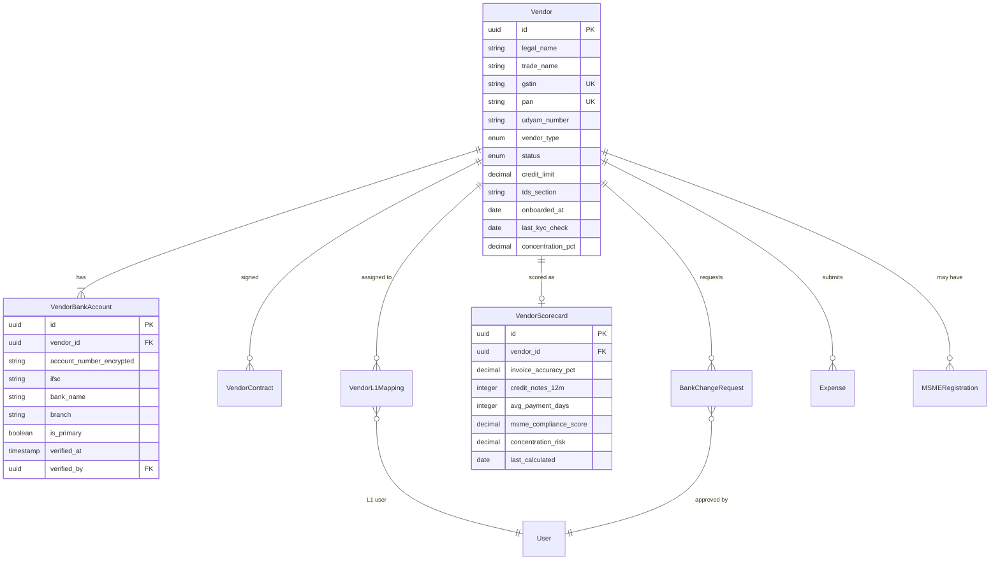
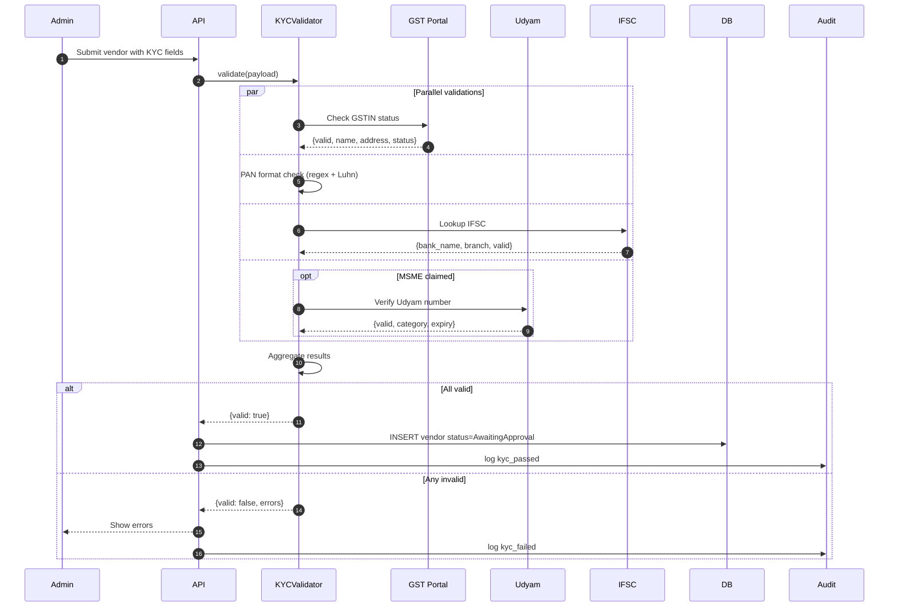

# Vendor Management — Data Flow Diagram

## Data Model



## Sequence: KYC Validation Pipeline



## Scorecard Calculation Sources

```mermaid
flowchart LR
    subgraph Sources["Data Sources"]
        Bills[All bills 12 months]
        Payments[Payment history]
        CN[Credit notes issued]
        MSME[MSME compliance events]
        SpendData[Total category spend]
    end

    subgraph Metrics["Calculated Metrics"]
        Acc[Invoice accuracy %<br/>= bills_passed_first_try / total]
        CNRate[CN frequency<br/>= count / total]
        AvgDays[Avg payment days<br/>= mean(paid_at - approved_at)]
        MSMEScore[MSME compliance<br/>0-100]
        Conc[Concentration %<br/>= vendor_spend / category_total]
    end

    subgraph Scorecard["Scorecard Output"]
        Output[VendorScorecard row]
    end

    Bills --> Acc
    Bills --> CNRate
    CN --> CNRate
    Payments --> AvgDays
    MSME --> MSMEScore
    SpendData --> Conc
    Bills --> Conc

    Acc --> Output
    CNRate --> Output
    AvgDays --> Output
    MSMEScore --> Output
    Conc --> Output

    Output --> Alert{Concentration > 40%?}
    Alert -->|Yes| AlertCFO[Alert CFO]

    classDef src fill:#e3f2fd,stroke:#1976d2
    classDef calc fill:#fff9c4,stroke:#f57f17
    classDef out fill:#e8f5e9,stroke:#388e3c
    class Bills,Payments,CN,MSME,SpendData src
    class Acc,CNRate,AvgDays,MSMEScore,Conc calc
    class Output,AlertCFO out
```
