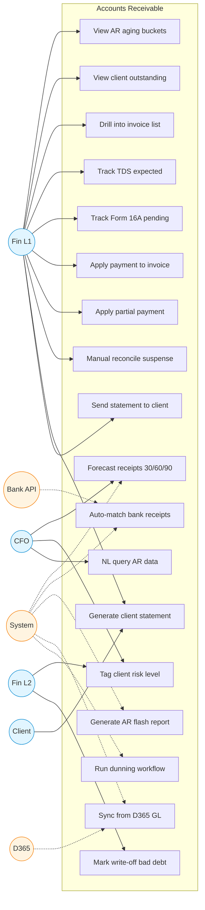

# Accounts Receivable — Use Case Diagram

Tracks money owed to 3SC by clients. Status: 🟡 Phase 2.

```mermaid
flowchart LR
    FinL1((Fin L1))
    FinL2((Fin L2))
    CFO((CFO))
    Client((Client))
    System((System))
    Bank((Bank API))
    D365((D365))

    subgraph AR["Accounts Receivable"]
        UC1[View AR aging buckets]
        UC2[View client outstanding]
        UC3[Drill into invoice list]
        UC4[Forecast receipts 30/60/90]
        UC5[Track TDS expected]
        UC6[Track Form 16A pending]
        UC7[Apply payment to invoice]
        UC8[Apply partial payment]
        UC9[Auto-match bank receipts]
        UC10[Manual reconcile suspense]
        UC11[Tag client risk level]
        UC12[Generate AR flash report]
        UC13[Generate client statement]
        UC14[Send statement to client]
        UC15[Mark write-off bad debt]
        UC16[Sync from D365 GL]
        UC17[Run dunning workflow]
        UC18[NL query AR data]
    end

    FinL1 --> UC1
    FinL1 --> UC2
    FinL1 --> UC3
    FinL1 --> UC5
    FinL1 --> UC6
    FinL1 --> UC7
    FinL1 --> UC8
    FinL1 --> UC10
    FinL1 --> UC13
    FinL1 --> UC14
    FinL2 --> UC11
    FinL2 --> UC15
    CFO --> UC4
    CFO --> UC11
    CFO --> UC18
    Client --> UC13
    System -.-> UC4
    System -.-> UC9
    System -.-> UC12
    System -.-> UC16
    System -.-> UC17
    Bank -.-> UC9
    D365 -.-> UC16

    classDef actor fill:#e1f5ff,stroke:#0288d1
    classDef ext fill:#fff4e1,stroke:#f57c00
    class FinL1,FinL2,CFO,Client actor
    class System,Bank,D365 ext
```
