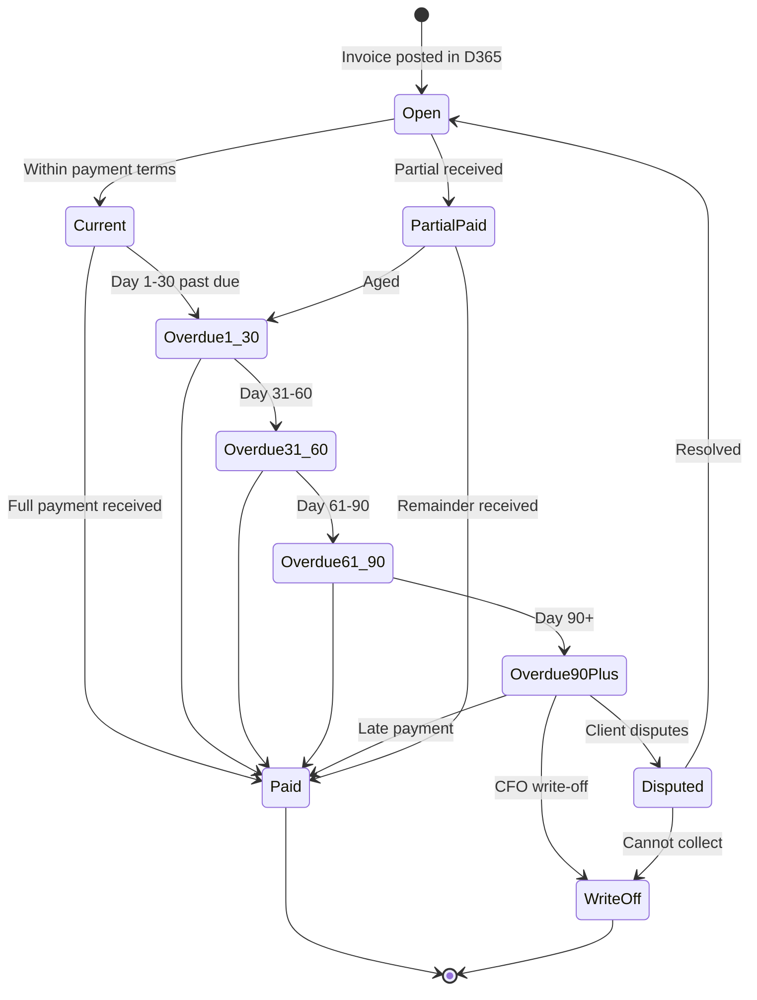
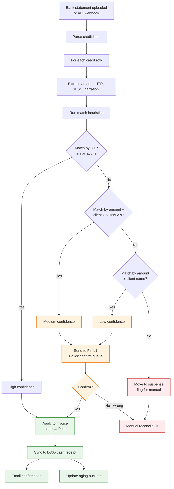
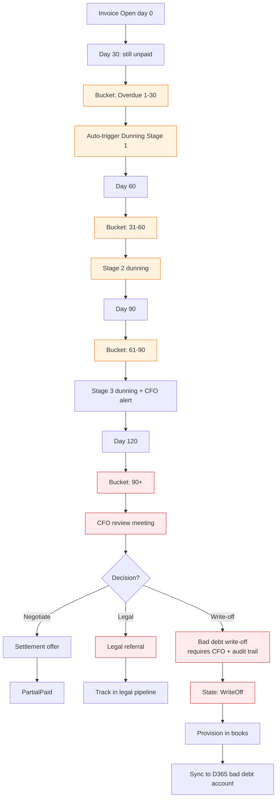

# Accounts Receivable — Flow Diagrams

## Receivable Lifecycle State Machine

## Happy Path — Auto-Match Bank Receipt

## Bad Path — Long-Aging Receivable

## Edge Cases

| ID | Edge Case | Resolution |
|---|---|---|
| AREC1 | Client pays one lump sum for 5 invoices | Auto-allocate by invoice age (oldest first), Fin L1 can override |
| AREC2 | Payment > invoice amount | Apply to invoice, balance to advance/credit account |
| AREC3 | Client pays in foreign currency | Convert at receipt-date rate, log FX gain/loss |
| AREC4 | TDS deducted but Form 16A missing 6+ months | Auto-escalate to client + flag for CA |
| AREC5 | Client name on bank receipt differs from master | Fuzzy match (>85% Levenshtein) or manual |
| AREC6 | Same UTR appears twice (bank error) | Flag for Fin L1, do not double-apply |
| AREC7 | Aging recalc on weekend | Skip weekends in business-day aging |
| AREC8 | Invoice cancelled after partial payment | Refund flow, cannot just delete |
