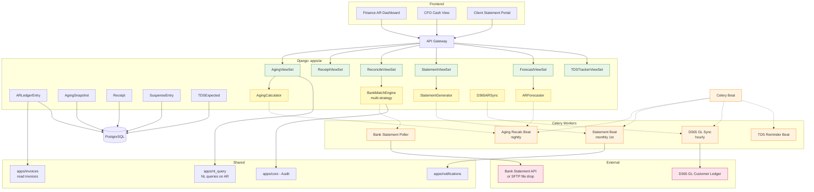

# Accounts Receivable — Architecture Diagram

```mermaid
flowchart TB
    subgraph FE["Frontend"]
        FinDash[Finance AR Dashboard]
        CFODash[CFO Cash View]
        ClientStmt[Client Statement Portal]
    end

    Gateway[API Gateway]
    FinDash --> Gateway
    CFODash --> Gateway
    ClientStmt --> Gateway

    subgraph DjangoApp["Django: apps/ar"]
        AgingApi[AgingViewSet]
        ReceiptApi[ReceiptViewSet]
        ReconApi[ReconcileViewSet]
        StmtApi[StatementViewSet]
        ForecastApi[ForecastViewSet]
        TDSApi[TDSTrackerViewSet]

        ARModel[ARLedgerEntry]
        AgingModel[AgingSnapshot]
        ReceiptModel[Receipt]
        SuspenseModel[SuspenseEntry]
        TDSModel[TDSExpected]

        SvcAging[AgingCalculator]
        SvcMatch[BankMatchEngine<br/>multi-strategy]
        SvcStmt[StatementGenerator]
        SvcForecast[ARForecaster]
        SvcD365Sync[D365ARSync]
    end

    Gateway --> AgingApi
    Gateway --> ReceiptApi
    Gateway --> ReconApi
    Gateway --> StmtApi
    Gateway --> ForecastApi
    Gateway --> TDSApi

    AgingApi --> SvcAging
    ReconApi --> SvcMatch
    StmtApi --> SvcStmt
    ForecastApi --> SvcForecast

    subgraph Workers["Celery Workers"]
        AgingBeat[Aging Recalc Beat<br/>nightly]
        BankPoll[Bank Statement Poller]
        D365Sync[D365 GL Sync<br/>hourly]
        StmtBeat[Statement Beat<br/>monthly 1st]
        TDSBeat[TDS Reminder Beat]
    end

    SvcAging -.-> AgingBeat
    SvcMatch -.-> BankPoll
    SvcD365Sync -.-> D365Sync
    SvcStmt -.-> StmtBeat
    SvcForecast -.-> AgingBeat

    Beat[Celery Beat] -.-> AgingBeat
    Beat -.-> StmtBeat
    Beat -.-> D365Sync
    Beat -.-> TDSBeat

    subgraph Shared["Shared"]
        InvModule[apps/invoices<br/>read invoices]
        AuditApp[apps/core - Audit]
        NotifApp[apps/notifications]
        NLQ[apps/nl_query<br/>NL queries on AR]
    end

    ARModel --> InvModule
    SvcMatch --> AuditApp
    StmtBeat --> NotifApp
    AgingApi --> NLQ

    DB[(PostgreSQL)]
    ARModel --> DB
    AgingModel --> DB
    ReceiptModel --> DB
    SuspenseModel --> DB
    TDSModel --> DB

    subgraph External["External"]
        BankAPI[Bank Statement API<br/>or SFTP file drop]
        D365GL[D365 GL Customer Ledger]
    end

    BankPoll --> BankAPI
    D365Sync --> D365GL

    classDef api fill:#e8f5e9,stroke:#388e3c
    classDef svc fill:#fff9c4,stroke:#f9a825
    classDef worker fill:#fff3e0,stroke:#f57c00
    classDef ext fill:#fce4ec,stroke:#c2185b
    class AgingApi,ReceiptApi,ReconApi,StmtApi,ForecastApi,TDSApi api
    class SvcAging,SvcMatch,SvcStmt,SvcForecast,SvcD365Sync svc
    class AgingBeat,BankPoll,D365Sync,StmtBeat,TDSBeat,Beat worker
    class BankAPI,D365GL ext
```
