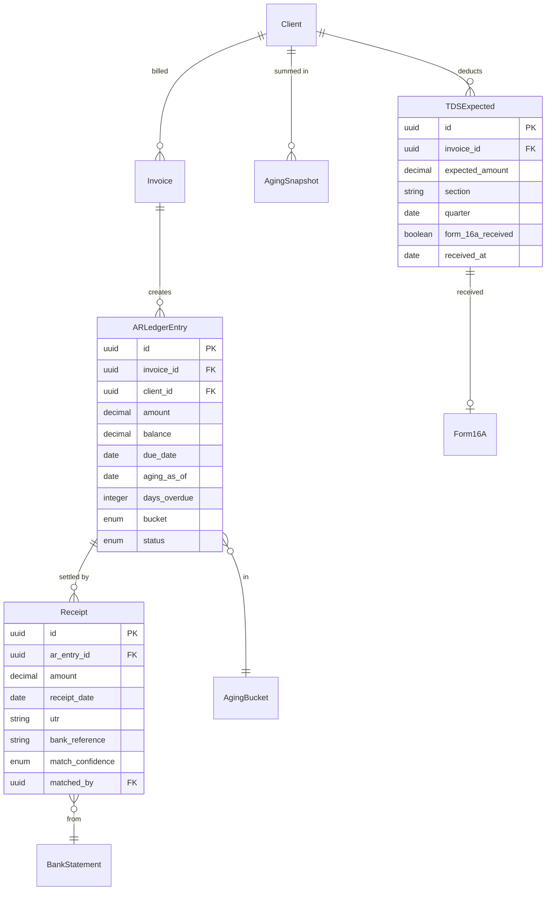
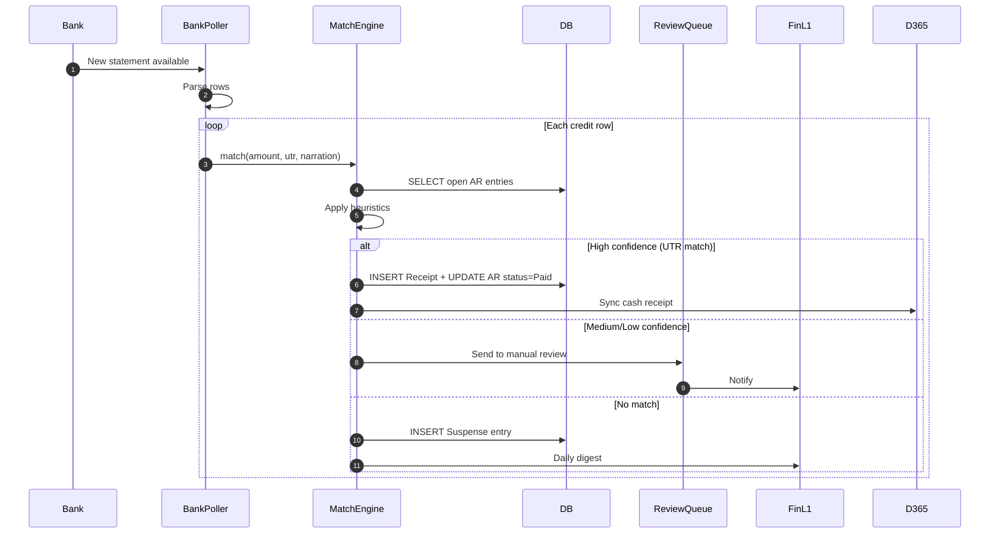
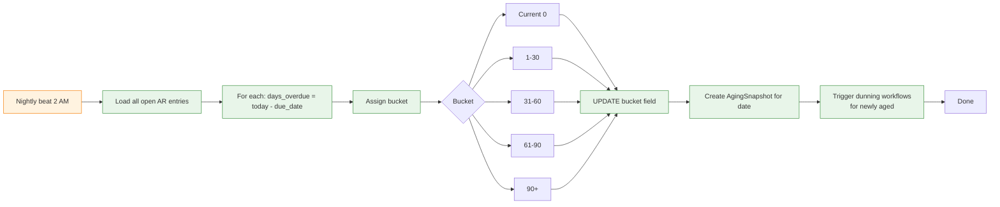
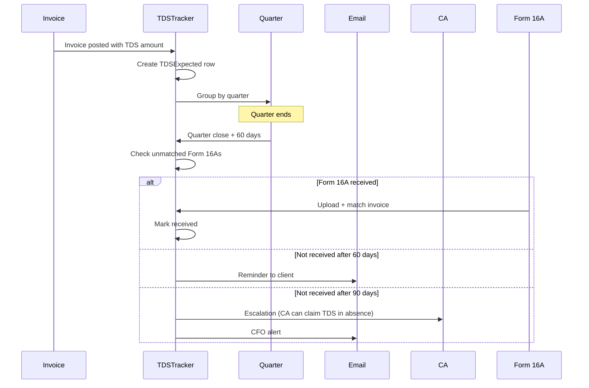

# Accounts Receivable — Data Flow Diagram

## Data Model

```mermaid
erDiagram
    Client ||--o{ Invoice : "billed"
    Invoice ||--o{ ARLedgerEntry : "creates"
    ARLedgerEntry ||--o{ Receipt : "settled by"
    ARLedgerEntry }o--|| AgingBucket : "in"
    Receipt }o--|| BankStatement : "from"
    Client ||--o{ AgingSnapshot : "summed in"
    Client ||--o{ TDSExpected : "deducts"
    TDSExpected ||--o| Form16A : "received"

    ARLedgerEntry {
        uuid id PK
        uuid invoice_id FK
        uuid client_id FK
        decimal amount
        decimal balance
        date due_date
        date aging_as_of
        integer days_overdue
        enum bucket
        enum status
    }

    Receipt {
        uuid id PK
        uuid ar_entry_id FK
        decimal amount
        date receipt_date
        string utr
        string bank_reference
        enum match_confidence
        uuid matched_by FK
    }

    TDSExpected {
        uuid id PK
        uuid invoice_id FK
        decimal expected_amount
        string section
        date quarter
        boolean form_16a_received
        date received_at
    }
```

## Sequence: Bank Reconciliation Pipeline

```mermaid
sequenceDiagram
    autonumber
    participant Bank
    participant Poller as BankPoller
    participant Match as MatchEngine
    participant DB
    participant Queue as ReviewQueue
    participant FinL1
    participant D365

    Bank->>Poller: New statement available
    Poller->>Poller: Parse rows
    loop Each credit row
        Poller->>Match: match(amount, utr, narration)
        Match->>DB: SELECT open AR entries
        Match->>Match: Apply heuristics

        alt High confidence (UTR match)
            Match->>DB: INSERT Receipt + UPDATE AR status=Paid
            Match->>D365: Sync cash receipt
        else Medium/Low confidence
            Match->>Queue: Send to manual review
            Queue->>FinL1: Notify
        else No match
            Match->>DB: INSERT Suspense entry
            Match->>FinL1: Daily digest
        end
    end
```

## Aging Calculation Flow

```mermaid
flowchart LR
    Beat[Nightly beat 2 AM] --> Load[Load all open AR entries]
    Load --> Calc[For each: days_overdue = today - due_date]
    Calc --> Bucket[Assign bucket]
    Bucket --> Buckets{Bucket}
    Buckets --> B1[Current 0]
    Buckets --> B2[1-30]
    Buckets --> B3[31-60]
    Buckets --> B4[61-90]
    Buckets --> B5[90+]
    B1 --> Save
    B2 --> Save
    B3 --> Save
    B4 --> Save
    B5 --> Save[UPDATE bucket field]
    Save --> Snapshot[Create AgingSnapshot for date]
    Snapshot --> Trigger[Trigger dunning workflows<br/>for newly aged]
    Trigger --> Done[Done]

    classDef beat fill:#fff3e0,stroke:#f57c00
    classDef calc fill:#e8f5e9,stroke:#388e3c
    class Beat beat
    class Load,Calc,Bucket,Save,Snapshot,Trigger calc
```

## TDS Tracking Flow

```mermaid
sequenceDiagram
    participant Inv as Invoice
    participant TDS as TDSTracker
    participant Quarter
    participant Email
    participant CA
    participant Form16 as Form 16A

    Inv->>TDS: Invoice posted with TDS amount
    TDS->>TDS: Create TDSExpected row
    TDS->>Quarter: Group by quarter

    Note over Quarter: Quarter ends

    Quarter->>TDS: Quarter close + 60 days
    TDS->>TDS: Check unmatched Form 16As
    alt Form 16A received
        Form16->>TDS: Upload + match invoice
        TDS->>TDS: Mark received
    else Not received after 60 days
        TDS->>Email: Reminder to client
    else Not received after 90 days
        TDS->>CA: Escalation (CA can claim TDS in absence)
        TDS->>Email: CFO alert
    end
```
