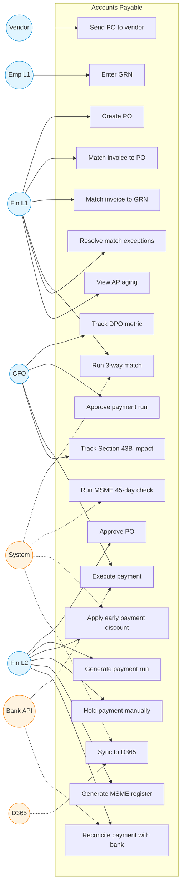

# Accounts Payable — Use Case Diagram

Money owed by 3SC to vendors. Includes 3-way match and MSME compliance enforcement (45-day rule). Status: 🟡 Phase 2.

```mermaid
flowchart LR
    FinL1((Fin L1))
    FinL2((Fin L2))
    CFO((CFO))
    EmpL1((Emp L1))
    Vendor((Vendor))
    System((System))
    Bank((Bank API))
    D365((D365))

    subgraph AP["Accounts Payable"]
        UC1[Create PO]
        UC2[Approve PO]
        UC3[Send PO to vendor]
        UC4[Enter GRN]
        UC5[Match invoice to PO]
        UC6[Match invoice to GRN]
        UC7[Run 3-way match]
        UC8[Resolve match exceptions]
        UC9[View AP aging]
        UC10[Track DPO metric]
        UC11[Run MSME 45-day check]
        UC12[Generate payment run]
        UC13[Approve payment run]
        UC14[Execute payment]
        UC15[Apply early payment discount]
        UC16[Hold payment manually]
        UC17[Track Section 43B impact]
        UC18[Generate MSME register]
        UC19[Reconcile payment with bank]
        UC20[Sync to D365]
    end

    FinL1 --> UC1
    FinL1 --> UC5
    FinL1 --> UC6
    FinL1 --> UC7
    FinL1 --> UC8
    FinL1 --> UC9
    FinL2 --> UC2
    FinL2 --> UC12
    FinL2 --> UC15
    FinL2 --> UC16
    FinL2 --> UC18
    FinL2 --> UC19
    CFO --> UC10
    CFO --> UC13
    CFO --> UC14
    CFO --> UC17
    EmpL1 --> UC4
    Vendor --> UC3
    System -.-> UC7
    System -.-> UC11
    System -.-> UC15
    System -.-> UC20
    Bank -.-> UC14
    Bank -.-> UC19
    D365 -.-> UC20

    classDef actor fill:#e1f5ff,stroke:#0288d1
    classDef ext fill:#fff4e1,stroke:#f57c00
    class FinL1,FinL2,CFO,EmpL1,Vendor actor
    class System,Bank,D365 ext
```
