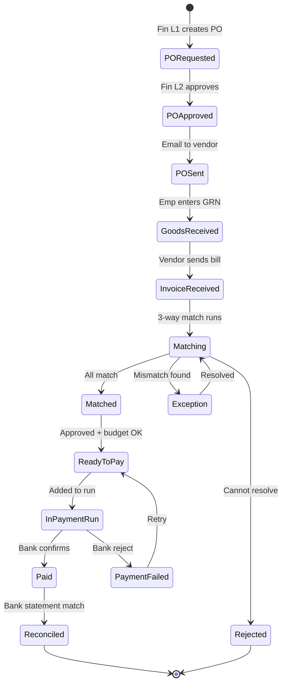
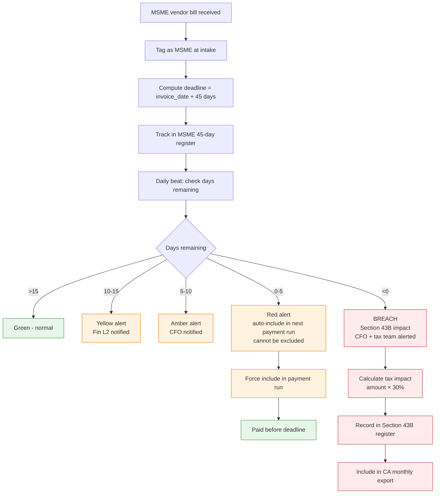
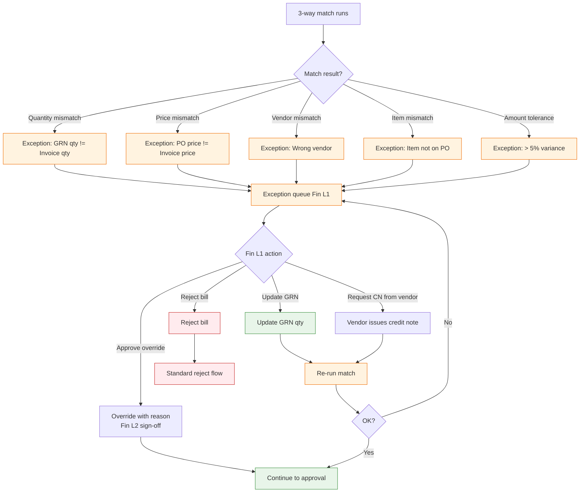

# Accounts Payable — Flow Diagrams

## P2P (Procure-to-Pay) State Machine

## Happy Path — Standard P2P

```mermaid
flowchart TD
    Need[Department needs goods/services] --> CreatePO[Fin L1 creates PO]
    CreatePO --> POApprove[Fin L2 approves PO<br/>budget pre-check]
    POApprove --> SendPO[Send PO to vendor]
    SendPO --> Wait[Wait for delivery]
    Wait --> Delivery[Goods delivered]
    Delivery --> GRN[Emp L1 enters GRN<br/>quantity received]
    GRN --> Invoice[Vendor sends invoice<br/>via Expense module]
    Invoice --> ThreeWay[3-Way Match Engine]

    ThreeWay --> MatchPO{PO match?<br/>vendor + items + price}
    MatchPO -->|Yes| MatchGRN{GRN match?<br/>quantity}
    MatchGRN -->|Yes| MatchInv{Invoice match?<br/>amount}
    MatchInv -->|Yes| Matched[All matched]
    Matched --> BudgetCheck[Real-time budget check]
    BudgetCheck --> ApprovalChain[6-step approval chain]
    ApprovalChain --> ReadyPay[Ready to Pay]
    ReadyPay --> AddRun[Added to next payment run]
    AddRun --> RunSchedule[Payment run scheduled<br/>weekly Tue/Fri]
    RunSchedule --> CFOApprove[CFO approves run]
    CFOApprove --> Execute[Execute via bank API]
    Execute --> BankConfirm[Bank confirms NEFT]
    BankConfirm --> Paid[State: Paid]
    Paid --> ReconBank[Auto-reconcile next bank statement]
    ReconBank --> Reconciled[State: Reconciled]
    Reconciled --> SyncD365[Sync to D365]
    SyncD365 --> NotifyVendor[Notify vendor with UTR]

    classDef happy fill:#e8f5e9,stroke:#388e3c
    classDef sys fill:#f3e5f5,stroke:#7b1fa2
    classDef ext fill:#e0f7fa,stroke:#00838f
    class CreatePO,POApprove,GRN,Matched,ApprovalChain,CFOApprove,Reconciled,SyncD365 happy
    class ThreeWay,MatchPO,MatchGRN,MatchInv,BudgetCheck sys
    class Execute,BankConfirm,ReconBank ext
```

## Critical Flow — MSME 45-Day Rule Enforcement

Section 43B(h) of Income Tax Act: payments to MSME vendors beyond 45 days are disallowed as deduction. This triggers automatic enforcement.

## Bad Path — 3-Way Match Exception

## Edge Cases

| ID | Edge Case | Resolution |
|---|---|---|
| APEC1 | Invoice received before GRN | Hold in pending GRN queue, alert dept |
| APEC2 | GRN entered for partial qty | Match against partial, balance in pending |
| APEC3 | Vendor sends multiple invoices for one PO | Match each invoice cumulatively against PO balance |
| APEC4 | Early payment discount available | Auto-flag, calculate savings, prioritize in run |
| APEC5 | Bank API timeout during payment run | Retry per-vendor, isolate failures, do not re-pay successes |
| APEC6 | UTR returned but bank later reverses | Listen for reversal webhook, revert state, alert |
| APEC7 | Vendor bank changed during pending bill | Pause this bill until bank change cleared |
| APEC8 | MSME bill stuck in dispute > 45 days | Tax team alerted, dispute does not pause Section 43B clock |
| APEC9 | Foreign vendor (no GST) | Skip GST checks, apply RBI rate, track FX |
| APEC10 | Duplicate invoice from vendor | Hard reject via dedupe (vendor + invoice_no + amount) |
