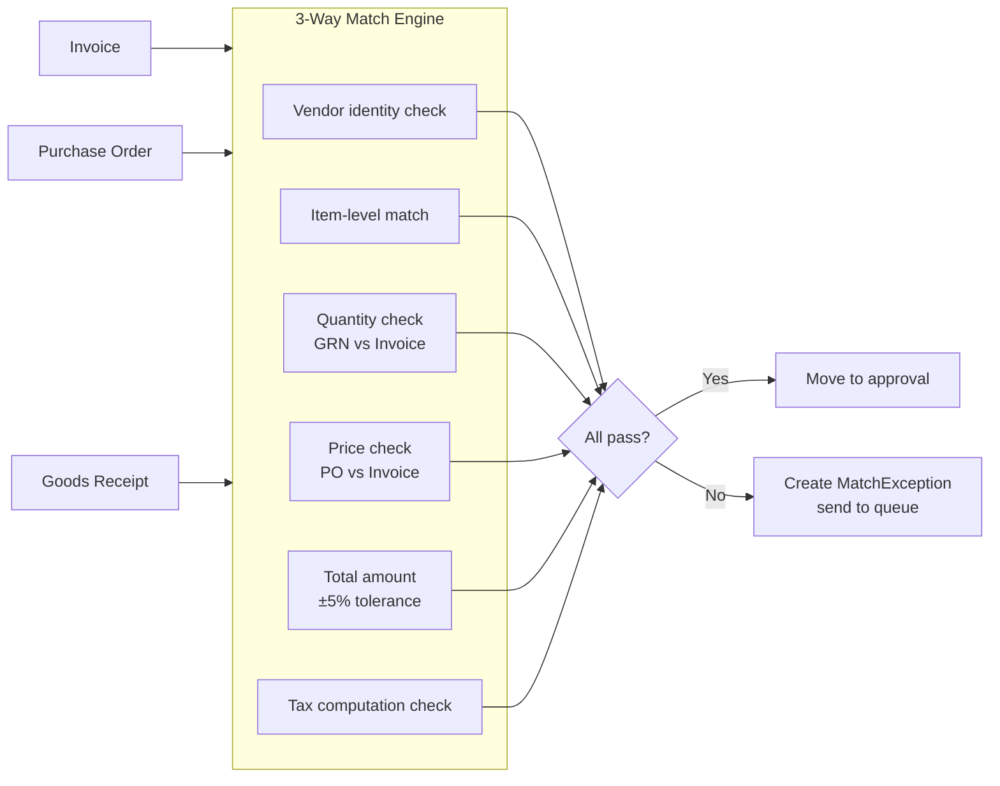

# Accounts Payable — Architecture Diagram

```mermaid
flowchart TB
    subgraph FE["Frontend"]
        POUI[PO Management UI]
        GRNUI[GRN Entry UI]
        ExcUI[Match Exception Queue]
        PayRunUI[Payment Run Console]
        MSMEUI[MSME Compliance Dashboard]
    end

    Gateway[API Gateway]
    POUI --> Gateway
    GRNUI --> Gateway
    ExcUI --> Gateway
    PayRunUI --> Gateway
    MSMEUI --> Gateway

    subgraph DjangoApp["Django: apps/ap"]
        POApi[POViewSet]
        GRNApi[GRNViewSet]
        MatchApi[MatchViewSet]
        AgingApi[APAgingViewSet]
        RunApi[PaymentRunViewSet]
        MSMEApi[MSMEViewSet]
        DPOApi[DPOMetricViewSet]

        POModel[PurchaseOrder]
        GRNModel[GoodsReceipt]
        MatchExcModel[MatchException]
        APAgingModel[APAgingSnapshot]
        RunModel[PaymentRun]
        RunItemModel[PaymentRunItem]
        MSMEReg[MSMERegister]
        Sec43BModel[Sec43BRegister]

        SvcMatch[ThreeWayMatcher]
        SvcRun[PaymentRunGenerator]
        SvcExec[PaymentExecutor]
        SvcMSME[MSMEEnforcer]
        SvcDPO[DPOCalculator]
        SvcDisc[EarlyDiscountFinder]
    end

    Gateway --> POApi
    Gateway --> GRNApi
    Gateway --> MatchApi
    Gateway --> AgingApi
    Gateway --> RunApi
    Gateway --> MSMEApi
    Gateway --> DPOApi

    MatchApi --> SvcMatch
    RunApi --> SvcRun
    RunApi --> SvcExec
    MSMEApi --> SvcMSME
    DPOApi --> SvcDPO

    subgraph Workers["Celery Workers"]
        MSMEBeat[MSME 45-day Beat<br/>daily 6 AM]
        RunBeat[Payment Run Beat<br/>Tue + Fri 11 AM]
        AgingBeat[Aging Beat<br/>nightly]
        DiscBeat[Discount Scanner<br/>daily]
        BankPoll[Bank Confirmation Poller]
        D365SyncBeat[D365 Sync Beat<br/>hourly]
    end

    SvcMSME -.-> MSMEBeat
    SvcRun -.-> RunBeat
    SvcDisc -.-> DiscBeat
    SvcExec -.-> BankPoll

    Beat[Celery Beat] -.-> MSMEBeat
    Beat -.-> RunBeat
    Beat -.-> AgingBeat
    Beat -.-> DiscBeat
    Beat -.-> D365SyncBeat

    subgraph CrossModule["Cross-Module Calls"]
        ExpMod[apps/expenses<br/>bills enter via OCR pipeline]
        BudMod[apps/budgets<br/>real-time check]
        VendMod[apps/vendors<br/>MSME flag source]
        InvMod[apps/invoices<br/>linked POs]
    end

    ExpMod --> MatchApi
    SvcMatch --> BudMod
    MSMEReg --> VendMod
    POApi --> InvMod

    subgraph Shared["Shared"]
        ApprovalApp[apps/approvals]
        AuditApp[apps/core - Audit]
        NotifApp[apps/notifications]
    end

    POApi --> ApprovalApp
    RunApi --> ApprovalApp
    SvcMatch --> AuditApp
    SvcMSME --> NotifApp

    DB[(PostgreSQL)]
    POModel --> DB
    GRNModel --> DB
    MatchExcModel --> DB
    APAgingModel --> DB
    RunModel --> DB
    MSMEReg --> DB
    Sec43BModel --> DB

    subgraph External["External"]
        BankAPI[Bank API<br/>NEFT/RTGS execution]
        D365AP[D365 AP module]
    end

    SvcExec --> BankAPI
    BankPoll --> BankAPI
    D365SyncBeat --> D365AP

    classDef api fill:#e8f5e9,stroke:#388e3c
    classDef svc fill:#fff9c4,stroke:#f9a825
    classDef worker fill:#fff3e0,stroke:#f57c00
    classDef ext fill:#fce4ec,stroke:#c2185b
    classDef cross fill:#fffde7,stroke:#fbc02d

    class POApi,GRNApi,MatchApi,AgingApi,RunApi,MSMEApi,DPOApi api
    class SvcMatch,SvcRun,SvcExec,SvcMSME,SvcDPO,SvcDisc svc
    class MSMEBeat,RunBeat,AgingBeat,DiscBeat,BankPoll,D365SyncBeat,Beat worker
    class BankAPI,D365AP ext
    class ExpMod,BudMod,VendMod,InvMod cross
```

## 3-Way Match Engine — Component View

```mermaid
flowchart LR
    Inv[Invoice] --> Engine
    PO[Purchase Order] --> Engine
    GRN[Goods Receipt] --> Engine

    subgraph Engine["3-Way Match Engine"]
        VendCheck[Vendor identity check]
        ItemCheck[Item-level match]
        QtyCheck[Quantity check<br/>GRN vs Invoice]
        PriceCheck[Price check<br/>PO vs Invoice]
        TotalCheck[Total amount<br/>±5% tolerance]
        TaxCheck[Tax computation check]
    end

    VendCheck --> Result
    ItemCheck --> Result
    QtyCheck --> Result
    PriceCheck --> Result
    TotalCheck --> Result
    TaxCheck --> Result

    Result{All pass?} -->|Yes| Pass[Move to approval]
    Result -->|No| Exc[Create MatchException<br/>send to queue]
```
