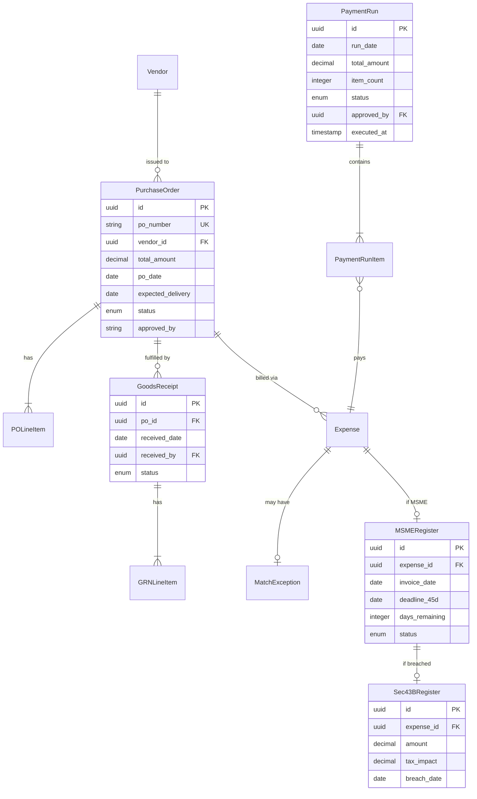
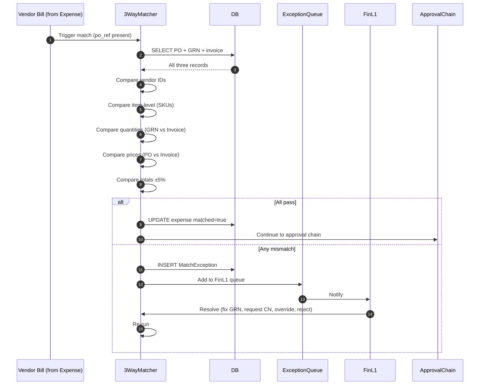
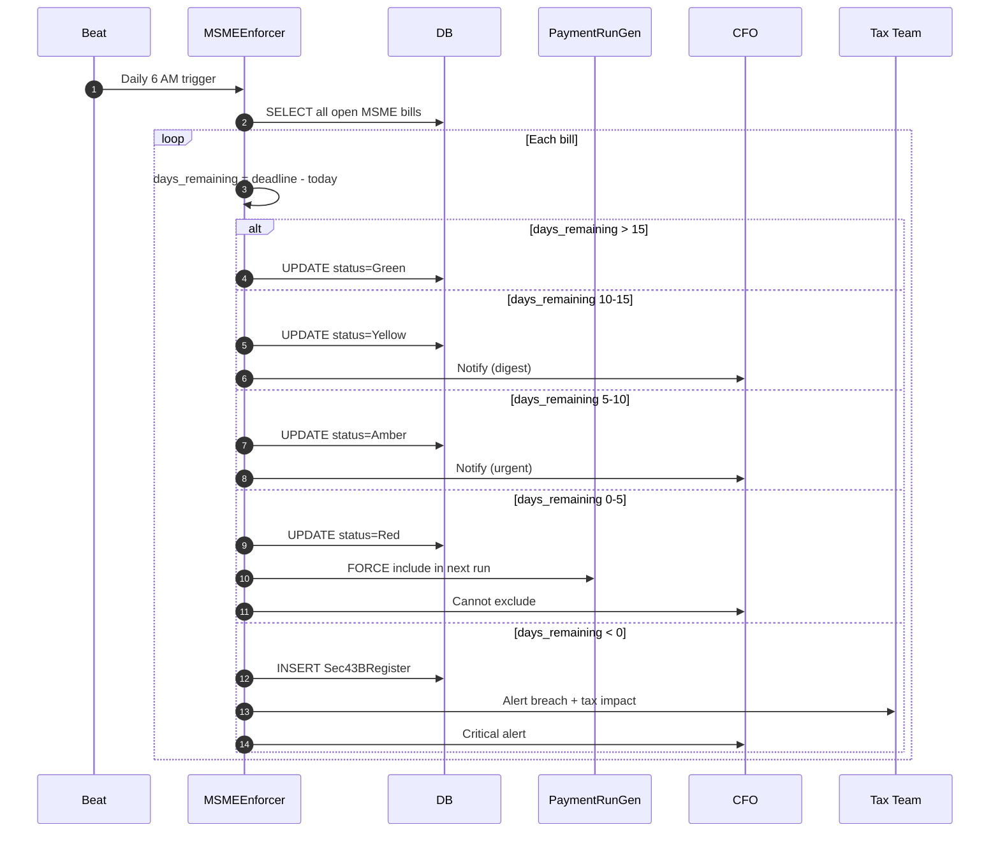
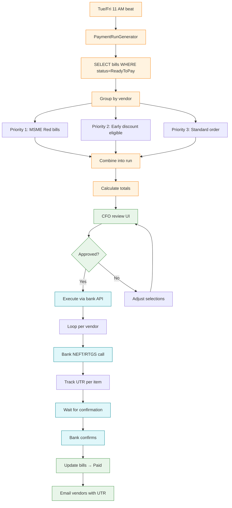

# Accounts Payable — Data Flow Diagram

## Data Model

```mermaid
erDiagram
    Vendor ||--o{ PurchaseOrder : "issued to"
    PurchaseOrder ||--|{ POLineItem : has
    PurchaseOrder ||--o{ GoodsReceipt : "fulfilled by"
    GoodsReceipt ||--|{ GRNLineItem : has
    PurchaseOrder ||--o{ Expense : "billed via"
    Expense ||--o| MatchException : "may have"
    PaymentRun ||--|{ PaymentRunItem : contains
    PaymentRunItem }o--|| Expense : "pays"
    Expense ||--o| MSMERegister : "if MSME"
    MSMERegister ||--o| Sec43BRegister : "if breached"

    PurchaseOrder {
        uuid id PK
        string po_number UK
        uuid vendor_id FK
        decimal total_amount
        date po_date
        date expected_delivery
        enum status
        string approved_by
    }

    GoodsReceipt {
        uuid id PK
        uuid po_id FK
        date received_date
        uuid received_by FK
        enum status
    }

    PaymentRun {
        uuid id PK
        date run_date
        decimal total_amount
        integer item_count
        enum status
        uuid approved_by FK
        timestamp executed_at
    }

    MSMERegister {
        uuid id PK
        uuid expense_id FK
        date invoice_date
        date deadline_45d
        integer days_remaining
        enum status
    }

    Sec43BRegister {
        uuid id PK
        uuid expense_id FK
        decimal amount
        decimal tax_impact
        date breach_date
    }
```

## Sequence: 3-Way Match

```mermaid
sequenceDiagram
    autonumber
    participant Bill as Vendor Bill (from Expense)
    participant Match as 3WayMatcher
    participant DB
    participant Exc as ExceptionQueue
    participant FinL1
    participant App as ApprovalChain

    Bill->>Match: Trigger match (po_ref present)
    Match->>DB: SELECT PO + GRN + invoice
    DB-->>Match: All three records

    Match->>Match: Compare vendor IDs
    Match->>Match: Compare item-level (SKUs)
    Match->>Match: Compare quantities (GRN vs Invoice)
    Match->>Match: Compare prices (PO vs Invoice)
    Match->>Match: Compare totals ±5%

    alt All pass
        Match->>DB: UPDATE expense matched=true
        Match->>App: Continue to approval chain
    else Any mismatch
        Match->>DB: INSERT MatchException
        Match->>Exc: Add to FinL1 queue
        Exc->>FinL1: Notify
        FinL1->>Match: Resolve (fix GRN, request CN, override, reject)
        Match->>Match: Re-run
    end
```

## Sequence: MSME Daily Beat + Auto-Inclusion

```mermaid
sequenceDiagram
    autonumber
    participant Beat
    participant MSME as MSMEEnforcer
    participant DB
    participant Run as PaymentRunGen
    participant CFO
    participant Tax as Tax Team

    Beat->>MSME: Daily 6 AM trigger
    MSME->>DB: SELECT all open MSME bills
    loop Each bill
        MSME->>MSME: days_remaining = deadline - today
        alt days_remaining > 15
            MSME->>DB: UPDATE status=Green
        else days_remaining 10-15
            MSME->>DB: UPDATE status=Yellow
            MSME->>CFO: Notify (digest)
        else days_remaining 5-10
            MSME->>DB: UPDATE status=Amber
            MSME->>CFO: Notify (urgent)
        else days_remaining 0-5
            MSME->>DB: UPDATE status=Red
            MSME->>Run: FORCE include in next run
            MSME->>CFO: Cannot exclude
        else days_remaining < 0
            MSME->>DB: INSERT Sec43BRegister
            MSME->>Tax: Alert breach + tax impact
            MSME->>CFO: Critical alert
        end
    end
```

## Payment Run Generation Pipeline

```mermaid
flowchart TD
    Beat[Tue/Fri 11 AM beat] --> Gen[PaymentRunGenerator]
    Gen --> Filter[SELECT bills WHERE status=ReadyToPay]
    Filter --> Group[Group by vendor]
    Group --> MSMEPriority[Priority 1: MSME Red bills]
    Group --> Discount[Priority 2: Early discount eligible]
    Group --> Standard[Priority 3: Standard order]

    MSMEPriority --> Combine[Combine into run]
    Discount --> Combine
    Standard --> Combine
    Combine --> Total[Calculate totals]
    Total --> CFOReview[CFO review UI]
    CFOReview --> Approve{Approved?}
    Approve -->|Yes| Execute[Execute via bank API]
    Approve -->|No| Adjust[Adjust selections]
    Adjust --> CFOReview
    Execute --> PerVendor[Loop per vendor]
    PerVendor --> NEFT[Bank NEFT/RTGS call]
    NEFT --> Track[Track UTR per item]
    Track --> Wait[Wait for confirmation]
    Wait --> Confirm[Bank confirms]
    Confirm --> UpdatePaid[Update bills → Paid]
    UpdatePaid --> NotifyVendors[Email vendors with UTR]

    classDef beat fill:#fff3e0,stroke:#f57c00
    classDef proc fill:#e8f5e9,stroke:#388e3c
    classDef ext fill:#e0f7fa,stroke:#00838f
    class Beat,Gen,Filter,Group,Combine,Total beat
    class CFOReview,Approve,UpdatePaid,NotifyVendors proc
    class Execute,NEFT,Wait,Confirm ext
```
