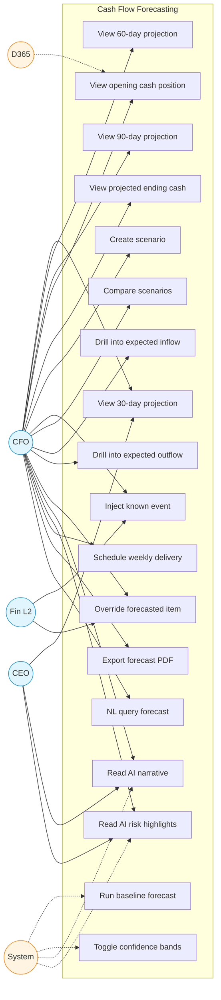

# Cash Flow Forecasting — Use Case Diagram

Forward-looking 30/60/90-day cash projection with scenario modeling and AI narrative. Status: 🔵 Phase 3.

```mermaid
flowchart LR
    CFO((CFO))
    CEO((CEO))
    FinL2((Fin L2))
    System((System))
    D365((D365))

    subgraph CF["Cash Flow Forecasting"]
        UC1[View 30-day projection]
        UC2[View 60-day projection]
        UC3[View 90-day projection]
        UC4[View opening cash position]
        UC5[View projected ending cash]
        UC6[Run baseline forecast]
        UC7[Create scenario]
        UC8[Inject known event]
        UC9[Compare scenarios]
        UC10[Toggle confidence bands]
        UC11[Drill into expected inflow]
        UC12[Drill into expected outflow]
        UC13[Override forecasted item]
        UC14[Read AI narrative]
        UC15[Read AI risk highlights]
        UC16[Schedule weekly delivery]
        UC17[Export forecast PDF]
        UC18[NL query forecast]
    end

    CFO --> UC1
    CFO --> UC2
    CFO --> UC3
    CFO --> UC4
    CFO --> UC5
    CFO --> UC7
    CFO --> UC8
    CFO --> UC9
    CFO --> UC11
    CFO --> UC12
    CFO --> UC13
    CFO --> UC14
    CFO --> UC15
    CFO --> UC16
    CFO --> UC17
    CFO --> UC18
    CEO --> UC1
    CEO --> UC14
    CEO --> UC15
    FinL2 --> UC8
    FinL2 --> UC13
    System -.-> UC6
    System -.-> UC10
    System -.-> UC14
    System -.-> UC15
    D365 -.-> UC4

    classDef actor fill:#e1f5ff,stroke:#0288d1
    classDef ext fill:#fff4e1,stroke:#f57c00
    class CFO,CEO,FinL2 actor
    class System,D365 ext
```
