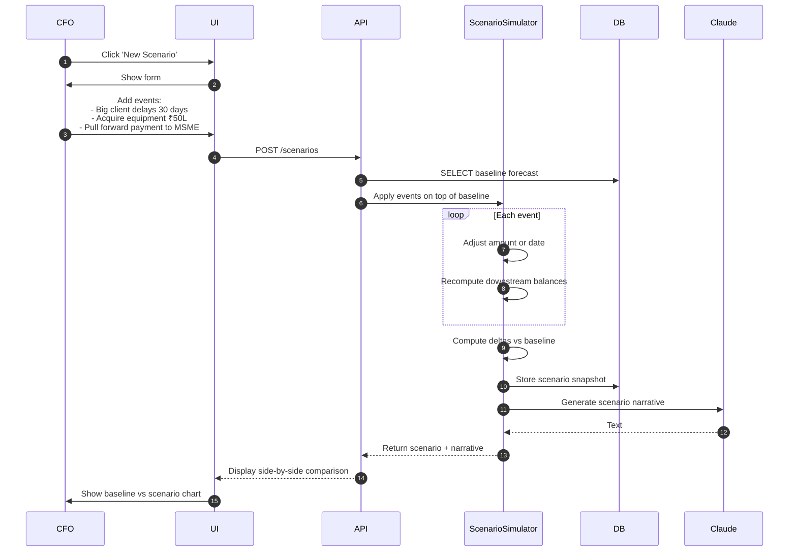

# Cash Flow Forecasting — Flow Diagrams

## Forecast Generation Flow

```mermaid
flowchart TD
    Trigger[Beat: nightly 1 AM<br/>or on-demand] --> LoadOpen[Load opening cash position<br/>from D365 GL]
    LoadOpen --> LoadAR[Load AR ledger<br/>open invoices + due dates]
    LoadAR --> LoadAP[Load AP ledger<br/>scheduled payment runs]
    LoadAP --> LoadRec[Load recurring items<br/>salaries, rent, utilities]
    LoadRec --> LoadStat[Load statutory dues<br/>GST, TDS, PF, ESI]
    LoadStat --> LoadHist[Load historical patterns<br/>last 24 months]

    LoadHist --> Prophet[Run Prophet model]
    Prophet --> Yhat[Generate yhat predictions]
    Yhat --> Bands[Generate yhat_lower / yhat_upper]
    Bands --> Combine[Combine known + predicted]
    Combine --> Layer[Layer by date]
    Layer --> Compute[Compute running balance]
    Compute --> Daily[Build daily projection 30/60/90]
    Daily --> StoreF[Store ForecastSnapshot]

    StoreF --> Anomaly[Check for anomalies vs historical]
    Anomaly --> AINarr[AI: generate narrative]
    AINarr --> AIRisk[AI: highlight risks]
    AIRisk --> Render[Render dashboard data]
    Render --> Notify[Notify CFO if dashboard updated]

    classDef sys fill:#f3e5f5,stroke:#7b1fa2
    classDef ml fill:#e1bee7,stroke:#4a148c
    classDef ai fill:#fce4ec,stroke:#c2185b
    class LoadOpen,LoadAR,LoadAP,LoadRec,LoadStat,LoadHist,Combine,Layer,Compute,Daily,StoreF sys
    class Prophet,Yhat,Bands,Anomaly ml
    class AINarr,AIRisk,Render ai
```

## Scenario Modeling Flow

## Edge Cases

| ID | Edge Case | Resolution |
|---|---|---|
| CFEC1 | New entity, no historical data | Use heuristic baseline (manual config) until 6 months data available |
| CFEC2 | Massive outlier in historical data | Prophet handles via change-points, optionally exclude with flag |
| CFEC3 | Holiday calendar (no business activity) | Use Indian holiday calendar in Prophet seasonality |
| CFEC4 | FX exposure on USD invoices | Show in INR at current spot, sensitivity range ±5% |
| CFEC5 | Bank balance API returns stale | Use D365 last-sync, show warning banner |
| CFEC6 | Conflicting overrides (multiple users) | Last-write-wins, audit log who/when |
| CFEC7 | Forecast confidence band too wide | Show alert + suggest adding more history or stronger seasonality |
| CFEC8 | Statutory dues date moved (govt extension) | Manual override flag, picked up next forecast run |
