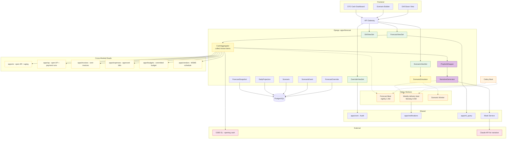

# Cash Flow Forecasting — Architecture Diagram

```mermaid
flowchart TB
    subgraph FE["Frontend"]
        CFOCash[CFO Cash Dashboard]
        ScenUI[Scenario Builder]
        DrillUI[Drill-Down View]
    end

    Gateway[API Gateway]
    CFOCash --> Gateway
    ScenUI --> Gateway
    DrillUI --> Gateway

    subgraph DjangoApp["Django: apps/forecast"]
        ForecastApi[ForecastViewSet]
        ScenApi[ScenarioViewSet]
        DrillApi[DrillViewSet]
        OvrApi[OverrideViewSet]

        SnapModel[ForecastSnapshot]
        DailyModel[DailyProjection]
        ScenarioModel[Scenario]
        EventModel[ScenarioEvent]
        OverrideModel[ForecastOverride]

        SvcAggregator[CashAggregator<br/>collect known items]
        SvcProphet[ProphetWrapper]
        SvcSim[ScenarioSimulator]
        SvcNarr[NarrativeGenerator]
    end

    Gateway --> ForecastApi
    Gateway --> ScenApi
    Gateway --> DrillApi
    Gateway --> OvrApi

    ForecastApi --> SvcAggregator
    SvcAggregator --> SvcProphet
    ScenApi --> SvcSim
    SvcProphet --> SvcNarr

    subgraph Workers["Celery Workers"]
        ForecastBeat[Forecast Beat<br/>nightly 1 AM]
        WeeklyBeat[Weekly delivery beat<br/>Monday 8 AM]
        ScenWorker[Scenario Worker]
    end

    SvcAggregator -.-> ForecastBeat
    SvcSim -.-> ScenWorker
    SvcNarr -.-> WeeklyBeat

    Beat[Celery Beat] -.-> ForecastBeat
    Beat -.-> WeeklyBeat

    subgraph CrossModule["Cross-Module Reads"]
        ARMod[apps/ar - open AR + aging]
        APMod[apps/ap - open AP + payment runs]
        InvMod[apps/invoices - sent invoices]
        ExpMod[apps/expenses - approved bills]
        BudMod[apps/budgets - committed budget]
        VendMod[apps/vendors - MSME schedule]
    end

    SvcAggregator --> ARMod
    SvcAggregator --> APMod
    SvcAggregator --> InvMod
    SvcAggregator --> ExpMod
    SvcAggregator --> BudMod
    SvcAggregator --> VendMod

    subgraph Shared["Shared"]
        AuditApp[apps/core - Audit]
        NotifApp[apps/notifications]
        NLQ[apps/nl_query]
        MaskSvc[Mask Service]
    end

    OvrApi --> AuditApp
    WeeklyBeat --> NotifApp
    ForecastApi --> NLQ
    SvcNarr --> MaskSvc

    DB[(PostgreSQL)]
    SnapModel --> DB
    DailyModel --> DB
    ScenarioModel --> DB
    EventModel --> DB
    OverrideModel --> DB

    subgraph External["External"]
        D365GL[D365 GL - opening cash]
        Claude[Claude API for narrative]
    end

    SvcAggregator --> D365GL
    MaskSvc --> Claude

    classDef api fill:#e8f5e9,stroke:#388e3c
    classDef svc fill:#fff9c4,stroke:#f9a825
    classDef ml fill:#e1bee7,stroke:#4a148c
    classDef worker fill:#fff3e0,stroke:#f57c00
    classDef ext fill:#fce4ec,stroke:#c2185b
    classDef cross fill:#fffde7,stroke:#fbc02d

    class ForecastApi,ScenApi,DrillApi,OvrApi api
    class SvcAggregator,SvcSim svc
    class SvcProphet,SvcNarr ml
    class ForecastBeat,WeeklyBeat,ScenWorker,Beat worker
    class D365GL,Claude ext
    class ARMod,APMod,InvMod,ExpMod,BudMod,VendMod cross
```
