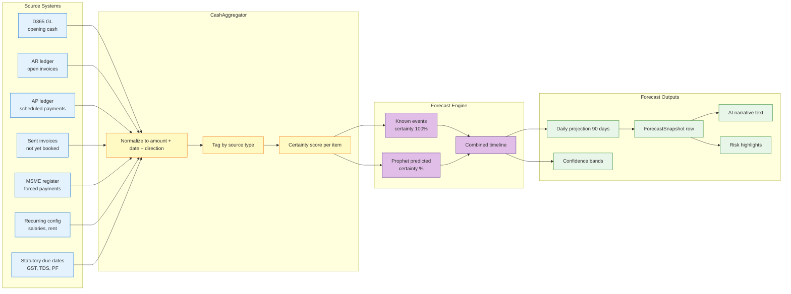
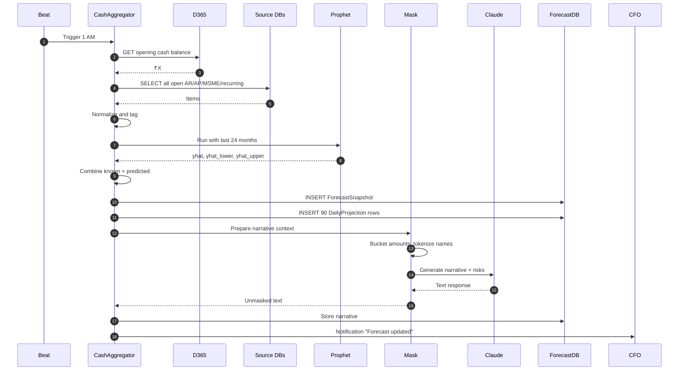
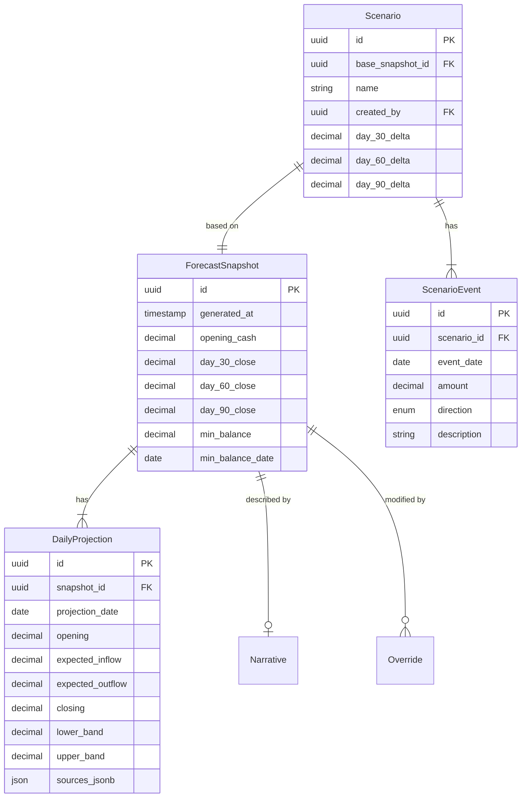

# Cash Flow Forecasting — Data Flow Diagram

## Forecast Data Flow

```mermaid
flowchart LR
    subgraph Sources["Source Systems"]
        D365[D365 GL<br/>opening cash]
        AR[AR ledger<br/>open invoices]
        AP[AP ledger<br/>scheduled payments]
        Inv[Sent invoices<br/>not yet booked]
        MSME[MSME register<br/>forced payments]
        Recurring[Recurring config<br/>salaries, rent]
        Statutory[Statutory due dates<br/>GST, TDS, PF]
    end

    subgraph Aggregator["CashAggregator"]
        Norm[Normalize to amount + date + direction]
        Tag[Tag by source type]
        Cert[Certainty score per item]
    end

    D365 --> Norm
    AR --> Norm
    AP --> Norm
    Inv --> Norm
    MSME --> Norm
    Recurring --> Norm
    Statutory --> Norm
    Norm --> Tag
    Tag --> Cert

    subgraph Engine["Forecast Engine"]
        Known[Known events<br/>certainty 100%]
        Predicted[Prophet predicted<br/>certainty %]
        Combined[Combined timeline]
    end

    Cert --> Known
    Cert --> Predicted
    Known --> Combined
    Predicted --> Combined

    subgraph Output["Forecast Outputs"]
        Daily[Daily projection 90 days]
        Bands[Confidence bands]
        Snap[ForecastSnapshot row]
        Narr[AI narrative text]
        Risk[Risk highlights]
    end

    Combined --> Daily
    Combined --> Bands
    Daily --> Snap
    Snap --> Narr
    Snap --> Risk

    classDef src fill:#e3f2fd,stroke:#1976d2
    classDef agg fill:#fff9c4,stroke:#f57f17
    classDef eng fill:#e1bee7,stroke:#4a148c
    classDef out fill:#e8f5e9,stroke:#388e3c
    class D365,AR,AP,Inv,MSME,Recurring,Statutory src
    class Norm,Tag,Cert agg
    class Known,Predicted,Combined eng
    class Daily,Bands,Snap,Narr,Risk out
```

## Sequence: Daily Forecast Generation

```mermaid
sequenceDiagram
    autonumber
    participant Beat
    participant Agg as CashAggregator
    participant D365
    participant DBSrc as Source DBs
    participant Prophet
    participant Mask
    participant Claude
    participant DBOut as ForecastDB
    participant CFO

    Beat->>Agg: Trigger 1 AM
    Agg->>D365: GET opening cash balance
    D365-->>Agg: ₹X
    Agg->>DBSrc: SELECT all open AR/AP/MSME/recurring
    DBSrc-->>Agg: Items

    Agg->>Agg: Normalize and tag
    Agg->>Prophet: Run with last 24 months
    Prophet-->>Agg: yhat, yhat_lower, yhat_upper

    Agg->>Agg: Combine known + predicted
    Agg->>DBOut: INSERT ForecastSnapshot
    Agg->>DBOut: INSERT 90 DailyProjection rows

    Agg->>Mask: Prepare narrative context
    Mask->>Mask: Bucket amounts, tokenize names
    Mask->>Claude: Generate narrative + risks
    Claude-->>Mask: Text response
    Mask-->>Agg: Unmasked text
    Agg->>DBOut: Store narrative

    Agg->>CFO: Notification "Forecast updated"
```

## Data Model

```mermaid
erDiagram
    ForecastSnapshot ||--|{ DailyProjection : has
    ForecastSnapshot ||--o| Narrative : "described by"
    ForecastSnapshot ||--o{ Override : "modified by"
    Scenario ||--|| ForecastSnapshot : "based on"
    Scenario ||--|{ ScenarioEvent : has

    ForecastSnapshot {
        uuid id PK
        timestamp generated_at
        decimal opening_cash
        decimal day_30_close
        decimal day_60_close
        decimal day_90_close
        decimal min_balance
        date min_balance_date
    }

    DailyProjection {
        uuid id PK
        uuid snapshot_id FK
        date projection_date
        decimal opening
        decimal expected_inflow
        decimal expected_outflow
        decimal closing
        decimal lower_band
        decimal upper_band
        json sources_jsonb
    }

    Scenario {
        uuid id PK
        uuid base_snapshot_id FK
        string name
        uuid created_by FK
        decimal day_30_delta
        decimal day_60_delta
        decimal day_90_delta
    }

    ScenarioEvent {
        uuid id PK
        uuid scenario_id FK
        date event_date
        decimal amount
        enum direction
        string description
    }
```
