# Reporting — Use Case Diagram

16 standard reports plus NL query, scheduled delivery, and CFO summaries. Status: 🟡 Phase 2.

```mermaid
flowchart LR
    CFO((CFO))
    CEO((CEO))
    FinL1((Fin L1))
    FinL2((Fin L2))
    HoD((Dept Head))
    CA((External CA))
    System((System))

    subgraph RP["Reporting"]
        UC1[Generate AR aging report]
        UC2[Generate AP aging report]
        UC3[Generate B vs A monthly]
        UC4[Generate cash position]
        UC5[Generate vendor scorecard]
        UC6[Generate invoice register]
        UC7[Generate purchase register]
        UC8[Generate GST returns prep]
        UC9[Generate TDS summary]
        UC10[Generate MSME compliance]
        UC11[Generate dept consumption]
        UC12[Generate revenue MIS]
        UC13[Generate expense MIS]
        UC14[Generate audit log export]
        UC15[Generate Sec43B register]
        UC16[Generate CFO monthly summary]

        UC17[Schedule report email]
        UC18[Set delivery cadence]
        UC19[Configure recipients]

        UC20[Export PDF]
        UC21[Export Excel]
        UC22[Export CSV]

        UC23[NL query data]
        UC24[Save NL query as report]
        UC25[Read AI summary]
    end

    CFO --> UC3
    CFO --> UC4
    CFO --> UC11
    CFO --> UC12
    CFO --> UC13
    CFO --> UC16
    CFO --> UC17
    CFO --> UC23
    CFO --> UC25
    CEO --> UC4
    CEO --> UC12
    CEO --> UC16
    CEO --> UC25
    FinL1 --> UC1
    FinL1 --> UC2
    FinL1 --> UC6
    FinL1 --> UC7
    FinL2 --> UC8
    FinL2 --> UC9
    FinL2 --> UC10
    FinL2 --> UC15
    HoD --> UC11
    CA --> UC8
    CA --> UC9
    CA --> UC15
    System -.-> UC16
    System -.-> UC17
    System -.-> UC25

    classDef actor fill:#e1f5ff,stroke:#0288d1
    classDef sys fill:#f3e5f5,stroke:#7b1fa2
    classDef ext fill:#fff4e1,stroke:#f57c00
    class CFO,CEO,FinL1,FinL2,HoD actor
    class System sys
    class CA ext
```

## Standard Report Inventory

| # | Report | Frequency | Primary Users | Source Modules |
|---|---|---|---|---|
| 1 | AR Aging | Daily | Fin L1, CFO | AR |
| 2 | AP Aging | Daily | Fin L1, CFO | AP |
| 3 | B vs A Monthly | Monthly 2nd | CFO, HoDs | Budget, AP |
| 4 | Cash Position | Daily | CFO, CEO | Forecast |
| 5 | Vendor Scorecard | Weekly | CFO | Vendor, AP |
| 6 | Invoice Register | Monthly | Fin L2, CA | Invoice |
| 7 | Purchase Register | Monthly | Fin L2, CA | Expense, AP |
| 8 | GST Returns Prep (1, 2A, 3B) | Monthly | Fin L2, CA | Invoice, AP |
| 9 | TDS Summary | Monthly | Fin L2, CA | Invoice, AP |
| 10 | MSME Compliance | Weekly | CFO, CA | AP |
| 11 | Dept Consumption | Weekly | HoDs | Budget, Expense |
| 12 | Revenue MIS | Monthly | CFO, CEO | Invoice, AR |
| 13 | Expense MIS | Monthly | CFO | Expense, AP |
| 14 | Audit Log Export | On-demand | Audit, CFO | Audit |
| 15 | Sec 43B Register | Monthly | CFO, CA | AP |
| 16 | CFO Monthly Summary | Monthly | CFO, CEO, Board | All modules |
