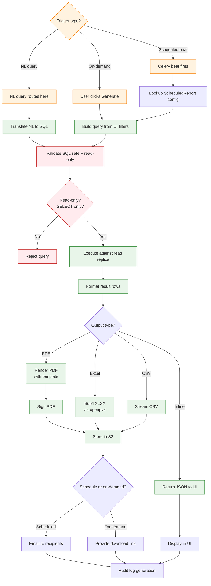
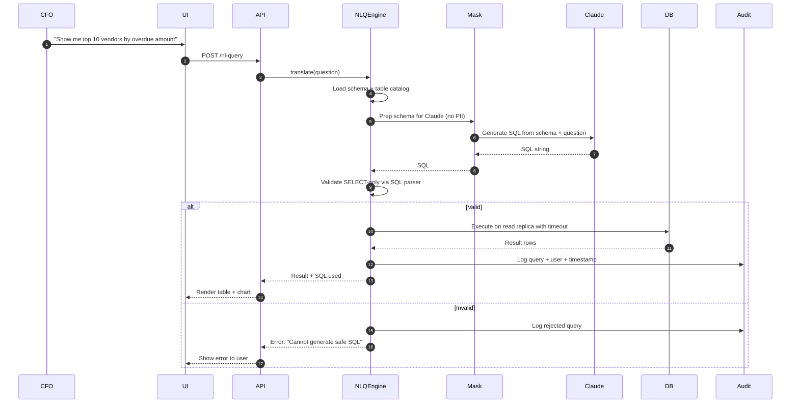
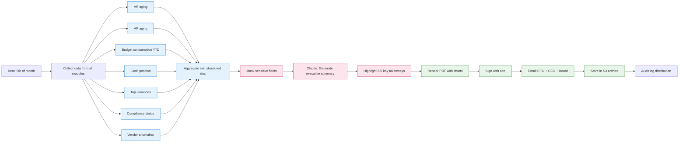

# Reporting — Flow Diagrams

## Report Generation Pipeline

```mermaid
flowchart TD
    Trigger{Trigger type?}
    Trigger -->|Scheduled beat| Beat[Celery beat fires]
    Trigger -->|On-demand| User[User clicks Generate]
    Trigger -->|NL query| NLQ[NL query routes here]

    Beat --> Lookup[Lookup ScheduledReport config]
    User --> Build[Build query from UI filters]
    NLQ --> Translate[Translate NL to SQL]

    Lookup --> Build
    Translate --> Validate[Validate SQL safe + read-only]
    Build --> Validate

    Validate --> ReadOnly{Read-only?<br/>SELECT only?}
    ReadOnly -->|No| Reject[Reject query]
    ReadOnly -->|Yes| Execute[Execute against read replica]

    Execute --> Format[Format result rows]
    Format --> Choice{Output type?}
    Choice -->|PDF| RenderPDF[Render PDF<br/>with template]
    Choice -->|Excel| BuildXlsx[Build XLSX<br/>via openpyxl]
    Choice -->|CSV| WriteCSV[Stream CSV]
    Choice -->|Inline| Inline[Return JSON to UI]

    RenderPDF --> Sign[Sign PDF]
    Sign --> Store[Store in S3]
    BuildXlsx --> Store
    WriteCSV --> Store
    Store --> Decision{Schedule or on-demand?}
    Decision -->|Scheduled| Email[Email to recipients]
    Decision -->|On-demand| Download[Provide download link]
    Inline --> Display[Display in UI]

    Email --> AuditLog[Audit log generation]
    Download --> AuditLog
    Display --> AuditLog

    classDef trigger fill:#fff3e0,stroke:#f57c00
    classDef proc fill:#e8f5e9,stroke:#388e3c
    classDef secure fill:#ffebee,stroke:#c62828
    class Trigger,Beat,User,NLQ trigger
    class Build,Translate,Execute,Format,RenderPDF,BuildXlsx,WriteCSV,Inline,Sign,Store proc
    class Validate,ReadOnly,Reject secure
```

## NL Query Flow

```mermaid
sequenceDiagram
    autonumber
    participant CFO
    participant UI
    participant API
    participant NLQ as NLQEngine
    participant Mask
    participant Claude
    participant DB
    participant Audit

    CFO->>UI: "Show me top 10 vendors by overdue amount"
    UI->>API: POST /nl-query
    API->>NLQ: translate(question)
    NLQ->>NLQ: Load schema + table catalog
    NLQ->>Mask: Prep schema for Claude (no PII)
    Mask->>Claude: Generate SQL from schema + question
    Claude-->>Mask: SQL string
    Mask-->>NLQ: SQL
    NLQ->>NLQ: Validate SELECT-only via SQL parser
    alt Valid
        NLQ->>DB: Execute on read replica with timeout
        DB-->>NLQ: Result rows
        NLQ->>Audit: Log query + user + timestamp
        NLQ-->>API: Result + SQL used
        API-->>UI: Render table + chart
    else Invalid
        NLQ->>Audit: Log rejected query
        NLQ-->>API: Error: "Cannot generate safe SQL"
        API-->>UI: Show error to user
    end
```

## CFO Monthly Summary Generation

```mermaid
flowchart LR
    Trigger[Beat: 5th of month] --> Collect[Collect data from all modules]
    Collect --> M1[AR aging]
    Collect --> M2[AP aging]
    Collect --> M3[Budget consumption YTD]
    Collect --> M4[Cash position]
    Collect --> M5[Top variances]
    Collect --> M6[Compliance status]
    Collect --> M7[Vendor anomalies]

    M1 --> Aggregate
    M2 --> Aggregate
    M3 --> Aggregate
    M4 --> Aggregate
    M5 --> Aggregate
    M6 --> Aggregate
    M7 --> Aggregate

    Aggregate[Aggregate into structured doc] --> Mask[Mask sensitive fields]
    Mask --> AI[Claude: Generate executive summary]
    AI --> Highlight[Highlight 3-5 key takeaways]
    Highlight --> Render[Render PDF with charts]
    Render --> Sign[Sign with cert]
    Sign --> Distribute[Email CFO + CEO + Board]
    Distribute --> Store[Store in S3 archive]
    Store --> Audit[Audit log distribution]

    classDef collect fill:#e3f2fd,stroke:#1976d2
    classDef ai fill:#fce4ec,stroke:#c2185b
    classDef out fill:#e8f5e9,stroke:#388e3c
    class M1,M2,M3,M4,M5,M6,M7,Aggregate collect
    class Mask,AI,Highlight ai
    class Render,Sign,Distribute,Store out
```
