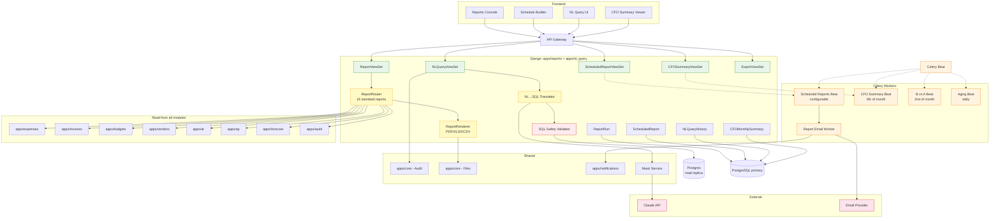

# Reporting — Architecture Diagram

```mermaid
flowchart TB
    subgraph FE["Frontend"]
        RptUI[Reports Console]
        SchedUI[Schedule Builder]
        NLQUI[NL Query UI]
        SumUI[CFO Summary Viewer]
    end

    Gateway[API Gateway]
    RptUI --> Gateway
    SchedUI --> Gateway
    NLQUI --> Gateway
    SumUI --> Gateway

    subgraph DjangoApp["Django: apps/reports + apps/nl_query"]
        RptApi[ReportViewSet]
        SchedApi[ScheduledReportViewSet]
        NLQApi[NLQueryViewSet]
        SumApi[CFOSummaryViewSet]
        ExpApi[ExportViewSet]

        RptModel[ReportRun]
        SchedModel[ScheduledReport]
        NLQModel[NLQueryHistory]
        SumModel[CFOMonthlySummary]

        RptRouter[ReportRouter<br/>16 standard reports]
        Renderer[ReportRenderer<br/>PDF/XLSX/CSV]
        SQLValidator[SQL Safety Validator]
        Translator[NL→SQL Translator]
    end

    Gateway --> RptApi
    Gateway --> SchedApi
    Gateway --> NLQApi
    Gateway --> SumApi
    Gateway --> ExpApi

    RptApi --> RptRouter
    RptRouter --> Renderer
    NLQApi --> Translator
    Translator --> SQLValidator
    SQLValidator --> ReadDB[(Postgres<br/>read replica)]

    subgraph Workers["Celery Workers"]
        SchedBeat[Scheduled Reports Beat<br/>configurable]
        SumBeat[CFO Summary Beat<br/>5th of month]
        BvABeat[B vs A Beat<br/>2nd of month]
        AgingBeat[Aging Beat<br/>daily]
        EmailWorker[Report Email Worker]
    end

    SchedApi -.-> SchedBeat
    SumApi -.-> SumBeat
    Beat[Celery Beat] -.-> SchedBeat
    Beat -.-> SumBeat
    Beat -.-> BvABeat
    Beat -.-> AgingBeat
    SchedBeat --> EmailWorker

    subgraph CrossModule["Read from all modules"]
        ExpMod[apps/expenses]
        InvMod[apps/invoices]
        BudMod[apps/budgets]
        VendMod[apps/vendors]
        ARMod[apps/ar]
        APMod[apps/ap]
        ForecastMod[apps/forecast]
        AuditMod[apps/audit]
    end

    RptRouter --> ExpMod
    RptRouter --> InvMod
    RptRouter --> BudMod
    RptRouter --> VendMod
    RptRouter --> ARMod
    RptRouter --> APMod
    RptRouter --> ForecastMod
    RptRouter --> AuditMod

    subgraph Shared["Shared"]
        AuditApp[apps/core - Audit]
        FilesApp[apps/core - Files]
        NotifApp[apps/notifications]
        MaskSvc[Mask Service]
    end

    Renderer --> FilesApp
    EmailWorker --> NotifApp
    NLQApi --> AuditApp
    Translator --> MaskSvc

    DB[(PostgreSQL primary)]
    RptModel --> DB
    SchedModel --> DB
    NLQModel --> DB
    SumModel --> DB

    subgraph External["External"]
        Claude[Claude API]
        EmailProv[Email Provider]
    end

    MaskSvc --> Claude
    EmailWorker --> EmailProv

    classDef api fill:#e8f5e9,stroke:#388e3c
    classDef svc fill:#fff9c4,stroke:#f9a825
    classDef worker fill:#fff3e0,stroke:#f57c00
    classDef ext fill:#fce4ec,stroke:#c2185b
    classDef secure fill:#ffebee,stroke:#c62828

    class RptApi,SchedApi,NLQApi,SumApi,ExpApi api
    class RptRouter,Renderer,Translator svc
    class SchedBeat,SumBeat,BvABeat,AgingBeat,EmailWorker,Beat worker
    class Claude,EmailProv ext
    class SQLValidator secure
```
