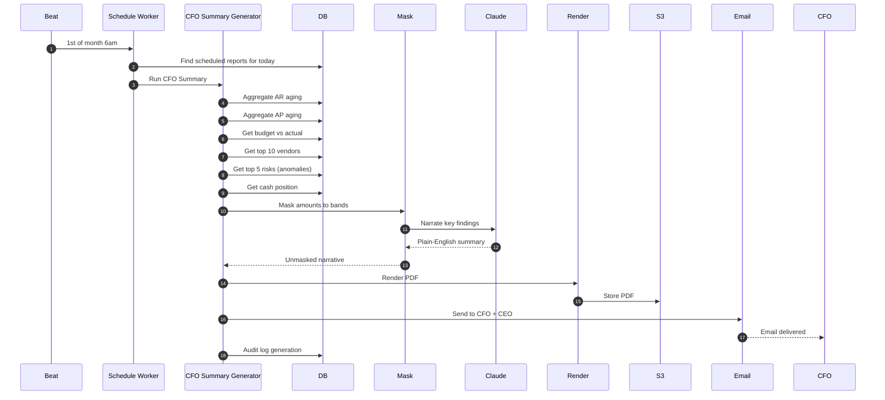
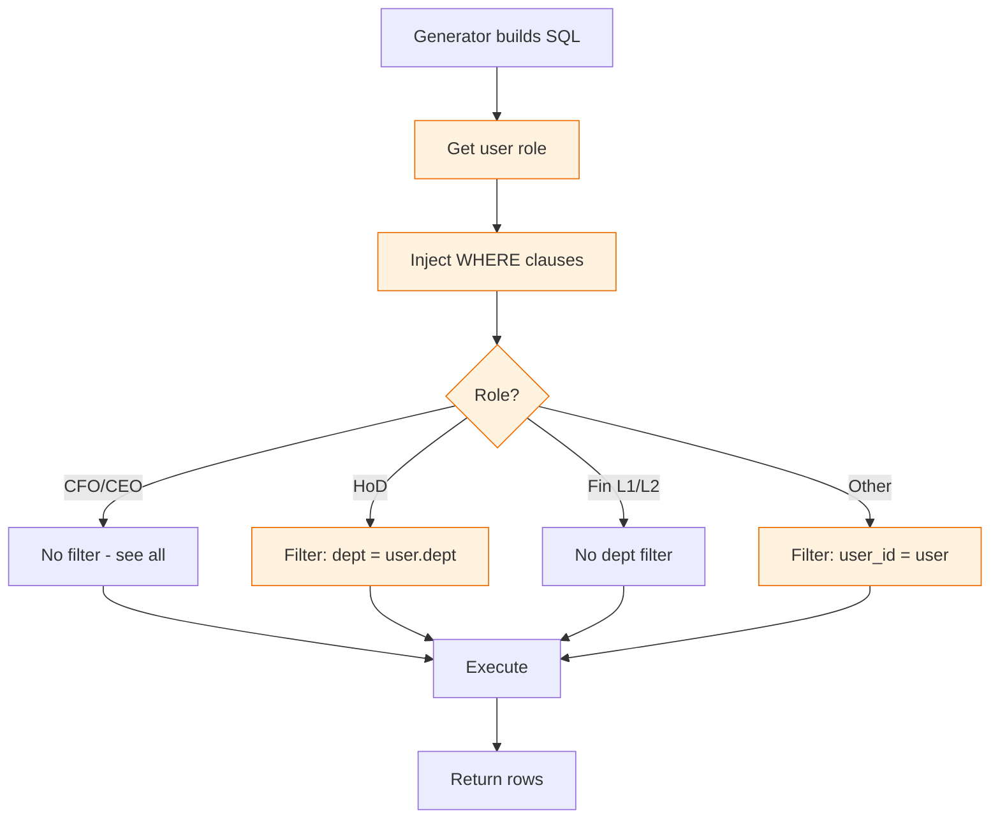
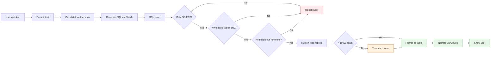

# Reporting — Data Flow

## Sequence: Scheduled CFO Monthly Summary

```mermaid
sequenceDiagram
    autonumber
    participant Beat
    participant Sched as Schedule Worker
    participant Gen as CFO Summary Generator
    participant DB
    participant Mask
    participant Claude
    participant Render
    participant S3
    participant Email
    participant CFO

    Beat->>Sched: 1st of month 6am
    Sched->>DB: Find scheduled reports for today
    Sched->>Gen: Run CFO Summary
    Gen->>DB: Aggregate AR aging
    Gen->>DB: Aggregate AP aging
    Gen->>DB: Get budget vs actual
    Gen->>DB: Get top 10 vendors
    Gen->>DB: Get top 5 risks (anomalies)
    Gen->>DB: Get cash position
    Gen->>Mask: Mask amounts to bands
    Mask->>Claude: Narrate key findings
    Claude-->>Mask: Plain-English summary
    Mask-->>Gen: Unmasked narrative
    Gen->>Render: Render PDF
    Render->>S3: Store PDF
    Gen->>Email: Send to CFO + CEO
    Email-->>CFO: Email delivered
    Gen->>DB: Audit log generation
```

## Permission Filtering at Query Time

```mermaid
flowchart TD
    Query[Generator builds SQL] --> RBAC[Get user role]
    RBAC --> Inject[Inject WHERE clauses]
    Inject --> Roles{Role?}
    Roles -->|CFO/CEO| All[No filter - see all]
    Roles -->|HoD| Dept[Filter: dept = user.dept]
    Roles -->|Fin L1/L2| AllFin[No dept filter]
    Roles -->|Other| Own[Filter: user_id = user]
    All --> Exec[Execute]
    Dept --> Exec
    AllFin --> Exec
    Own --> Exec
    Exec --> Result[Return rows]

    classDef perm fill:#fff3e0,stroke:#ef6c00
    class RBAC,Inject,Roles,Dept,Own perm
```

## NL Query Safety Pipeline

```mermaid
flowchart LR
    Q[User question] --> Parse[Parse intent]
    Parse --> Schema[Get whitelisted schema]
    Schema --> Gen[Generate SQL via Claude]
    Gen --> Lint[SQL Linter]
    Lint --> Check1{Only SELECT?}
    Check1 -->|No| Reject[Reject query]
    Check1 -->|Yes| Check2{Whitelisted tables only?}
    Check2 -->|No| Reject
    Check2 -->|Yes| Check3{No suspicious functions?}
    Check3 -->|No| Reject
    Check3 -->|Yes| Replica[Run on read replica]
    Replica --> Limit{< 10000 rows?}
    Limit -->|No| Truncate[Truncate + warn]
    Limit -->|Yes| Format[Format as table]
    Truncate --> Format
    Format --> Narrate[Narrate via Claude]
    Narrate --> Display[Show user]

    classDef safe fill:#e8f5e9,stroke:#388e3c
    classDef bad fill:#ffebee,stroke:#c62828
    classDef warn fill:#fff3e0,stroke:#ef6c00
    class Reject bad
    class Truncate warn
    class Display,Format,Narrate safe
```
