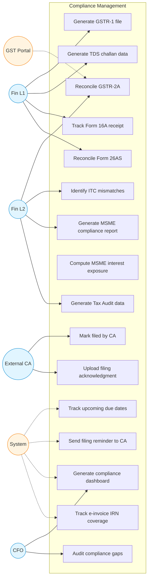

# Compliance Management — Use Case Diagram

GST, TDS, MSME, and statutory compliance support. Status: 🟡 Phase 2.

## 🚫 Anti-Requirement
**The system NEVER auto-files returns with any government portal.** It only prepares data and generates files. The CA always files manually. This is non-negotiable to avoid liability for incorrect filings.

## Use Case Index

| ID | Use Case | Actor | Notes |
|---|---|---|---|
| UC1 | Generate GSTR-1 file | Fin L1 | JSON for portal upload, CA uploads |
| UC2 | Reconcile GSTR-2A | Fin L2 | Match 2A vs purchase register |
| UC3 | Identify ITC mismatches | Fin L2 | Vendor not filed yet, etc. |
| UC4 | Generate TDS challan data | Fin L1 | CSV for portal, CA pays |
| UC5 | Track Form 16A receipt | Fin L1 | Quarterly, vendor-side |
| UC6 | Reconcile Form 26AS | Fin L1 | Annual, against TDS book |
| UC7 | Generate MSME report | Fin L2 | Half-yearly Form MSME-1 |
| UC8 | Compute MSME interest | System | Section 16 MSMED Act |
| UC9 | Upcoming due dates | System | Calendar of compliances |
| UC10 | Send reminder to CA | System | T-7, T-3, T-1 |
| UC11 | Mark filed by CA | CA | After portal upload |
| UC12 | Upload acknowledgment | CA | ARN/receipt number |
| UC13 | Compliance dashboard | CFO | Heatmap by area |
| UC14 | Audit compliance gaps | CFO | Drill-down |
| UC15 | Tax Audit data | Fin L2 | Section 44AB pack |
| UC16 | E-invoice coverage | System | Audit IRN-required invoices |
