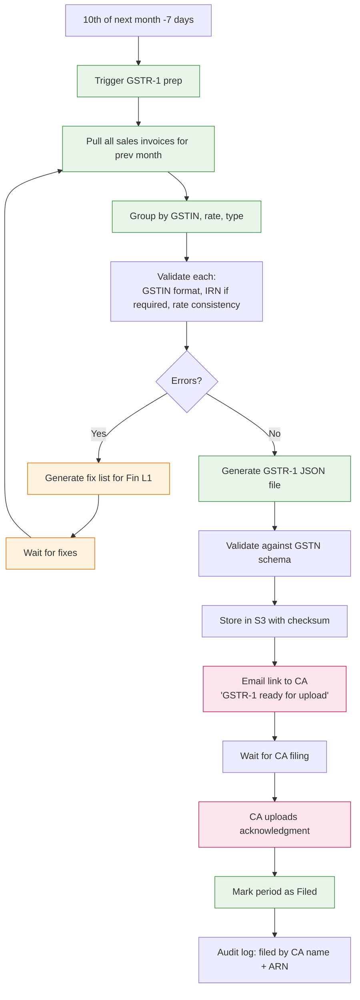
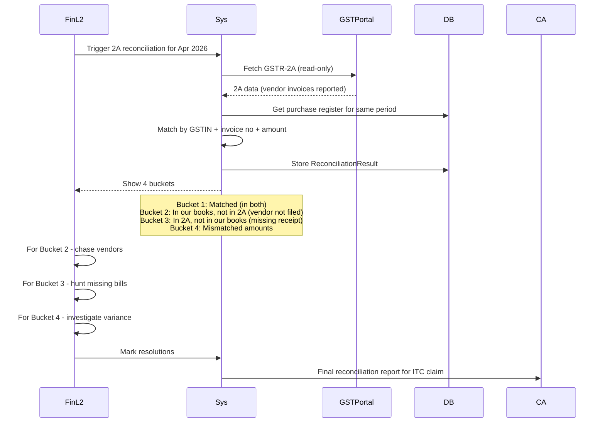
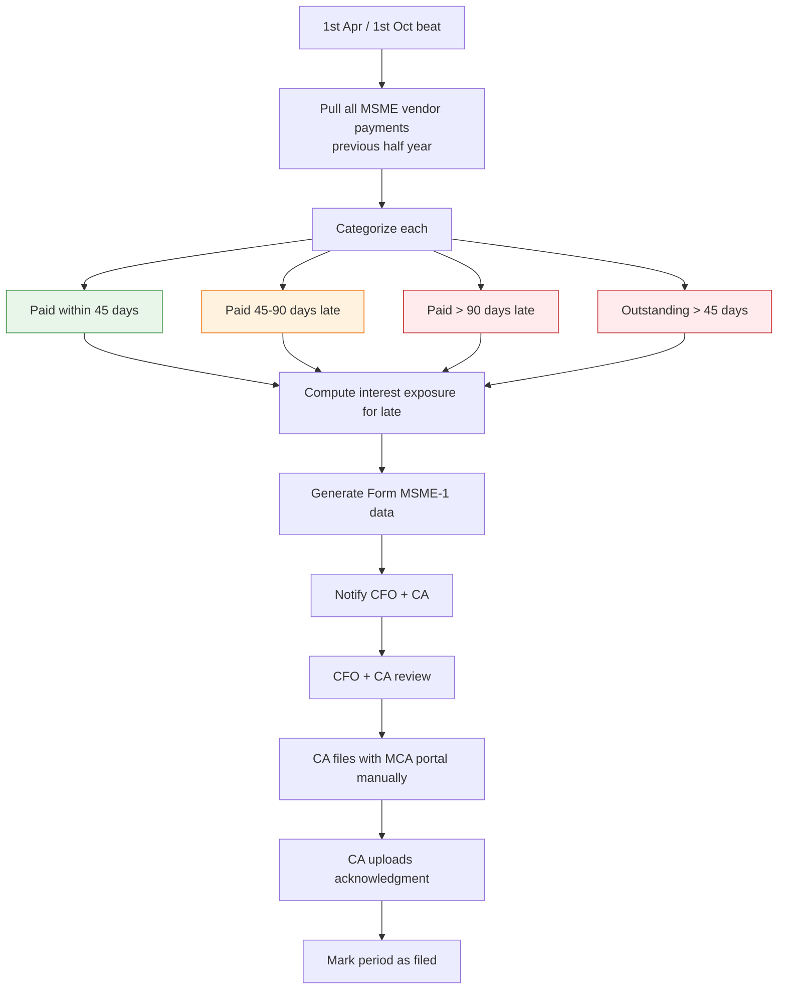
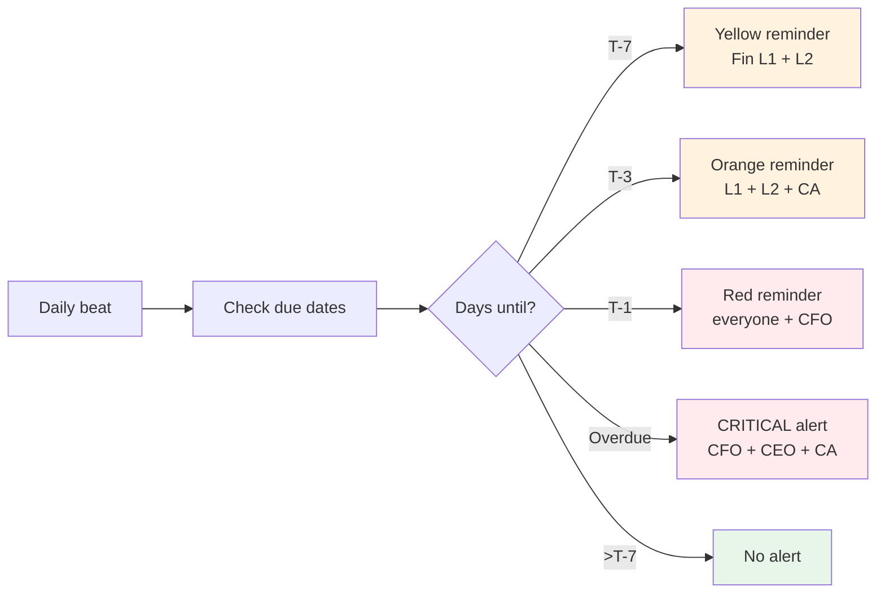

# Compliance Management — Flow Diagrams

## GSTR-1 Preparation Flow

```mermaid
flowchart TD
    Beat[10th of next month -7 days] --> Trigger[Trigger GSTR-1 prep]
    Trigger --> Pull[Pull all sales invoices for prev month]
    Pull --> Group[Group by GSTIN, rate, type]
    Group --> Validate[Validate each:<br/>GSTIN format, IRN if required, rate consistency]
    Validate --> Errors{Errors?}
    Errors -->|Yes| FixList[Generate fix list for Fin L1]
    FixList --> Wait[Wait for fixes]
    Wait --> Pull
    Errors -->|No| GenJSON[Generate GSTR-1 JSON file]
    GenJSON --> Validate2[Validate against GSTN schema]
    Validate2 --> Store[Store in S3 with checksum]
    Store --> NotifyCA[Email link to CA<br/>'GSTR-1 ready for upload']
    NotifyCA --> Wait2[Wait for CA filing]
    Wait2 --> CAUpload[CA uploads acknowledgment]
    CAUpload --> Mark[Mark period as Filed]
    Mark --> Audit[Audit log: filed by CA name + ARN]

    classDef good fill:#e8f5e9,stroke:#388e3c
    classDef warn fill:#fff3e0,stroke:#ef6c00
    classDef ext fill:#fce4ec,stroke:#c2185b
    class Trigger,Pull,Group,GenJSON,Mark good
    class FixList,Wait warn
    class NotifyCA,CAUpload ext
```

## GSTR-2A Reconciliation Flow

```mermaid
sequenceDiagram
    participant FinL2
    participant Sys
    participant GSTPortal
    participant DB
    participant CA

    FinL2->>Sys: Trigger 2A reconciliation for Apr 2026
    Sys->>GSTPortal: Fetch GSTR-2A (read-only)
    GSTPortal-->>Sys: 2A data (vendor invoices reported)
    Sys->>DB: Get purchase register for same period
    Sys->>Sys: Match by GSTIN + invoice no + amount
    Sys->>DB: Store ReconciliationResult
    Sys-->>FinL2: Show 4 buckets

    Note over Sys: Bucket 1: Matched (in both)<br/>Bucket 2: In our books, not in 2A (vendor not filed)<br/>Bucket 3: In 2A, not in our books (missing receipt)<br/>Bucket 4: Mismatched amounts

    FinL2->>FinL2: For Bucket 2 - chase vendors
    FinL2->>FinL2: For Bucket 3 - hunt missing bills
    FinL2->>FinL2: For Bucket 4 - investigate variance
    FinL2->>Sys: Mark resolutions
    Sys->>CA: Final reconciliation report for ITC claim
```

## MSME Half-Yearly Report (Form MSME-1)

```mermaid
flowchart TD
    Trigger[1st Apr / 1st Oct beat] --> Pull[Pull all MSME vendor payments<br/>previous half year]
    Pull --> Categorize[Categorize each]
    Categorize --> Cat1[Paid within 45 days]
    Categorize --> Cat2[Paid 45-90 days late]
    Categorize --> Cat3[Paid > 90 days late]
    Categorize --> Cat4[Outstanding > 45 days]
    Cat1 --> CalcInt[Compute interest exposure for late]
    Cat2 --> CalcInt
    Cat3 --> CalcInt
    Cat4 --> CalcInt
    CalcInt --> Form[Generate Form MSME-1 data]
    Form --> CFO[Notify CFO + CA]
    CFO --> Review[CFO + CA review]
    Review --> CAFiles[CA files with MCA portal manually]
    CAFiles --> Ack[CA uploads acknowledgment]
    Ack --> Done[Mark period as filed]

    classDef good fill:#e8f5e9,stroke:#388e3c
    classDef warn fill:#fff3e0,stroke:#ef6c00
    classDef bad fill:#ffebee,stroke:#c62828
    class Cat1 good
    class Cat2 warn
    class Cat3,Cat4 bad
```

## Compliance Calendar Reminders

```mermaid
flowchart LR
    Beat[Daily beat] --> CheckDue[Check due dates]
    CheckDue --> Buckets{Days until?}
    Buckets -->|T-7| Yellow[Yellow reminder<br/>Fin L1 + L2]
    Buckets -->|T-3| Orange[Orange reminder<br/>L1 + L2 + CA]
    Buckets -->|T-1| Red[Red reminder<br/>everyone + CFO]
    Buckets -->|Overdue| Critical[CRITICAL alert<br/>CFO + CEO + CA]
    Buckets -->|>T-7| Skip[No alert]

    classDef good fill:#e8f5e9
    classDef warn fill:#fff3e0
    classDef bad fill:#ffebee
    class Skip good
    class Yellow,Orange warn
    class Red,Critical bad
```
