# Compliance Management — Architecture Diagram

```mermaid
flowchart TB
    subgraph FE["Frontend"]
        CompDash[Compliance Dashboard]
        CADash[CA Data Pack UI]
        DeadlineUI[Deadline Tracker]
    end

    Gateway[API Gateway]
    CompDash --> Gateway
    CADash --> Gateway
    DeadlineUI --> Gateway

    subgraph DjangoApp["Django: apps/compliance"]
        GSTApi[GSTPrepViewSet]
        TDSApi[TDSPrepViewSet]
        MSMEApi[MSMEComplianceViewSet]
        DeadApi[DeadlineViewSet]
        CAExpApi[CAExportViewSet]
        ReconApi[ReconcileViewSet]

        GSTR1Model[GSTR1Preparation]
        GSTR3BModel[GSTR3BPreparation]
        TDSChalModel[TDSChallan]
        Form16AModel[Form16ATracker]
        Form26ASModel[Form26ASRecon]
        MSMERegModel[MSMERegister]
        FilingModel[FilingRecord]
        DeadlineModel[ComplianceDeadline]

        SvcGSTPrep[GSTPreparer]
        SvcGSTRecon[GSTReconciler]
        SvcTDSPrep[TDSPreparer]
        SvcMSME[MSMEReporter]
        SvcCAPack[CADataPackBuilder]
        SvcDeadline[DeadlineMonitor]
    end

    Gateway --> GSTApi
    Gateway --> TDSApi
    Gateway --> MSMEApi
    Gateway --> DeadApi
    Gateway --> CAExpApi
    Gateway --> ReconApi

    GSTApi --> SvcGSTPrep
    ReconApi --> SvcGSTRecon
    TDSApi --> SvcTDSPrep
    MSMEApi --> SvcMSME
    CAExpApi --> SvcCAPack
    DeadApi --> SvcDeadline

    subgraph Workers["Celery Workers"]
        GSTBeat[GST Prep Beat<br/>11th of month]
        ReconBeat[GSTR-2A Recon Beat<br/>weekly]
        TDSBeat[TDS Challan Beat<br/>7th of month]
        MSMEBeat[MSME Register Beat<br/>weekly]
        DeadlineBeat[Deadline Reminder Beat<br/>daily]
        Form26ASBeat[Form 26AS Sync<br/>weekly]
    end

    SvcGSTPrep -.-> GSTBeat
    SvcGSTRecon -.-> ReconBeat
    SvcTDSPrep -.-> TDSBeat
    SvcMSME -.-> MSMEBeat
    SvcDeadline -.-> DeadlineBeat
    SvcGSTRecon -.-> Form26ASBeat

    Beat[Celery Beat] -.-> GSTBeat
    Beat -.-> ReconBeat
    Beat -.-> TDSBeat
    Beat -.-> MSMEBeat
    Beat -.-> DeadlineBeat
    Beat -.-> Form26ASBeat

    subgraph CrossModule["Read-only from"]
        InvMod[apps/invoices<br/>output GST]
        APMod[apps/ap<br/>input GST + TDS deducted]
        VendMod[apps/vendors<br/>MSME flag]
    end

    SvcGSTPrep --> InvMod
    SvcGSTPrep --> APMod
    SvcTDSPrep --> APMod
    SvcMSME --> APMod
    SvcMSME --> VendMod

    subgraph Shared["Shared"]
        AuditApp[apps/core - Audit]
        FilesApp[apps/core - Files]
        NotifApp[apps/notifications]
        RptApp[apps/reports - render]
    end

    SvcCAPack --> RptApp
    SvcCAPack --> FilesApp
    SvcDeadline --> NotifApp
    GSTApi --> AuditApp

    DB[(PostgreSQL)]
    GSTR1Model --> DB
    GSTR3BModel --> DB
    TDSChalModel --> DB
    Form16AModel --> DB
    Form26ASModel --> DB
    MSMERegModel --> DB
    FilingModel --> DB
    DeadlineModel --> DB

    subgraph External["External - READ ONLY"]
        GSTPortal[GST Portal<br/>fetch GSTR-2A, validate]
        TraceAPI[TRACES Form 26AS]
        CAEmail[CA Email - one-way export]
    end

    SvcGSTRecon --> GSTPortal
    Form26ASBeat --> TraceAPI
    SvcCAPack --> CAEmail

    Anti[🚫 NO write paths to:<br/>GST Portal filing<br/>TRACES filing<br/>Bank for TDS payment]

    classDef api fill:#e8f5e9,stroke:#388e3c
    classDef svc fill:#fff9c4,stroke:#f9a825
    classDef worker fill:#fff3e0,stroke:#f57c00
    classDef ext fill:#fce4ec,stroke:#c2185b
    classDef anti fill:#ffebee,stroke:#c62828,stroke-width:3px
    classDef cross fill:#fffde7,stroke:#fbc02d

    class GSTApi,TDSApi,MSMEApi,DeadApi,CAExpApi,ReconApi api
    class SvcGSTPrep,SvcGSTRecon,SvcTDSPrep,SvcMSME,SvcCAPack,SvcDeadline svc
    class GSTBeat,ReconBeat,TDSBeat,MSMEBeat,DeadlineBeat,Form26ASBeat,Beat worker
    class GSTPortal,TraceAPI,CAEmail ext
    class Anti anti
    class InvMod,APMod,VendMod cross
```

## Critical Architecture Property: Read-Only External Boundary

The **only** external API calls compliance ever makes are reads (fetch GSTR-2A, fetch Form 26AS) and one-way exports (email to CA). There is no write path to the GST Portal, TRACES, or banks. This is enforced at the architecture layer — the `compliance` Django app has zero write-capable client code for those endpoints.
