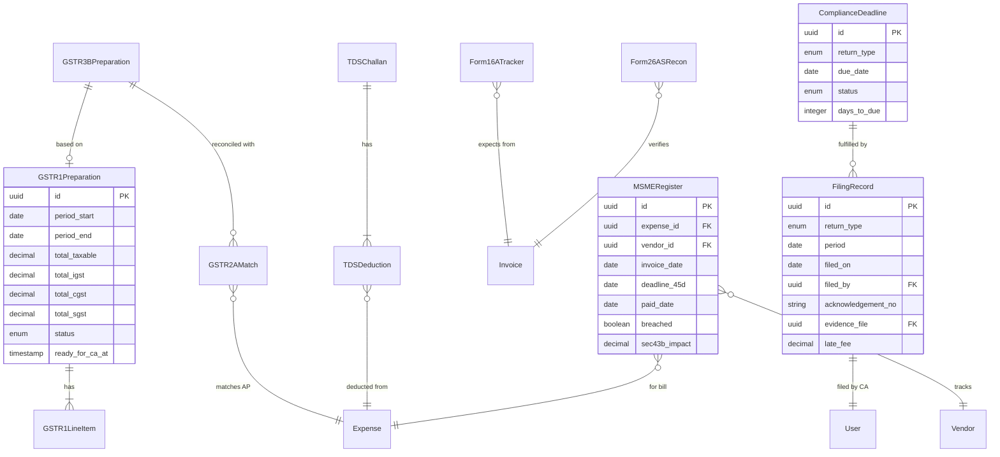
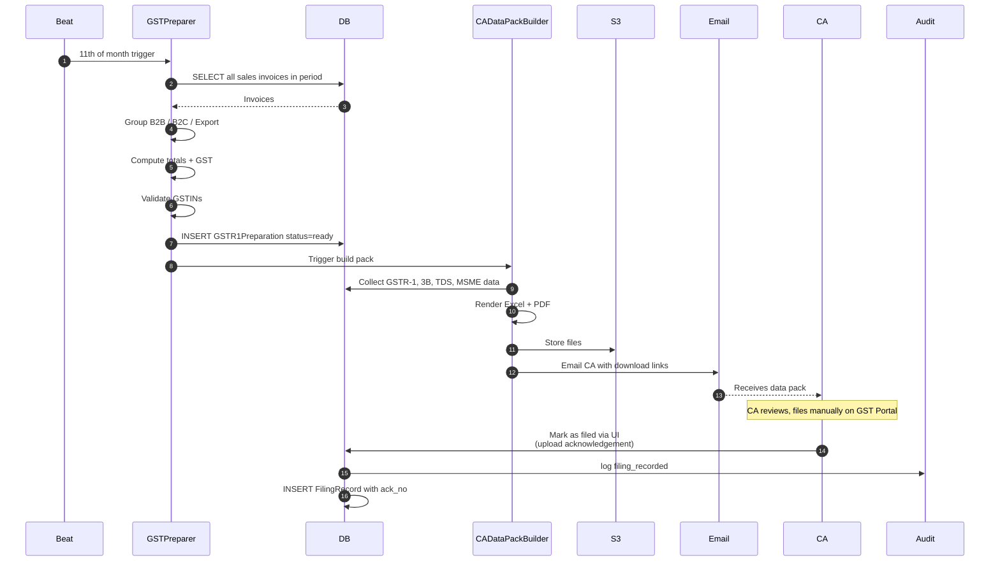
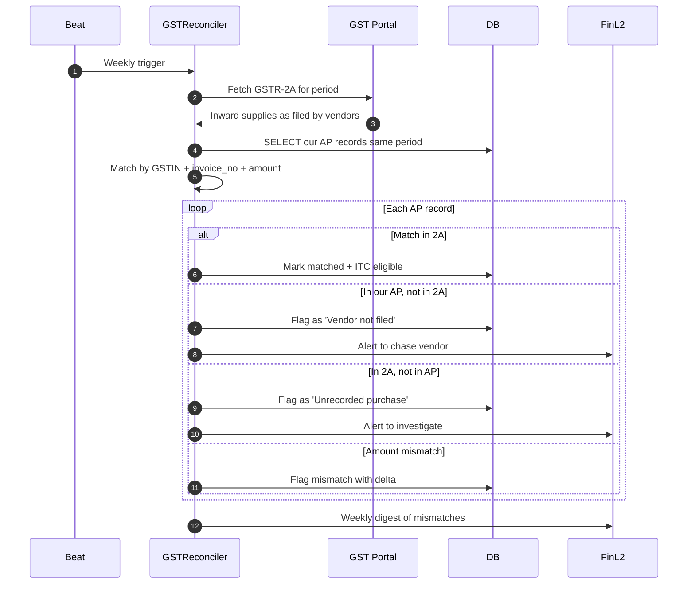
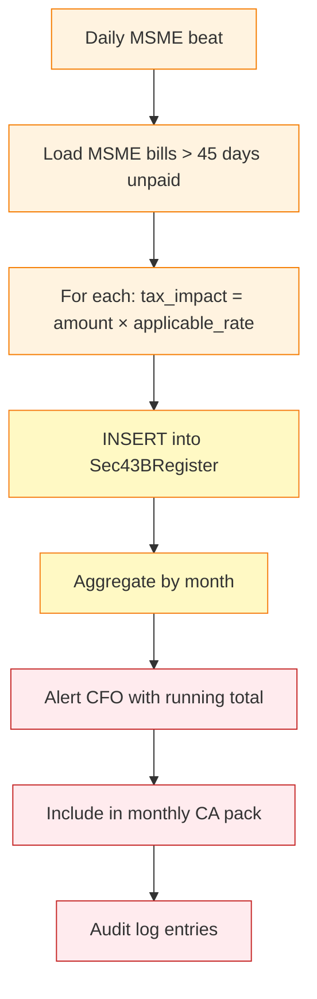

# Compliance Management — Data Flow Diagram

## Data Model

```mermaid
erDiagram
    GSTR1Preparation ||--|{ GSTR1LineItem : has
    GSTR3BPreparation ||--o| GSTR1Preparation : "based on"
    GSTR3BPreparation ||--o{ GSTR2AMatch : "reconciled with"
    GSTR2AMatch }o--|| Expense : "matches AP"
    TDSChallan ||--|{ TDSDeduction : has
    TDSDeduction }o--|| Expense : "deducted from"
    Form16ATracker }o--|| Invoice : "expects from"
    Form26ASRecon }o--|| Invoice : "verifies"
    MSMERegister }o--|| Vendor : "tracks"
    MSMERegister }o--|| Expense : "for bill"
    FilingRecord ||--|| User : "filed by CA"
    ComplianceDeadline ||--o{ FilingRecord : "fulfilled by"

    GSTR1Preparation {
        uuid id PK
        date period_start
        date period_end
        decimal total_taxable
        decimal total_igst
        decimal total_cgst
        decimal total_sgst
        enum status
        timestamp ready_for_ca_at
    }

    FilingRecord {
        uuid id PK
        enum return_type
        date period
        date filed_on
        uuid filed_by FK
        string acknowledgement_no
        uuid evidence_file FK
        decimal late_fee
    }

    ComplianceDeadline {
        uuid id PK
        enum return_type
        date due_date
        enum status
        integer days_to_due
    }

    MSMERegister {
        uuid id PK
        uuid expense_id FK
        uuid vendor_id FK
        date invoice_date
        date deadline_45d
        date paid_date
        boolean breached
        decimal sec43b_impact
    }
```

## Sequence: GSTR-1 Preparation and CA Handoff

```mermaid
sequenceDiagram
    autonumber
    participant Beat
    participant GSTPrep as GSTPreparer
    participant DB
    participant CAPack as CADataPackBuilder
    participant S3
    participant Email
    participant CA
    participant Audit

    Beat->>GSTPrep: 11th of month trigger
    GSTPrep->>DB: SELECT all sales invoices in period
    DB-->>GSTPrep: Invoices
    GSTPrep->>GSTPrep: Group B2B / B2C / Export
    GSTPrep->>GSTPrep: Compute totals + GST
    GSTPrep->>GSTPrep: Validate GSTINs
    GSTPrep->>DB: INSERT GSTR1Preparation status=ready
    GSTPrep->>CAPack: Trigger build pack

    CAPack->>DB: Collect GSTR-1, 3B, TDS, MSME data
    CAPack->>CAPack: Render Excel + PDF
    CAPack->>S3: Store files
    CAPack->>Email: Email CA with download links
    Email-->>CA: Receives data pack

    Note over CA: CA reviews, files manually on GST Portal

    CA->>DB: Mark as filed via UI<br/>(upload acknowledgement)
    DB->>Audit: log filing_recorded
    DB->>DB: INSERT FilingRecord with ack_no
```

## Sequence: GSTR-2A Reconciliation

```mermaid
sequenceDiagram
    autonumber
    participant Beat
    participant Recon as GSTReconciler
    participant GST as GST Portal
    participant DB
    participant FinL2

    Beat->>Recon: Weekly trigger
    Recon->>GST: Fetch GSTR-2A for period
    GST-->>Recon: Inward supplies as filed by vendors
    Recon->>DB: SELECT our AP records same period
    Recon->>Recon: Match by GSTIN + invoice_no + amount

    loop Each AP record
        alt Match in 2A
            Recon->>DB: Mark matched + ITC eligible
        else In our AP, not in 2A
            Recon->>DB: Flag as 'Vendor not filed'
            Recon->>FinL2: Alert to chase vendor
        else In 2A, not in AP
            Recon->>DB: Flag as 'Unrecorded purchase'
            Recon->>FinL2: Alert to investigate
        else Amount mismatch
            Recon->>DB: Flag mismatch with delta
        end
    end

    Recon->>FinL2: Weekly digest of mismatches
```

## Section 43B Computation Pipeline

```mermaid
flowchart TD
    Beat[Daily MSME beat] --> Load[Load MSME bills > 45 days unpaid]
    Load --> Compute[For each: tax_impact = amount × applicable_rate]
    Compute --> Insert[INSERT into Sec43BRegister]
    Insert --> Aggregate[Aggregate by month]
    Aggregate --> CFOAlert[Alert CFO with running total]
    CFOAlert --> Tax[Include in monthly CA pack]
    Tax --> Audit[Audit log entries]

    classDef beat fill:#fff3e0,stroke:#f57c00
    classDef calc fill:#fff9c4,stroke:#f57f17
    classDef alert fill:#ffebee,stroke:#c62828
    class Beat,Load,Compute beat
    class Insert,Aggregate calc
    class CFOAlert,Tax,Audit alert
```
