# Audit & Governance — Use Case Diagram

Immutable audit trail, RBAC management, SoD enforcement, AI-powered audit queries. Status: 🟢 Hackathon scope.

```mermaid
flowchart LR
    Admin((Admin))
    CFO((CFO))
    Auditor((Internal Auditor))
    External((External Auditor))
    System((System))

    subgraph AG["Audit & Governance"]
        UC1[View audit trail any record]
        UC2[Search audit logs]
        UC3[Filter by user/action/date]
        UC4[Export audit log PDF]
        UC5[Export audit log CSV]
        UC6[Verify log integrity]

        UC7[Run AI audit query]
        UC8[View flagged anomalies]
        UC9[Investigate suspicious pattern]

        UC10[Manage users]
        UC11[Assign roles]
        UC12[Configure approval chains]
        UC13[Configure SoD rules]
        UC14[Define backup approvers]

        UC15[Deactivate user]
        UC16[Reset user password]
        UC17[View session log]

        UC18[Run SoD violation report]
        UC19[Run access review report]
        UC20[Generate quarterly audit pack]

        UC21[Mark record as audited]
        UC22[Add audit note]
        UC23[Lock record from edits]

        UCX1[🚫 Edit audit log]
        UCX2[🚫 Delete audit log]
        UCX3[🚫 Bypass SoD]
    end

    Admin --> UC10
    Admin --> UC11
    Admin --> UC12
    Admin --> UC13
    Admin --> UC14
    Admin --> UC15
    Admin --> UC16
    Admin --> UC17
    CFO --> UC1
    CFO --> UC4
    CFO --> UC7
    CFO --> UC8
    CFO --> UC18
    CFO --> UC20
    Auditor --> UC1
    Auditor --> UC2
    Auditor --> UC3
    Auditor --> UC4
    Auditor --> UC5
    Auditor --> UC7
    Auditor --> UC8
    Auditor --> UC9
    Auditor --> UC18
    Auditor --> UC19
    Auditor --> UC21
    Auditor --> UC22
    Auditor --> UC23
    External --> UC4
    External --> UC5
    External --> UC20
    System -.-> UC6
    System -.-> UC18

    classDef actor fill:#e1f5ff,stroke:#0288d1
    classDef sys fill:#f3e5f5,stroke:#7b1fa2
    classDef anti fill:#ffebee,stroke:#c62828,stroke-width:3px
    class Admin,CFO,Auditor,External actor
    class System sys
    class UCX1,UCX2,UCX3 anti
```

## Anti-Requirements

| ID | Anti-Use Case | Reason |
|---|---|---|
| UCX1 | Edit audit log | Audit logs are immutable. Period. |
| UCX2 | Delete audit log | Statutory retention 7 years |
| UCX3 | Bypass SoD | Even Admin cannot bypass. SoD is enforced in code, not config |
