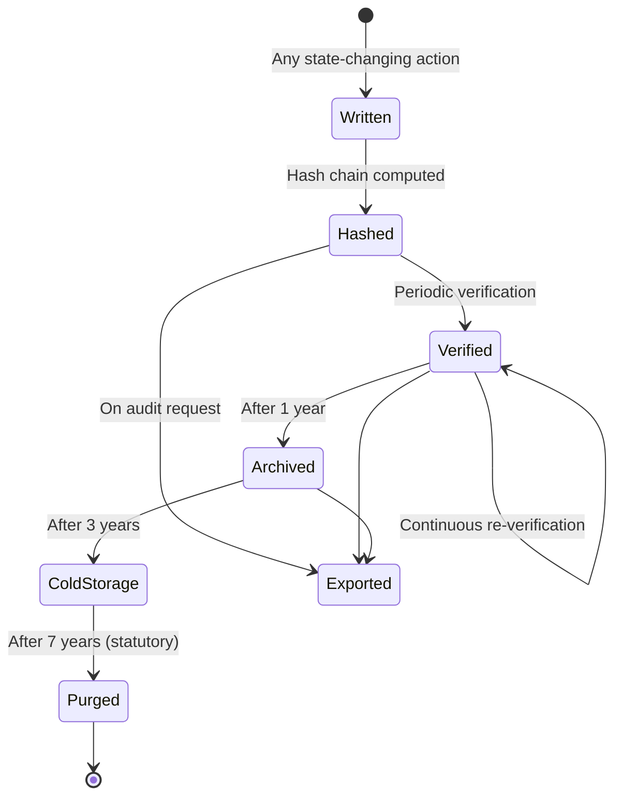
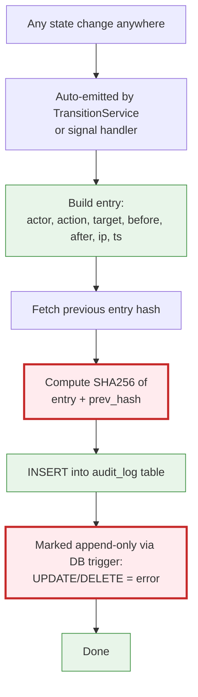
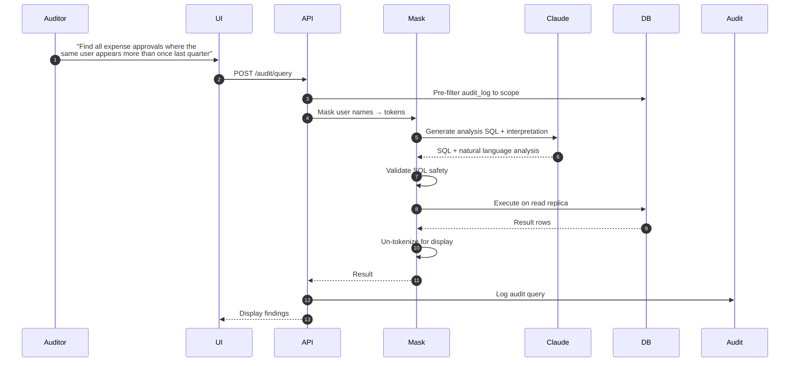

# Audit & Governance — Flow Diagrams

## Audit Log Lifecycle



## Happy Path — Write Audit Log Entry



## SoD Violation Detection (Continuous)

```mermaid
flowchart TD
    Beat[Hourly SoD scanner] --> Scan[Scan recent approvals]
    Scan --> Check1{Same user appears<br/>twice in same chain?}
    Check1 -->|Yes| V1[Violation: double-approval]
    Check1 -->|No| Check2{Filer = approver<br/>at any step?}
    Check2 -->|Yes| V2[Violation: self-approval]
    Check2 -->|No| Check3{Approver beneficiary?<br/>e.g. own dept]
    Check3 -->|Yes| V3[Possible conflict]
    Check3 -->|No| Check4{Vendor = current user?}
    Check4 -->|Yes| V4[Violation: vendor approval]
    Check4 -->|No| Done[Done]

    V1 --> Alert[Critical alert CFO + Admin]
    V2 --> Alert
    V3 --> Investigate[Send to investigation queue]
    V4 --> Alert

    Alert --> Lock[Lock the record]
    Lock --> Audit[Audit log violation]

    classDef bad fill:#ffebee,stroke:#c62828
    classDef warn fill:#fff3e0,stroke:#ef6c00
    classDef good fill:#e8f5e9,stroke:#388e3c
    class V1,V2,V4,Alert,Lock,Audit bad
    class V3,Investigate warn
    class Done good
```

## AI Audit Query Flow



## Edge Cases

| ID | Edge Case | Resolution |
|---|---|---|
| AGEC1 | Audit log corruption suspected | Run hash chain verification, alert if break, identify break point |
| AGEC2 | User deactivated mid-action | Action completes if API call already started, no new actions allowed |
| AGEC3 | Role revoked during pending approval | Pending step reassigned to backup, audit logged |
| AGEC4 | Two admins assign conflicting roles | Last-write-wins with audit log of both |
| AGEC5 | External auditor requests sensitive data | Read-only export with watermark, time-limited URL |
| AGEC6 | Audit log query returns >10k rows | Paginate, force CSV export for large results |
| AGEC7 | DB rollback after partial transaction | Audit log uses same transaction, rollback rolls back log too |
| AGEC8 | Clock skew between servers | Use DB server timestamp authoritatively, not app server |
