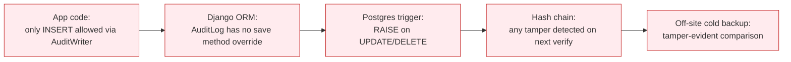

# Audit & Governance — Architecture Diagram

```mermaid
flowchart TB
    subgraph FE["Frontend"]
        AdminUI[Admin Console]
        AuditUI[Audit Trail Browser]
        SoDUI[SoD Violation Dashboard]
        AIQUI[AI Audit Query UI]
    end

    Gateway[API Gateway]
    AdminUI --> Gateway
    AuditUI --> Gateway
    SoDUI --> Gateway
    AIQUI --> Gateway

    subgraph DjangoApp["Django: apps/audit + apps/accounts"]
        AuditApi[AuditLogViewSet<br/>READ ONLY]
        UserApi[UserViewSet]
        RoleApi[RoleViewSet]
        ChainApi[ApprovalChainConfigViewSet]
        SoDApi[SoDRuleViewSet]
        AIQApi[AIQueryViewSet]
        ExportApi[AuditExportViewSet]

        AuditModel[AuditLog<br/>append-only]
        UserModel[User]
        RoleModel[Role]
        ChainModel[ApprovalChain]
        SoDModel[SoDRule]

        SvcWriter[AuditWriter<br/>singleton]
        SvcVerifier[HashChainVerifier]
        SvcSoD[SoDScanner]
        SvcAIQ[AIAuditQuery]
        SvcExport[AuditExporter]
    end

    Gateway --> AuditApi
    Gateway --> UserApi
    Gateway --> RoleApi
    Gateway --> ChainApi
    Gateway --> SoDApi
    Gateway --> AIQApi
    Gateway --> ExportApi

    AuditApi --> AuditModel
    AIQApi --> SvcAIQ
    SoDApi --> SvcSoD
    ExportApi --> SvcExport

    subgraph CrossModule["All other modules write here"]
        ExpMod[apps/expenses]
        InvMod[apps/invoices]
        BudMod[apps/budgets]
        VendMod[apps/vendors]
        APMod[apps/ap]
        ARMod[apps/ar]
        CompMod[apps/compliance]
    end

    ExpMod -.-> SvcWriter
    InvMod -.-> SvcWriter
    BudMod -.-> SvcWriter
    VendMod -.-> SvcWriter
    APMod -.-> SvcWriter
    ARMod -.-> SvcWriter
    CompMod -.-> SvcWriter

    SvcWriter --> AuditModel

    subgraph Workers["Celery Workers"]
        VerifyBeat[Hash Chain Verifier<br/>every 6h]
        SoDBeat[SoD Scanner<br/>hourly]
        AccessBeat[Access Review<br/>weekly]
        ArchiveBeat[Archive Beat<br/>monthly]
    end

    SvcVerifier -.-> VerifyBeat
    SvcSoD -.-> SoDBeat
    Beat[Celery Beat] -.-> VerifyBeat
    Beat -.-> SoDBeat
    Beat -.-> AccessBeat
    Beat -.-> ArchiveBeat

    subgraph DBLayer["Database"]
        PG[(PostgreSQL)]
        Trigger[DB Trigger:<br/>BEFORE UPDATE/DELETE on audit_log<br/>RAISE EXCEPTION]
        ColdS3[(S3 Cold Storage<br/>archived audit)]
    end

    AuditModel --> PG
    UserModel --> PG
    RoleModel --> PG
    ChainModel --> PG
    SoDModel --> PG
    PG --> Trigger
    ArchiveBeat --> ColdS3

    subgraph External["External"]
        Claude[Claude API<br/>via mask service]
        EmailAlert[Email Alerts]
    end

    SvcAIQ --> Claude
    SvcSoD --> EmailAlert

    classDef api fill:#e8f5e9,stroke:#388e3c
    classDef svc fill:#fff9c4,stroke:#f9a825
    classDef worker fill:#fff3e0,stroke:#f57c00
    classDef ext fill:#fce4ec,stroke:#c2185b
    classDef sec fill:#ffebee,stroke:#c62828,stroke-width:3px
    classDef cross fill:#fffde7,stroke:#fbc02d

    class AuditApi,UserApi,RoleApi,ChainApi,SoDApi,AIQApi,ExportApi api
    class SvcWriter,SvcVerifier,SvcSoD,SvcAIQ,SvcExport svc
    class VerifyBeat,SoDBeat,AccessBeat,ArchiveBeat,Beat worker
    class Claude,EmailAlert ext
    class Trigger sec
    class ExpMod,InvMod,BudMod,VendMod,APMod,ARMod,CompMod cross
```

## Immutability Enforcement (Defense in Depth)

Four independent layers protect the audit log:
1. **Application code** — only `AuditWriter.write()` exists, no update/delete methods
2. **ORM** — Django model has no save override path that mutates
3. **Database trigger** — Postgres `BEFORE UPDATE OR DELETE` raises an exception
4. **Hash chain** — every entry hashes (entry + prev_hash); any modification breaks the chain
5. **Cold backup** — periodic snapshot to S3, can be diffed against live to detect tamper
