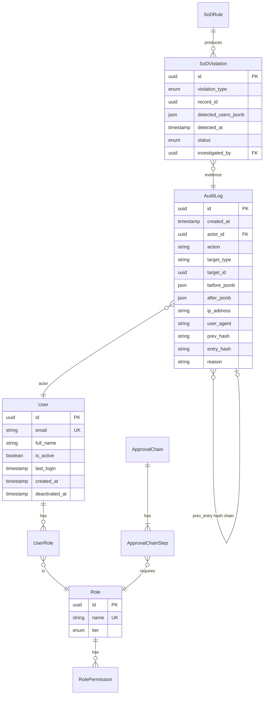
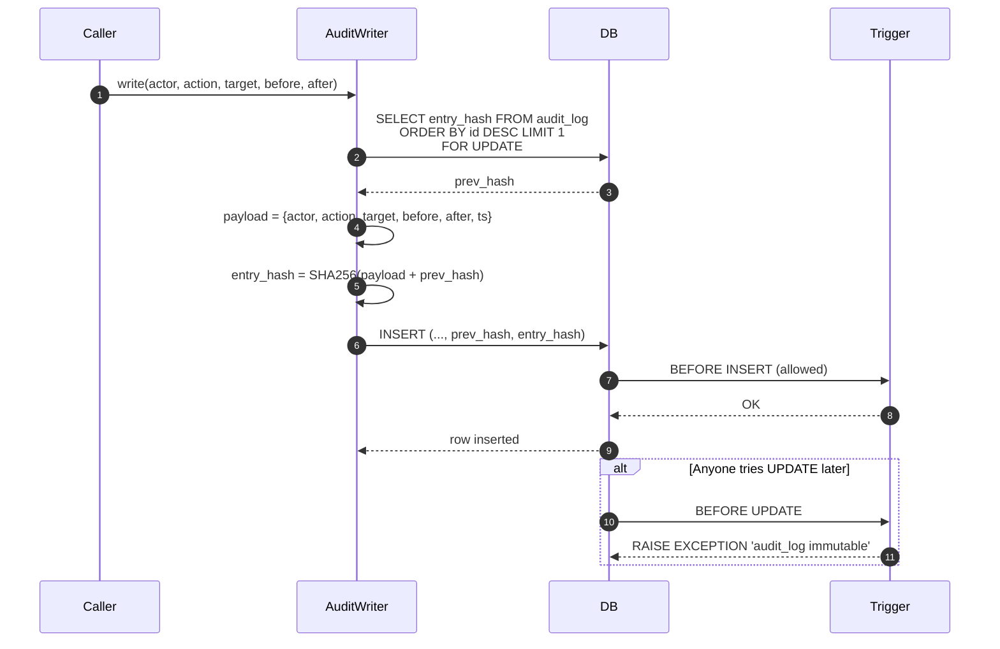
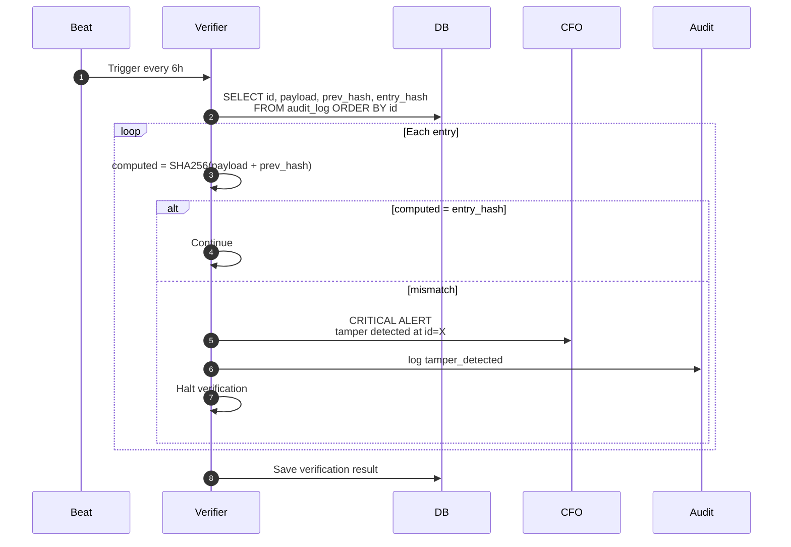
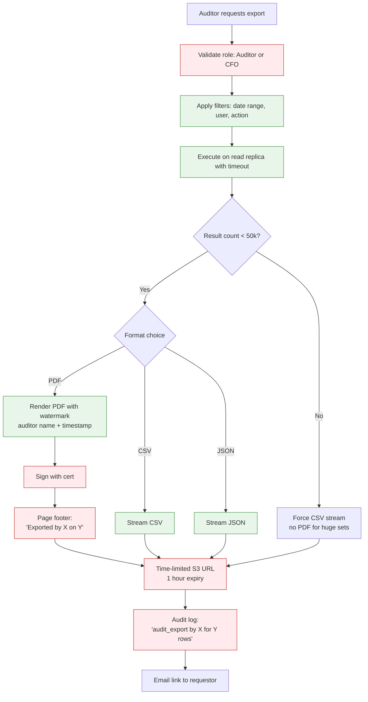

# Audit & Governance — Data Flow Diagram

## Data Model

```mermaid
erDiagram
    AuditLog }o--|| User : "actor"
    AuditLog }o--o| AuditLog : "prev_entry hash chain"
    User ||--o{ UserRole : has
    UserRole }o--|| Role : "is"
    Role ||--o{ RolePermission : has
    ApprovalChain ||--|{ ApprovalChainStep : has
    ApprovalChainStep }o--|| Role : "requires"
    SoDRule ||--o{ SoDViolation : produces
    SoDViolation }o--|| AuditLog : "evidence"

    AuditLog {
        uuid id PK
        timestamp created_at
        uuid actor_id FK
        string action
        string target_type
        uuid target_id
        json before_jsonb
        json after_jsonb
        string ip_address
        string user_agent
        string prev_hash
        string entry_hash
        string reason
    }

    User {
        uuid id PK
        string email UK
        string full_name
        boolean is_active
        timestamp last_login
        timestamp created_at
        timestamp deactivated_at
    }

    Role {
        uuid id PK
        string name UK
        enum tier
    }

    SoDViolation {
        uuid id PK
        enum violation_type
        uuid record_id
        json detected_users_jsonb
        timestamp detected_at
        enum status
        uuid investigated_by FK
    }
```

## Sequence: Hash Chain Write

```mermaid
sequenceDiagram
    autonumber
    participant Caller
    participant Writer as AuditWriter
    participant DB
    participant Trigger

    Caller->>Writer: write(actor, action, target, before, after)
    Writer->>DB: SELECT entry_hash FROM audit_log<br/>ORDER BY id DESC LIMIT 1<br/>FOR UPDATE
    DB-->>Writer: prev_hash

    Writer->>Writer: payload = {actor, action, target, before, after, ts}
    Writer->>Writer: entry_hash = SHA256(payload + prev_hash)

    Writer->>DB: INSERT (..., prev_hash, entry_hash)
    DB->>Trigger: BEFORE INSERT (allowed)
    Trigger-->>DB: OK
    DB-->>Writer: row inserted

    alt Anyone tries UPDATE later
        DB->>Trigger: BEFORE UPDATE
        Trigger-->>DB: RAISE EXCEPTION 'audit_log immutable'
    end
```

## Sequence: Hash Chain Verification

```mermaid
sequenceDiagram
    autonumber
    participant Beat
    participant Verifier
    participant DB
    participant CFO
    participant Audit

    Beat->>Verifier: Trigger every 6h
    Verifier->>DB: SELECT id, payload, prev_hash, entry_hash<br/>FROM audit_log ORDER BY id

    loop Each entry
        Verifier->>Verifier: computed = SHA256(payload + prev_hash)
        alt computed = entry_hash
            Verifier->>Verifier: Continue
        else mismatch
            Verifier->>CFO: CRITICAL ALERT<br/>tamper detected at id=X
            Verifier->>Audit: log tamper_detected
            Verifier->>Verifier: Halt verification
        end
    end

    Verifier->>DB: Save verification result
```

## Audit Export Pipeline

```mermaid
flowchart TD
    Request[Auditor requests export] --> Validate[Validate role: Auditor or CFO]
    Validate --> Filter[Apply filters: date range, user, action]
    Filter --> Query[Execute on read replica with timeout]
    Query --> Limit{Result count < 50k?}
    Limit -->|No| ForceCSV[Force CSV stream<br/>no PDF for huge sets]
    Limit -->|Yes| Format{Format choice}
    Format -->|PDF| RenderPDF[Render PDF with watermark<br/>auditor name + timestamp]
    Format -->|CSV| StreamCSV[Stream CSV]
    Format -->|JSON| StreamJSON[Stream JSON]

    RenderPDF --> Sign[Sign with cert]
    Sign --> WatermarkPage[Page footer:<br/>'Exported by X on Y']
    WatermarkPage --> URL[Time-limited S3 URL<br/>1 hour expiry]
    StreamCSV --> URL
    StreamJSON --> URL
    ForceCSV --> URL

    URL --> AuditExport[Audit log:<br/>'audit_export by X for Y rows']
    AuditExport --> Email[Email link to requestor]

    classDef sec fill:#ffebee,stroke:#c62828
    classDef proc fill:#e8f5e9,stroke:#388e3c
    class Validate,AuditExport,Sign,WatermarkPage,URL sec
    class Filter,Query,RenderPDF,StreamCSV,StreamJSON proc
```
