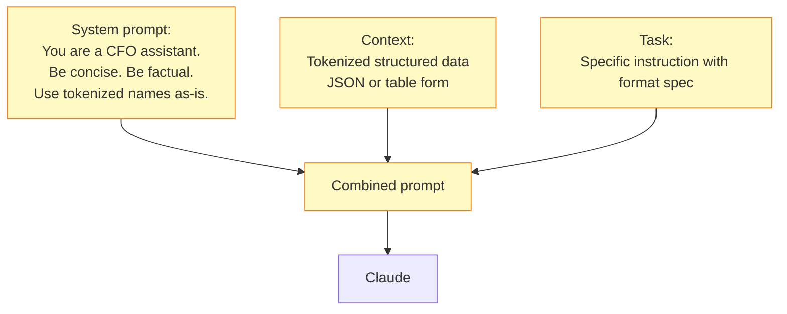

# Shared Capability — AI Summaries

Generates natural-language summaries (CFO Monthly, AR Flash, Forecast Narrative) from structured data via Claude.

## Architecture

```mermaid
flowchart LR
    Source[Module data<br/>structured] --> Aggr[Aggregator]
    Aggr --> Mask[Mask service]
    Mask --> Tpl[Prompt template]
    Tpl --> Claude[Claude API]
    Claude --> Resp[Text response]
    Resp --> Unmask[Unmask tokens]
    Unmask --> Render[Render to PDF/HTML]
    Render --> Distribute[Email / dashboard]

    classDef ai fill:#fce4ec,stroke:#c2185b
    classDef proc fill:#e8f5e9,stroke:#388e3c
    class Mask,Claude,Tpl ai
    class Aggr,Unmask,Render,Distribute proc
```



## Summary Types

| Summary | Frequency | Source Modules | Length |
|---|---|---|---|
| CFO Monthly Summary | Monthly 5th | All modules | ~500 words + 3-5 takeaways |
| AR Flash Report | Weekly Mon | AR | ~200 words |
| Forecast Narrative | Daily | Forecast | ~150 words |
| Vendor Risk Brief | Weekly | Vendor | ~100 words |
| Compliance Status | Monthly 1st | Compliance | ~300 words |

## Prompt Pattern



## Quality Controls

1. **Bounded length**: prompts include max-word limit (e.g. "in 200 words")
2. **Structured output**: JSON for takeaways, prose for narrative
3. **Numerical anchoring**: prompt includes raw numbers; model is told to cite them
4. **No fabrication policy**: prompt says "do not infer; only summarise what is given"
5. **Review queue**: first 5 summaries of each type are reviewed by Fin L2 before production
6. **Toggle**: any AI summary can be turned off per recipient via settings

## Example Output (CFO Monthly)

```text
CFO Monthly Summary — March 2026

Key Takeaways:
1. Revenue tracking 4% above budget for the quarter, driven by SaaS line.
2. AR aging deteriorated: 90+ bucket up 15% MoM, concentrated in 2 clients.
3. MSME compliance at 100% — no breaches this month.
4. Operating expenses 6% under budget, primarily underspend on travel.
5. Cash position projected at ₹X.Y crore at quarter end (90-day forward).

Narrative:
March results reflected continued momentum in subscription revenue, with the SaaS segment outperforming...
```
