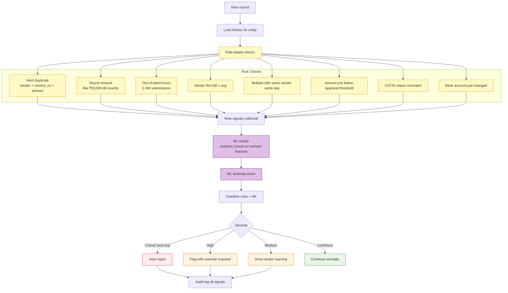

# Shared Capability — Anomaly Detection

Hybrid rules + ML approach to detect suspicious bills, payments, and invoice patterns.

## Detection Pipeline



## Severity Computation

```mermaid
flowchart LR
    Signals[Signal collection] --> Score[Score = sum(weights)]
    Score --> Tier{Score range}
    Tier -->|>= 100| Crit[CRITICAL<br/>auto-reject]
    Tier -->|50-99| High[HIGH<br/>override required]
    Tier -->|20-49| Med[MEDIUM<br/>warning]
    Tier -->|0-19| Low[LOW<br/>pass through]

    classDef bad fill:#ffebee
    classDef warn fill:#fff3e0
    classDef ok fill:#e8f5e9
    class Crit bad
    class High,Med warn
    class Low ok
```

## Signal Weights (Configurable)

| Signal | Weight | Notes |
|---|---|---|
| Hard duplicate (same vendor+inv_no+amount) | 100 | Auto-reject |
| Bank account changed within 7 days | 60 | Possible fraud |
| Amount > 3σ above vendor average | 40 | Statistical outlier |
| Round amount + first bill from vendor | 30 | Suspicious pattern |
| Submitted between 11 PM - 5 AM | 15 | Off-hours |
| Amount within 5% of approval threshold | 25 | Threshold gaming |
| GSTIN suspended in last 30 days | 50 | Compliance risk |
| Vendor concentration > 40% of category | 10 | Single-vendor risk |

## ML Component

- **Algorithm**: Isolation Forest (sklearn)
- **Features**: amount, day_of_month, day_of_week, hour, days_since_last_bill, ratio_to_vendor_avg, ratio_to_category_avg
- **Training**: Nightly retrain on rolling 12-month window
- **Score**: -1 to 1; threshold at -0.3 contributes 30 points to severity
