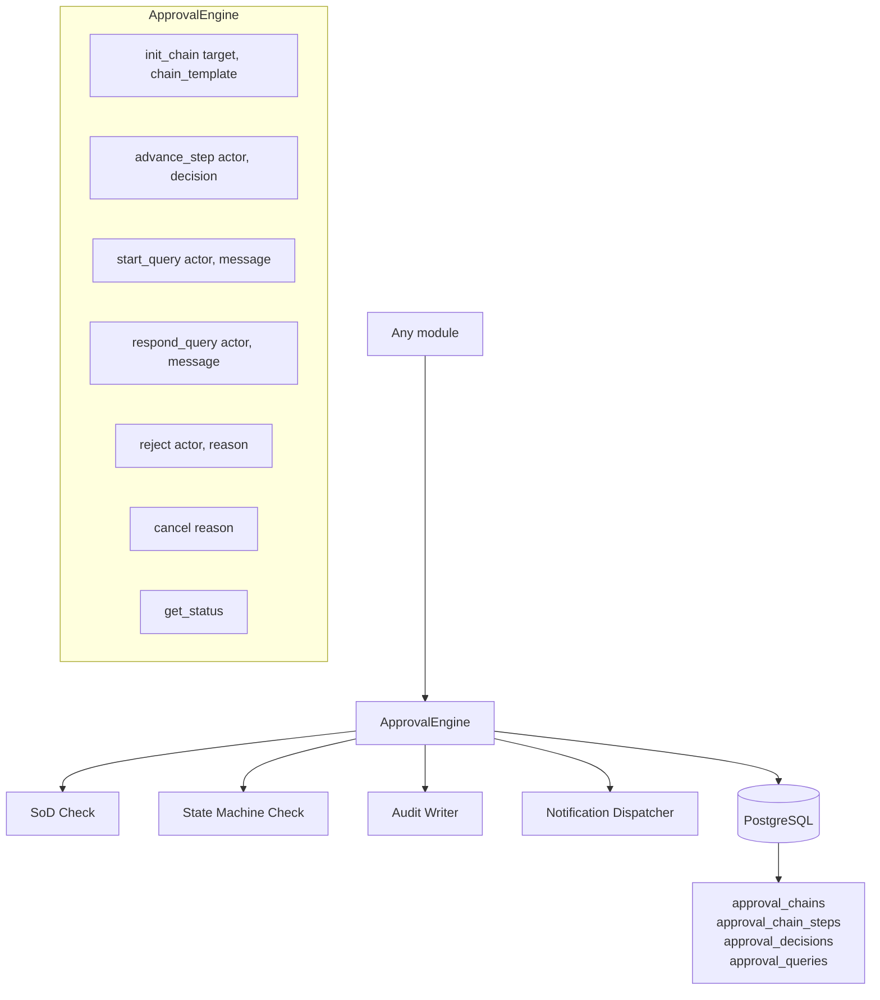
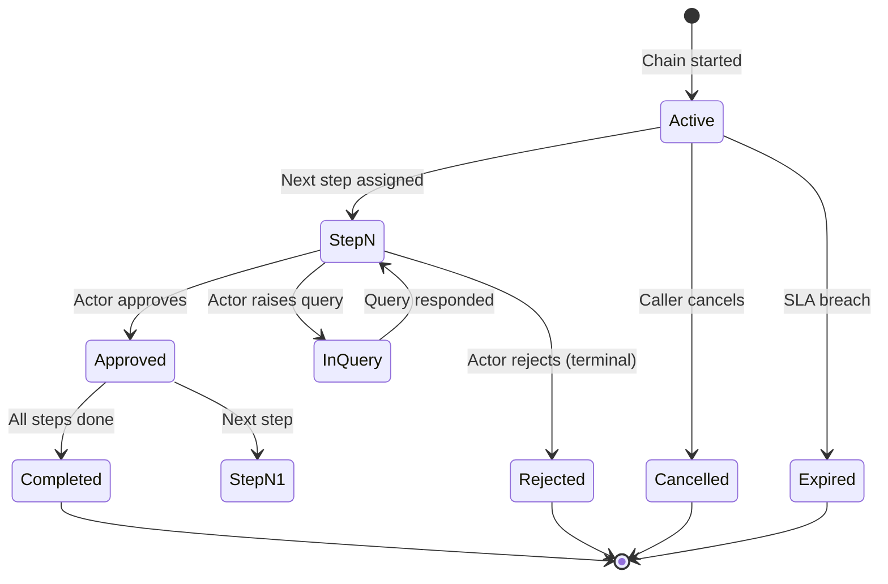
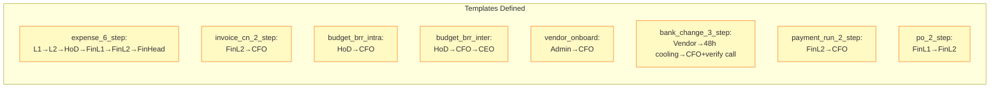
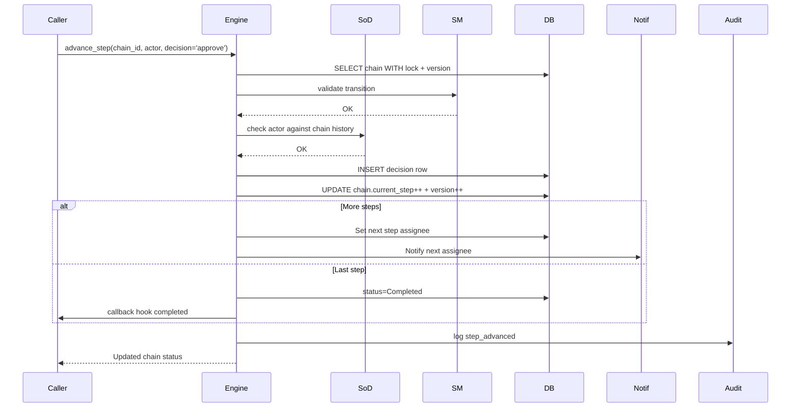

# Shared Capability — Approval Engine

Generic multi-step approval engine used by Expense (6-step), Invoice CN, Budget BRR, Vendor onboarding, Bank change, Payment runs, and PO approvals.

## Architecture

## Generic State Machine

## Chain Templates

## SoD Rules (Engine-Level)

The engine enforces these regardless of which module uses it:

1. **No self-approval**: actor ≠ submitter at any step
2. **No double-approval**: actor cannot appear twice in same chain
3. **No vendor-as-approver**: vendor role cannot approve their own bill
4. **No admin financial approval**: admin role cannot approve money flow steps
5. **Delegate cannot bypass SoD**: if delegate already approved earlier in chain, step auto-skips
6. **Filer-on-behalf cannot validate**: if `filer_on_behalf` is set, that user's L1 step routes to backup

## Sequence: Generic Step Advancement

