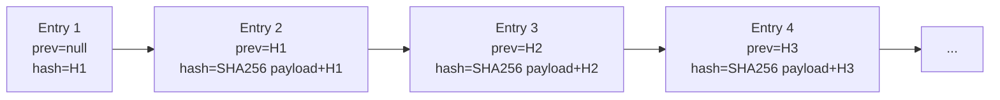

# Shared Capability — Audit Trail

Append-only, hash-chained audit log used by every state-changing operation in the system. See also `10-audit-governance/` for the consumer side.

## Write Architecture

```mermaid
flowchart LR
    AnyService[Any service] --> Decorator[@audited decorator<br/>or AuditWriter direct]
    Decorator --> Build[Build entry payload]
    Build --> Hash[SHA256 with prev_hash]
    Hash --> Insert[INSERT into audit_log]
    Insert --> Trigger[DB trigger:<br/>only INSERT allowed]
    Trigger --> OK[Success]

    classDef sec fill:#ffebee,stroke:#c62828
    class Hash,Trigger,Insert sec
```

## Standard Audit Entry

Every entry has:

```json
{
  "id": "uuid",
  "created_at": "2026-04-08T10:30:00Z",
  "actor_id": "user_uuid",
  "actor_role": "Fin L1",
  "action": "expense.approved",
  "target_type": "expense",
  "target_id": "expense_uuid",
  "before": {"status": "PENDING_L1"},
  "after": {"status": "PENDING_L2"},
  "reason": "validated against PO",
  "ip_address": "10.0.1.42",
  "user_agent": "Mozilla/5.0...",
  "session_id": "session_uuid",
  "prev_hash": "abc123...",
  "entry_hash": "def456..."
}
```

## Action Catalog

Actions follow `module.verb` naming:

| Module | Actions |
|---|---|
| expense | created, submitted, approved_l1, approved_l2, approved_hod, approved_fin_l1, approved_fin_l2, approved_fin_head, rejected, query_raised, query_responded, expired, reactivated, booked_d365, paid, withdrawn |
| invoice | drafted, sent, viewed, paid, partial_paid, dunning_stage1, dunning_stage2, dunning_stage3, disputed, cn_issued |
| budget | created, allocated, accepted, locked, brr_submitted, brr_approved, threshold_crossed, override_applied |
| vendor | created, kyc_validated, approved, suspended, reactivated, bank_change_requested, bank_change_approved |
| ap | po_created, grn_entered, match_passed, match_exception, payment_run_created, payment_executed |
| ar | receipt_applied, suspense_created, written_off |
| compliance | gstr1_prepared, gstr2a_reconciled, ca_pack_exported, filing_recorded |
| audit | log_verified, tamper_detected, export_generated, sod_violation_detected |
| accounts | user_created, role_assigned, user_deactivated, password_reset |

## Hash Chain



If anyone modifies entry 2, then entry 3's `prev` no longer matches entry 2's recomputed hash. The verifier walks the chain and breaks on first mismatch.

## Performance Considerations

- Audit log is the **highest write-volume table** in the system
- Partitioned by month for efficient archival
- Indexed on `(target_type, target_id)`, `(actor_id, created_at)`, `created_at` only
- Background partition manager moves old partitions to cold storage
- Hash chain verification operates on a single partition at a time to scale
