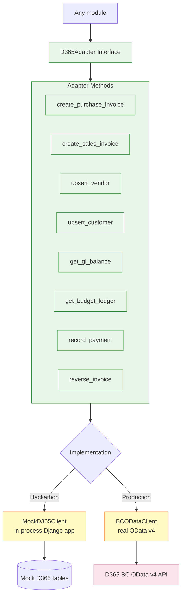
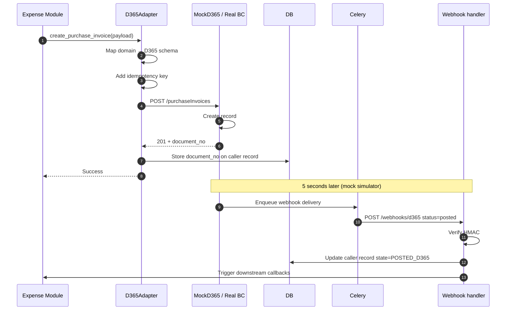
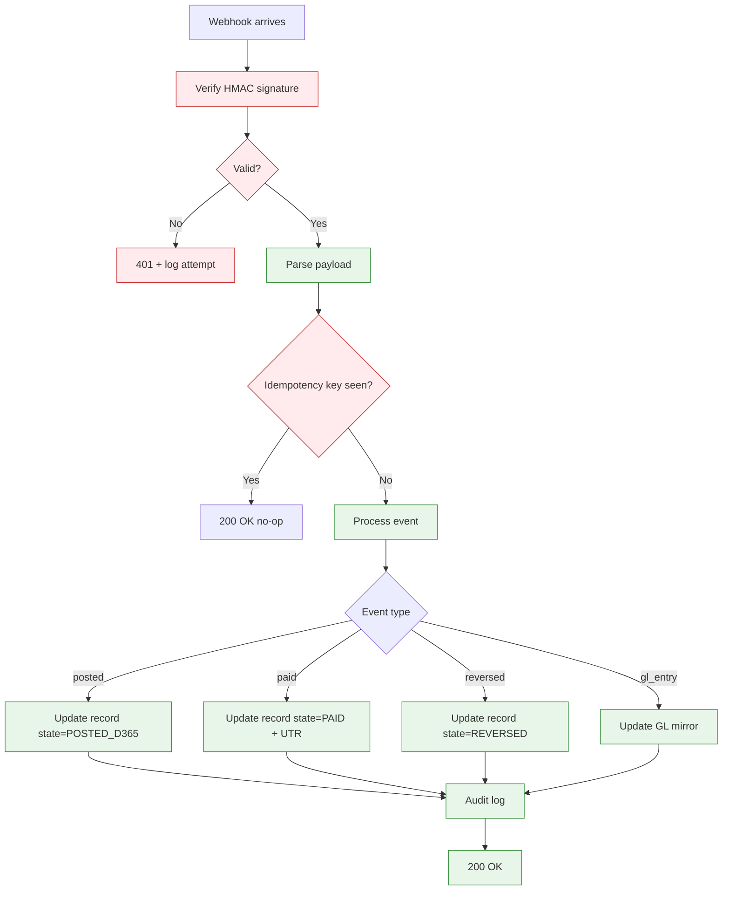
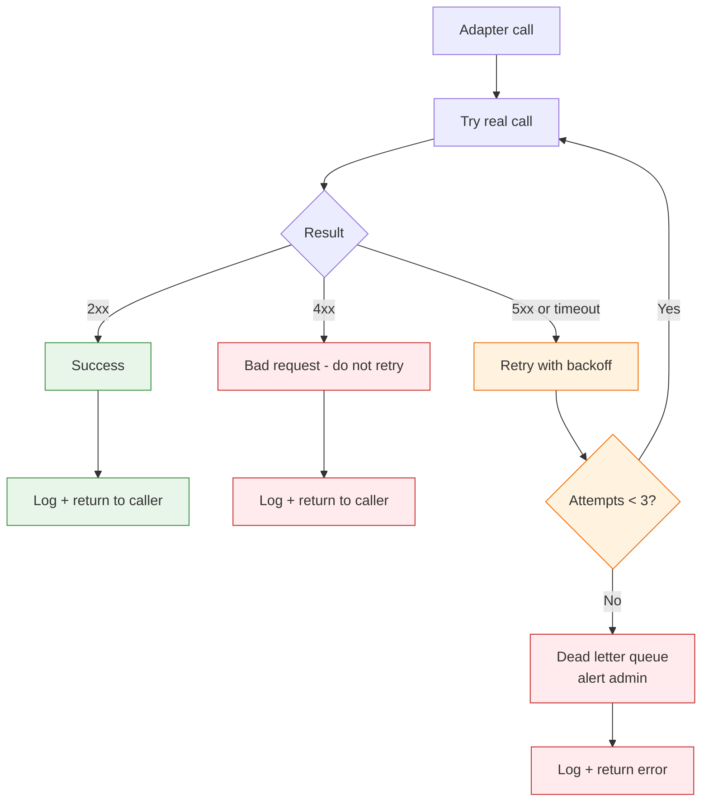

# Shared Capability — D365 Integration

The D365 adapter is the single interface to D365 Business Central. Hackathon uses Mock D365; Phase 2 swaps to real BC OData v4 with no caller code changes.

## Adapter Architecture

## Outbound Sequence: Booking a Purchase Invoice

## Inbound Webhook Processing

## Mock vs Real — Migration Path

| Concern | Hackathon (Mock) | Production (Real BC) |
|---|---|---|
| Transport | In-process Django views | HTTPS OData v4 |
| Auth | None | OAuth 2.0 client credentials |
| Endpoint | `/mock-d365/api/v2.0/...` | `https://api.businesscentral.dynamics.com/v2.0/{tenant}/...` |
| Webhook delivery | Celery delay 5s | Real-time from D365 |
| Webhook auth | Static HMAC secret | Azure AD signed tokens |
| Idempotency | UUID key in payload | Same |
| Error handling | Return 4xx/5xx as configured | Real BC error responses |
| Schema | Subset matching real BC | Full BC schema |

The adapter interface stays identical. Only the `Impl` module is swapped. No caller code changes.

## Resilience Patterns

