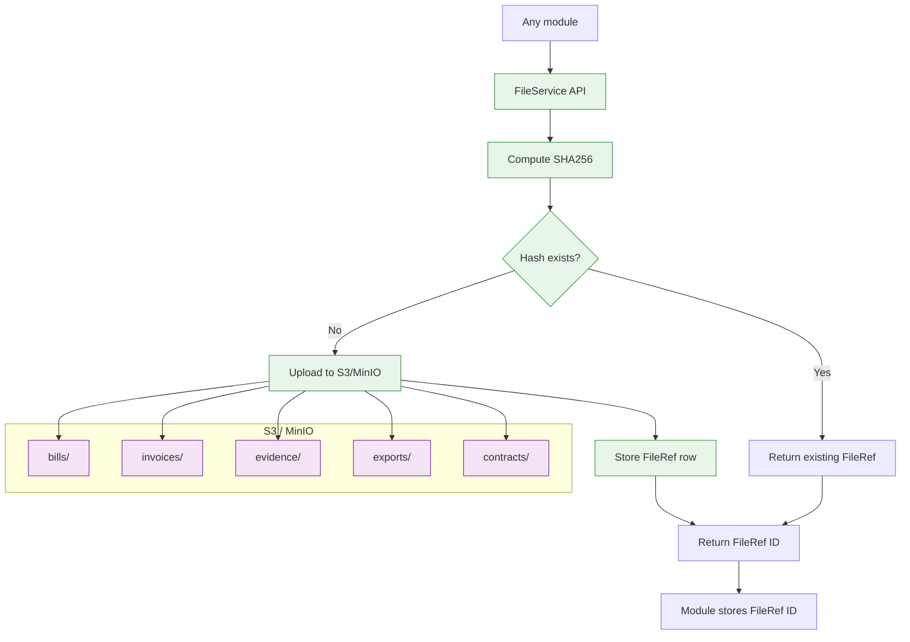
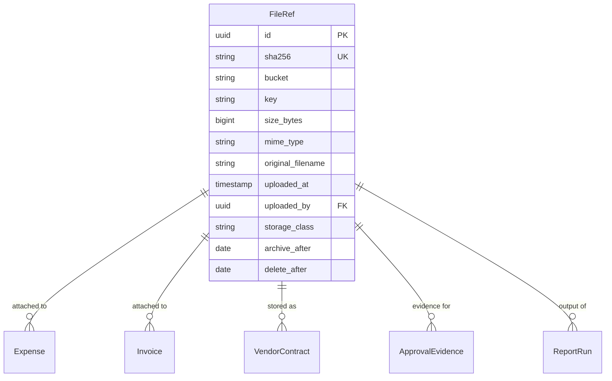
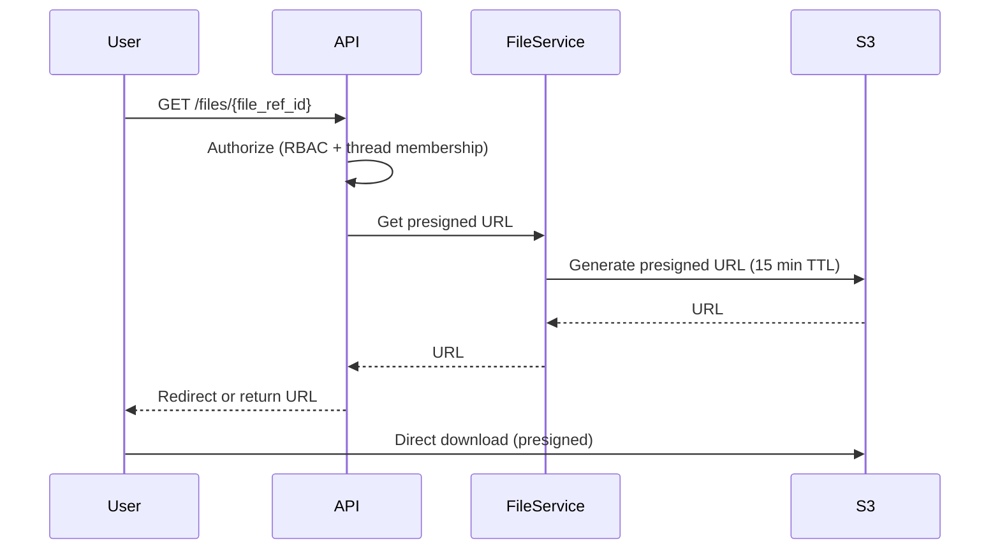
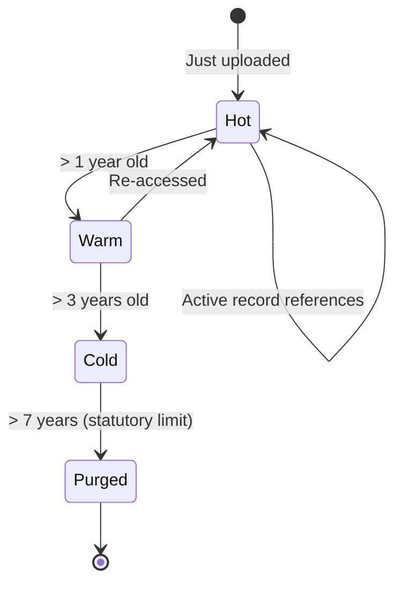

# Shared Capability — Document Storage

S3-compatible blob storage with SHA256 deduplication, metadata, and lifecycle policies.

## Architecture

## FileRef Schema

## Access Patterns

## Lifecycle

Storage class transitions are managed via S3 lifecycle rules in production, and via a Celery beat task in hackathon (mock).

## Security

- **At rest**: SSE-S3 encryption (AES-256)
- **In transit**: TLS 1.2+
- **Access**: presigned URLs only, never direct bucket access
- **TTL**: 15 minutes on download URLs
- **Audit**: every download is logged
- **Bucket policies**: deny public access at the bucket level
